# SQL语句优化

数据库应用程序的核心逻辑是通过SQL语句执行的，无论是直接通过解释器发出的，还是通过API在后台提交的。本节中的调优指南有助于加快各种MySQL应用程序的速度。这些指导原则包括读取和写入数据的SQL操作、SQL操作的幕后开销以及在特定场景中使用的操作，比如数据库监视。

## 1.1 SELECT语句优化

优化查询的主要考虑因素有以下几点：

- 让一个较慢的`SELECT ... WHERE`语句执行的更快的执行，第一件事情就是去检查你是否可以添加一个索引。在`WHERE`子句中使用的列上创建索引以加快计算，筛选，和最终检查的结果。为了避免磁盘空间的浪费，构造一组索引来加快应用程序中使用的许多相关查询。索引对于引用不同表的查询尤其重要，这些查询使用连接和外键等特性。你可以使用`EXPLAIN`语句来确定将哪些索引用于`SELECT`。
- 隔离和调优查询的任何部分，例如一个函数调用，这会花费过多的时间。根据查询的结构，可以对结果集中的每一行调用一个函数，甚至对表中的每一行调用一个函数，这极大地提高了效率。
- 尽量减少查询中全表扫描的次数，特别是对于大表。
- 通过定期使用`ANALYZE table`语句使表统计信息保持最新，这样优化器就有了构建有效执行计划所需的信息。
- 学习与每个表的存储引擎相关的调优技术、索引技术和配置参数。`InnoDB`和`MyISAM`都有一套指导原则来支持和维持查询的高性能。`具体细节在后面章节中会提到，此处仅做了解即可`
- 您可以为InnoDB表优化单查询事务。`具体细节在后面章节中会提到，此处仅做了解即可`
- 避免以难以理解的方式转换查询，特别是当优化器自动执行某些相同的转换时。
- 如果某个基本准则不能很容易地解决性能问题，那么通过阅读EXPLAIN计划并调整索引、WHERE子句、join子句等，研究特定查询的内部细节。`后面会提到`
- 调整MySQL用于缓存的内存区域的大小和属性。由于有效地使用了InnoDB缓冲池、MyISAM键缓存和MySQL查询缓存，重复查询运行得更快，因为结果是在第二次和以后的时间从内存中检索的。
- 即使对于使用缓存内存区域快速运行的查询，您也可以进行进一步优化，使它们所需的缓存内存更少，从而使应用程序更具可伸缩性。可伸缩性意味着您的应用程序可以同时处理更多的用户、更大的请求，等等，而不会出现性能的大幅下降。
- 处理锁定问题，您的查询速度可能会受到同时访问表的其他会话的影响。

### 1.1.1 WHERE子句优化

您可能会试图重写查询以使算术运算更快，同时牺牲可读性。因为MySQL会自动进行类似的优化，所以您通常可以避免这种工作，并以更易于理解和维护的形式保留查询。MySQL执行的一些优化如下:

- 删除不必要的括号

```mysql
((a AND b) AND c OR (((a AND b) AND (c AND d))))
-> (a AND b AND c) OR (a AND b AND c AND d)
```

- 常量替换

```mysql
(a<b AND b=c) AND a=5
-> b>5 AND b=c AND a=5
```

- 移除常量条件

```mysql
(b>=5 AND b=5) OR (b=6 AND 5=5) OR (b=7 AND 5=6)
-> b=5 OR b=6
```

- 索引使用的常量表达式只计算一次。

- `COUNT(*)`在没有WHERE的表上直接从`MyISAM`和`MEMORY`表信息中检索。当只与一个表一起使用时，这也适用于任何NOT NULL表达式。

- 提早检测无效的常量表达式。MySQL很快检测到一些`SELECT`语句是不可能的，并且没有返回任何行。

- 如果不使用`GROUP BY`或聚合函数（`COUNT()`，`MIN()`等），`HAVING`将与`WHERE`合并。

- 对于连接中的每个表，构造一个更简单的WHERE以获得对表的快速WHERE评估，并且还尽快跳过行。

- 在查询中的任何其他表之前，首先读取所有常量表。常数表是下列任何一种:

  ​	空表或只有一行的表。

  ​	与`PRIMARY KEY`或`UNIQUE`索引上的`WHERE`子句一起使用的表，其中所有索引部分都与常量表达式进行比较并定义为`NOT NULL`。

  ​	以下所有表都用作常量表：

```mysql
SELECT * FROM t WHERE primary_key=1;
SELECT * FROM t1,t2
WHERE t1.primary_key=1 AND t2.primary_key=t1.id;
```

- 通过尝试所有可能性，可以找到连接表的最佳连接组合。 如果`ORDER BY`和`GROUP BY`子句中的所有列都来自同一个表，则在加入时首先首选该表。
- 如果存在`ORDER BY`子句和不同的`GROUP BY`子句，或者`ORDER BY`或`GROUP BY`包含连接队列中第一个表以外的表中的列，则会创建临时表。
- 如果使用`SQL_SMALL_RESULT`修饰符，MySQL将使用内存中的临时表。
- 查询每个表索引，并使用最佳索引，除非优化程序认为使用表扫描更有效。 有一次，根据最佳指数是否跨越来使用扫描超过30％的表，但固定的百分比不再决定使用索引或扫描之间的选择。 优化器现在更复杂，并且基于其他因素（例如表大小，行数和I / O块大小）进行估算。
- 在某些情况下，MySQL甚至无需咨询数据文件即可从索引中读取行。 如果索引中使用的所有列都是数字，则仅使用索引树来解析查询。
- 在输出每一行之前，将跳过与`HAVING`子句不匹配的行。
- 一些非常快的查询示例：

```mysql
SELECT COUNT(*) FROM tbl_name;
SELECT MIN(key_part1),MAX(key_part1) FROM tbl_name;
SELECT MAX(key_part2) FROM tbl_name WHERE key_part1=constant;
SELECT ... FROM tbl_name ORDER BY key_part1,key_part2,... LIMIT 10;
SELECT ... FROM tbl_name ORDER BY key_part1 DESC, key_part2 DESC, ... LIMIT 10;
```

- MySQL仅使用索引树解析以下查询，假设索引列是数字：

```mysql
SELECT key_part1,key_part2 FROM tbl_name WHERE key_part1=val;
SELECT COUNT(*) FROM tbl_name WHERE key_part1=val1 AND key_part2=val2;
SELECT key_part2 FROM tbl_name GROUP BY key_part1;
```

- 以下查询使用索引来按排序顺序检索行，而不使用单独的排序传递：

```mysql
SELECT ... FROM tbl_name ORDER BY key_part1,key_part2,... ;
SELECT ... FROM tbl_name ORDER BY key_part1 DESC, key_part2 DESC, ... ;
```

### 1.1.2 范围优化

#### 1.1.2.1 单部分索引的范围访问方法

对于单部分索引，索引值间隔可以通过WHERE子句中的相应条件方便地表示，表示为范围条件而不是“间隔”。
单部分索引的范围条件定义如下:
- 对于`BTREE`和`HASH`索引，使用`=`，`<=>`，`IN()`，`IS NULL`或`IS NOT NULL`运算符时，关键部分与常量值的比较是范围条件。
- 此外，对于`BTREE`索引，关键部分与常量值的比较是使用`>`，`<`，`>=`，`<=`，`BETWEEN`，`!=`或`<>`运算符时的范围条件，或者如果参数为`LIKE`，则进行`LIKE`比较 `LIKE`是一个`不以通配符开头`的常量字符串。
- 对于所有索引类型，多个范围条件与OR或AND组合形成范围条件。
前面描述中的“常量值”表示以下之一：
- 查询字符串中的常量
- 来自同一联接的`const`或`system`表的列
- 不相关子查询的结果
- 完全由前面类型的子表达式组成的任何表达式以下是`WHERE`子句中具有范围条件的查询的一些示例：

```mysql
SELECT * FROM t1 WHERE key_col > 1 AND key_col < 10;
SELECT * FROM t1 WHERE key_col = 1 OR key_col IN (15,18,20);
SELECT * FROM t1WHERE key_col LIKE 'ab%' OR key_col BETWEEN 'bar' AND 'foo';
```

在优化器常量传播阶段，一些非常量值可以转换为常量

MySQL尝试从`WHERE`子句中为每个可能的索引提取范围条件。在提取过程中，不会使用不能用于构造范围条件的条件，组合产生重叠范围的条件，以及产生空范围的条件被移除。
考虑下面的语句，其中`key1`是索引列，`nonkey`没有索引:

```mysql
SELECT * FROM t1 WHERE
(key1 < 'abc' AND (key1 LIKE 'abcde%' OR key1 LIKE '%b')) OR
(key1 < 'bar' AND nonkey = 4) OR
(key1 < 'uux' AND key1 > 'z');
```

key key1的提取过程如下:
- 1 以原WHERE子句开始:

```mysql
(key1 < 'abc' AND (key1 LIKE 'abcde%' OR key1 LIKE '%b')) OR
(key1 < 'bar' AND nonkey = 4) OR
(key1 < 'uux' AND key1 > 'z')
```

- 2 移除`nonkey = 4` 和 `key1 LIKE '%b'`，因为他们不能被应用于范围扫描。移除它们的正确方法是用`TRUE`替换它们，这样我们在进行范围扫描时不会错过任何匹配的行。 用`TRUE`替换它们会产生：

```mysql
(key1 < 'abc' AND (key1 LIKE 'abcde%' OR TRUE)) OR
(key1 < 'bar' AND TRUE) OR
(key1 < 'uux' AND key1 > 'z')
```

- 3 折叠条件始终为真或假：
-------` (key1 LIKE 'abcde%' OR TRUE) is always true`
-------`  (key1 < 'uux' AND key1 > 'z') is always false`
用常数替换这些条件会产生：

```mysql
(key1 < 'abc' AND TRUE) OR (key1 < 'bar' AND TRUE) OR (FALSE)
```

删除不必要的TRUE和FALSE常量会产生：

```mysql
(key1 < 'abc') OR (key1 < 'bar')
```

- 4 将重叠的区间组合成一个区间，就得到了用于范围扫描的最终条件

```mysql
(key1 < 'bar')
```

通常（并且如前面的示例所示），用于范围扫描的条件比`WHERE`子句的限制性更小。 MySQL执行额外的检查以过滤掉那些行满足范围条件但不满足完整的`WHERE`子句。
范围条件提取算法可以处理任意深度的嵌套`AND`/`OR`结构，其输出不依赖于条件在`WHERE`子句中出现的顺序。
MySQL不支持合并空间索引的`range`访问方法的多个范围。 要解决此限制，可以使用具有相同`SELECT`语句的`UNION`，但将每个空间谓词放在不同的`SELECT`中除外。

#### 1.1.2.2 多部分索引的范围访问方法

多部分索引的范围条件是单部分索引的范围条件的扩展。 多部分索引上的范围条件将索引行限制在一个或多个关键元组间隔内。 使用索引中的排序在一组关键元组上定义关键元组间隔。

例如，考虑定义为`key1（key_part1，key_part2，key_part3）`的多部分索引，以及按键顺序列出的以下一组关键元组：

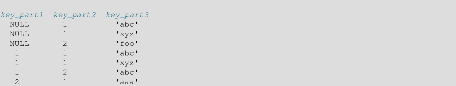

条件`key_part1 = 1`定义此间隔：
`(1,-inf,-inf) <= (key_part1,key_part2,key_part3) < (1,+inf,+inf)`
间隔覆盖前面数据集中的第4，第5和第6个元组，并且可以由范围访问方法使用。

相反，条件`key_part3 ='abc'`没有定义单个间隔，并且不能被范围访问方法使用。相比之下，条件key_part3 ='abc'没有定义单个间隔，并且不能被范围访问使用 方法。

以下描述更详细地说明了范围条件如何适用于多部分索引。
- 对于HASH索引，可以使用包含相同值的每个间隔。 这意味着只能为以下形式的条件生成间隔：

```mysql
key_part1 cmp const1
AND key_part2 cmp const2
AND ...
AND key_partN cmp constN;
```

这里，`const1，const2`，...是常量，`cmp`是`=`，`<=>`或`IS NULL`比较运算符之一，条件涵盖所有索引部分。 （也就是说，有N个条件，`N`部分索引的每个部分都有一个条件。）例如，以下是三部分`HASH`索引的范围条件：

```mysql
key_part1 = 1 AND key_part2 IS NULL AND key_part3 = 'foo'
```

- 对于`BTREE`索引，间隔可以用于与`AND`组合的条件，其中每个条件使用`=`，`<=>`，`IS NULL`，`>`，`<`，`>=`，`<=`，`!=`， `<>`，`BETWEEN`或`LIKE'pattern'`（其中`'pattern'`不以通配符开头）来比较关键部分和常量值。 可以使用间隔，只要可以确定包含与条件匹配的所有行的单个密钥元组（或者如果使用`<>`或`!=`则为两个间隔）。
- 只要比较运算符为`=`，`<=>`或`IS NULL`，优化程序就会尝试使用其他关键部分来确定间隔。 如果运算符是`>`，`<`，`>=`，`<=`，`!=`，`<>`，`BETWEEN`或`LIKE`，优化程序将使用它，但不再考虑关键部分。对于以下表达式，优化程序使用`=`来自第一次比较。它还使用了来自第二次比较的`>=`，但没有考虑其他关键部分，也没有使用第三个比较进行间隔构造：

```mysql
key_part1 = 'foo' AND key_part2 >= 10 AND key_part3 > 10
```

单区间为:

```mysql
('foo',10,-inf) < (key_part1,key_part2,key_part3) < ('foo',+inf,+inf)
```

创建的间隔可能包含比初始条件更多的行。 例如，前面的间隔包括值（'foo'，11,0），它不满足原始条件。

- 如果覆盖区间中包含的行集的条件与`OR`组合，则它们形成一个条件，该条件覆盖其间隔的并集中包含的一组行。如果条件是与`AND`结合，它们形成一个条件，覆盖其间隔交集中包含的一组行。例如，对于这个由两部分组成的索引：

```mysql
(key_part1 = 1 AND key_part2 < 2) OR (key_part1 > 5)
```

间隔是：

```mysql
(1,-inf) < (key_part1,key_part2) < (1,2)
(5,-inf) < (key_part1,key_part2)
```

在此示例中，第一行的间隔使用左边界的一个关键部分和右边界的两个关键部分。 第二行的间隔仅使用一个关键部分。 `key_len`列中的`EXPLAIN`输出表示使用的密钥前缀的最大长度。

在某些情况下，`key_len`可能表示使用了一个关键部分，但这可能不是您所期望的。假设`key_part1`和`key_part2`可以为`NULL`。然后`key_len`列显示以下条件的两个关键部分长度：

```mysql
key_part1 >= 1 AND key_part2 < 2
```

但是，事实上，条件被转换为:

```mysql
key_part1 >= 1 AND key_part2 IS NOT NULL
```

#### 1.1.2.3 多值比较的等价范围优化

考虑这些表达式，其中col_name是索引列：

```mysql
col_name IN(val1, ..., valN)
col_name = val1 OR ... OR col_name = valN
```

如果`col_name`等于多个值中的任何一个，则每个表达式都为`true`。 这些比较是等式范围比较（其中“范围”是单个值）。优化程序估计读取限定行的成本以进行相等范围比较，如下所示：
- 如果`col_name`上有惟一的索引，那么每个范围的行估计值为1，因为最多一行可以有给定的值。
- 否则，`col_name`上的任何索引都是非惟一的，优化器可以使用索引或索引统计数据中的下潜值来估计每个范围的行数。

使用索引下潜时，优化程序会在范围的每一端进行下潜，并使用范围中的行数作为估计值。例如，表达式col_name IN（10,20,30）有三个等式范围和优化器每个范围进行两次潜水以生成行估计。 每对潜水产生具有给定值的行数的估计。

index dive提供准确的行估计，但随着表达式中比较值的数量增加，优化程序需要更长时间才能生成行估计。 使用索引统计数据较少准确而不是索引潜水，但允许更快的行估计大值列表。

`eq_range_index_dive_limit`系统变量使您可以配置优化程序从一个行估计策略切换到另一个行估计策略的值的数量。 要允许使用索引潜水进行最多N个相等范围的比较，请将`eq_range_index_dive_limit`设置为`N` + 1.要禁用统计数据并始终使用索引潜水而不考虑N，请将`eq_range_index_dive_limit`设置为0。

要更新表索引统计信息以获得最佳估计值，请使用`ANALYZE TABLE`。
- 即使在以其他方式使用索引潜水的情况下，也会跳过满足所有这些条件的查询：
- 存在单索引FORCE INDEX索引提示。 我们的想法是，如果强制使用索引，那么从潜在的索引中获取额外开销就无法获得任何好处。
- 索引是非唯一的，而不是FULLTEXT索引
- 没有子查询。
- 没有`DISTINCT`,`GROUP BY`,or `ORDER BY`子句。
- 这些dive跳过条件仅适用于单表查询。 多表查询（连接）不会跳过index dive。

###$ 1.1.2.4 行构造函数表达式的范围优化

优化器能够将范围扫描访问方法应用于此表单的查询：

```mysql
SELECT ... FROM t1 WHERE ( col_1, col_2 ) IN (( 'a', 'b' ), ( 'c', 'd' ));
```

以前，要使用范围扫描，需要将查询写为:

```mysql
SELECT ... FROM t1 WHERE ( col_1 = 'a' AND col_2 = 'b' ) OR ( col_1 = 'c' AND col_2 = 'd' );
```

优化器要使用范围扫描，查询必须满足以下条件:
- 只使用谓词`IN()`，而不是`not IN()`。
- 在IN()谓词的左侧，行构造函数只包含列引用。
- 在`IN()`谓词的右侧，行构造函数只包含运行时常量，这些常量要么是文本，要么是在执行期间绑定到常量的本地列引用。
- 在`IN()`谓词的右侧，有多个行构造函数。

#### 1.1.2.5 限制内存使用范围优化

要控制范围优化器可用的内存，可以使用`range_optimizer_max_mem_size`系统变量:
- 值0表示“没有限制”。
- 当值大于0时，优化器在考虑范围访问方法时跟踪所消耗的内存。如果要超过指定的限制，则放弃范围访问方法，转而考虑其他方法，包括全表扫描。这可能不是最优的。如果发生这种情况，将出现以下警告(其中N是当前`range_optimizer_max_mem_size`值):


- 对于`UPDATE`和`DELETE`语句，如果优化器返回到全表扫描，并且启用了`sql_safe_updates`系统变量，则会出现错误而不是警告，因为实际上没有使用任何键来确定要修改哪些行。

对于超出可用范围优化内存并优化器返回到不太优化的计划的单个查询，增加`range_optimizer_max_mem_size`值可以提高性能。

要估计处理范围表达式所需的内存量，请使用以下准则:
- 对于诸如以下的简单查询，其中有一个候选键用于范围访问方法，每个谓词与OR组合使用大约230个字节：

```mysql
SELECT COUNT(*) FROM t
WHERE a=1 OR a=2 OR a=3 OR .. . a=N;
```

- 类似地，对于诸如以下的查询，每个与AND组合的谓词使用大约125个字节：

```mysql
SELECT COUNT(*) FROM t
WHERE a=1 AND b=1 AND c=1 ... N;
```

- 对于使用IN（）谓词的查询：

```mysql
SELECT COUNT(*) FROM t
WHERE a IN (1,2, ..., M) AND b IN (1,2, ..., N);
```

IN（）列表中的每个文字值都计为与OR结合的谓词。 如果有两个IN（）列表，则与OR组合的谓词数是每个列表中文字值数的乘积。
因此，在前一种情况下与OR组合的谓词数是M×N。

在5.7.11之前，每个谓词与`OR`组合的字节数更高，约为700字节。

### 1.1.3 索引合并优化

索引合并访问方法检索具有多个范围扫描的行，并将其结果合并为一个。此访问方法仅合并来自单个表的索引扫描，而不是跨多个表的扫描。合并可以生成其底层扫描的联合、交叉或交叉的联合。

可以使用索引合并的示例查询:

```mysql
SELECT * FROM tbl_name WHERE key1 = 10 OR key2 = 20;

SELECT * FROM tbl_name
WHERE (key1 = 10 OR key2 = 20) AND non_key = 30;

SELECT * FROM t1, t2
WHERE (t1.key1 IN (1,2) OR t1.key2 LIKE 'value%')
AND t2.key1 = t1.some_col;

SELECT * FROM t1, t2
WHERE t1.key1 = 1
AND (t2.key1 = t1.some_col OR t2.key2 = t1.some_col2);
```

**注意：索引合并优化算法有以下已知的局限性:**
- 如果您的查询具有带有深度AND / OR嵌套的复杂WHERE子句，并且MySQL未选择最佳计划，请尝试使用以下标识转换来分发术语：

```mysql
(x AND y) OR z => (x OR z) AND (y OR z)
(x OR y) AND z => (x AND z) OR (y AND z)
```

- 索引合并不适用于全文索引。

在`EXPLAIN`输出中，索引合并方法在类型列中显示为`index_merge`。 在这种情况下，键列包含使用的索引列表，`key_len`包含最长键的列表这些索引的部分。
索引合并访问方法有几种算法，它们显示在解释输出：

- Using intersect(...)
- Using union(...)
- Using sort_union(...)

索引合并的使用取决于optimizer_switch系统的index_merge，index_merge_intersection，index_merge_union和index_merge_sort_union标志的值变量。
默认情况下，所有这些标志都已打开。 要仅启用某些算法，请将`index_merge`设置为`off`，并仅启用应允许的其他算法。

#### 1.1.3.1 索引合并交叉存取算法

当WHERE子句在与AND组合的不同键上转换为多个范围条件时，此访问算法适用，并且每个条件是以下之一：
- 这种形式的`N-part`表达式，其中索引具有正好`N`个部分（即，所有索引部分都被覆盖）：

```mysql
key_part1 = const1 AND key_part2 = const2 ... AND key_partN = constN
```

- InnoDB表的主键上的任何范围条件。

```mysql
SELECT * FROM innodb_table
WHERE primary_key < 10 AND key_col1 = 20;
SELECT * FROM tbl_name
WHERE key1_part1 = 1 AND key1_part2 = 2 AND key2 = 2;
```

索引合并交集算法对所有使用的索引执行同时扫描，并生成从合并索引扫描接收的行序列的交集。

如果查询中使用的所有列都被使用的索引覆盖，则不会检索完整的表行（在这种情况下，`EXPLAIN`输出包含在`Extra`字段中`Using index`）。 以下是此类查询的示例：

```mysql
SELECT COUNT(*) FROM t1 WHERE key1 = 1 AND key2 = 1;
```

如果使用的索引未涵盖查询中使用的所有列，则仅在满足所有使用的键的范围条件时才检索完整行。
如果其中一个合并条件是`InnoDB`表的主键上的条件，则它不用于行检索，而是用于过滤掉使用其他条件检索的行。

#### 1.1.3.2 索引合并联合访问算法

该算法的标准类似于索引合并交集算法的标准。 当表的WHERE子句转换为多个范围条件时，该算法适用不同的键与OR组合，每个条件是以下之一：

- 这种形式的`N-part`表达式，其中索引具有正好`N`个部分（即，所有索引部分都被覆盖）：

```mysql
key_part1 = const1 AND key_part2 = const2 ... AND key_partN = constN
```

- InnoDB表的主键上的任何范围条件。
- 索引合并交集算法适用的条件。

```mysql
SELECT * FROM t1
WHERE key1 = 1 OR key2 = 2 OR key3 = 3;
SELECT * FROM innodb_table
WHERE (key1 = 1 AND key2 = 2)
OR (key3 = 'foo' AND key4 = 'bar') AND key5 = 5;
```

#### 1.1.3.3 索引合并排序联合访问算法

当WHERE子句转换为由OR组合的多个范围条件时，此访问算法适用，但索引合并联合算法不适用。

```mysql
SELECT * FROM tbl_name
  WHERE key_col1 < 10 OR key_col2 < 20;
SELECT * FROM tbl_name
  WHERE (key_col1 > 10 OR key_col2 = 20) AND nonkey_col = 30;
```

sort-union算法和union算法的区别在于，sort-union算法必须首先获取所有行的行id，并在返回任何行之前对它们进行排序。


### 1.1.4 引擎状态下推优化

......

### 1.1.5 索引条件下推优化（ICP）

索引条件下推(ICP)是MySQL使用索引从表中检索行的一种优化。在没有ICP的情况下，存储引擎遍历索引来定位基表中的行，并将它们返回给MySQL服务器，MySQL服务器将评估行在`WHERE`处的条件。启用ICP后，如果可以仅使用索引中的列来评估`WHERE`条件的某些部分，则MySQL服务器会将`WHERE`条件的这一部分向下推送到存储引擎。 然后，存储引擎使用索引条目评估推送的索引条件，并且仅当满足该条件时才从表中读取行。 ICP可以减少存储引擎必须访问基表的次数以及MySQL服务器必须访问存储引擎的次数。

指数条件下推优化的适用性受以下条件限制：

- 当需要访问全表行时，ICP用于`range`，`ref`，`eq_ref`和`ref_or_null`访问方法。
- ICP可用于`InnoDB`和`MyISAM`表，包括分区的`InnoDB`和`MyISAM`表。
- 对于`InnoDB表`，ICP仅用于二级索引。 ICP的目标是减少全行读取的数量，从而减少I/O操作。 对于`InnoDB`聚簇索引，完整记录已经读入`InnoDB`缓冲区。 在这种情况下使用ICP不会降低I/O。
- 在虚拟生成列上创建的二级索引不支持ICP。 `InnoDB`支持虚拟生成列的二级索引。
- 引用子查询的条件不能下推。
- 引用已存储函数的条件不能下推。存储引擎不能调用已存储的函数。
- 触发条件不能被下推。

要了解此优化的工作原理，请首先考虑在不使用索引条件下推时索引扫描的进度：

- 1 获取下一行，首先读取索引元组，然后使用索引元组定位和读取整个表行。
- 2 测试应用于此表的`WHERE`条件的部分。根据测试结果接受或拒绝行。

使用索引条件下推，扫描会像这样进行：

- 1 获取下一行的索引元组(但不是完整的表行)。 
- 2 测试适用于此表的`WHERE`条件的一部分，并且只能使用索引列进行检查。 如果不满足条件，则继续下一行的索引元组。
- 3 如果满足条件，请使用索引元组来查找并读取整个表行。
- 4 测试适用于此表的`WHERE`条件的剩余部分。 根据测试结果接受或拒绝该行。

EXPLAIN输出显示`Using index condition`下推时在`Extra`列中使用索引条件。 它不显示`Using index`，因为当必须读取完整的表行时，这不适用。

假设一个表包含关于人和他们的地址的信息，并且这个表有一个索引定义为`index (zipcode, lastname, firstname)`。如果我们知道一个人的邮编值，但不确定他的姓，我们可以这样搜索:

```mysql
SELECT * FROM people
WHERE zipcode='95054'
AND lastname LIKE '%etrunia%'
AND address LIKE '%Main Street%';
```

MySQL可以使用索引来扫描`zipcode ='95054'`的人。 第二部分（`lastname LIKE '%etrunia%'`）不能用于限制必须扫描的行数，因此如果没有Index Condition Pushdown，此查询必须为所有拥有`zipcode ='95054'`的人检索完整的表行。

使用索引条件下推，MySQL在读取整个表行之前检查`lastname LIKE '%etrunia%' `部分。 这样可以避免读取与`zipcode`条件匹配的索引元组对应的完整行，但不会读取`lastname`条件。

默认情况下启用索引条件下推。 可以使用`optimizer_switch`系统变量通过设置`index_condition_pushdown`标志来控制它：

```mysql
SET optimizer_switch = 'index_condition_pushdown=off';
SET optimizer_switch = 'index_condition_pushdown=on';
```

### 1.1.6 Nested-Loop Join Algorithms

......

### 1.1.7 嵌套连接优化

与SQL标准相比，扩展了`table_factor`的语法。 后者只接受`table_reference`，而不是一对括号内的列表。 如果我们将`table_reference`项列表中的每个逗号视为等效于内连接，则这是一个保守的扩展。 例如：

```mysql
SELECT * FROM t1 LEFT JOIN (t2, t3, t4)
ON (t2.a=t1.a AND t3.b=t1.b AND t4.c=t1.c)
```

相当于

```mysql
SELECT * FROM t1 LEFT JOIN (t2 CROSS JOIN t3 CROSS JOIN t4)
ON (t2.a=t1.a AND t3.b=t1.b AND t4.c=t1.c)
```

在MySQL中，`CROSS JOIN`在语法上等同于`INNER JOIN`; 他们可以互相替换。 在标准SQL中，它们不等效。 `INNER JOIN`与ON子句一起使用; 否则使用`CROSS JOIN`。
通常，在仅包含内部联接操作的联接表达式中可以忽略括号。 考虑这个连接表达式：

```mysql
t1 LEFT JOIN (t2 LEFT JOIN t3 ON t2.b=t3.b OR t2.b IS NULL)
ON t1.a=t2.a
```

删除括号并将操作分组到左边后，join表达式转换为如下表达式:

```mysql
(t1 LEFT JOIN t2 ON t1.a=t2.a) LEFT JOIN t3
ON t2.b=t3.b OR t2.b IS NULL
```

然而，这两个表达并不相同。 为此，假设表t1，t2和t3具有以下状态

- 表1包含了行 `(1)，(2)` 
- 表2包含了行 `(1)，(101)` 
- 表3包含了行 `(101)` 

在这种情况下，第一个表达式返回包含行`（1,1,101,101）`，`（2，NULL，NULL，NULL）`的结果集，而第二个表达式返回行`（1,1,101,101），（2，NULL，NULL，101）`：

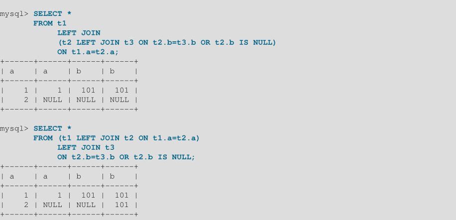

在以下示例中，外部联接操作与内部联接操作一起使用：
```mysql
t1 LEFT JOIN (t2, t3) ON t1.a=t2.a
```
该表达式无法转换为以下表达式：
```mysql
t1 LEFT JOIN t2 ON t1.a=t2.a, t3
```
对于给定的表状态，这两个表达式返回不同的行集：

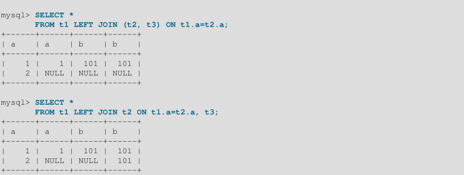

因此，如果我们在带有外连接运算符的连接表达式中省略括号，我们可能会更改原始表达式的结果集。

更准确地说，我们不能忽略左外连接操作的右操作数和右连接操作的左操作数中的括号。 换句话说，我们不能忽视内在的括号外连接操作的表表达式。 可以忽略其他操作数（外部表的操作数）的括号。

下列的表达式：
```mysql
(t1,t2) LEFT JOIN t3 ON P(t2.b,t3.b)
```
对于任何表`t1`，`t2`，`t3`以及属性`t2.b`和`t3.b`上的任何条件`P`，等效于此表达式：
```mysql
t1, t2 LEFT JOIN t3 ON P(t2.b,t3.b)
```
每当连接表达式（`joined_table`）中的连接操作的执行顺序不是从左到右时，我们就讨论嵌套连接。 请考虑以下查询：
```mysql
SELECT * FROM t1 LEFT JOIN (t2 LEFT JOIN t3 ON t2.b=t3.b) ON t1.a=t2.a
WHERE t1.a > 1
SELECT * FROM t1 LEFT JOIN (t2, t3) ON t1.a=t2.a
WHERE (t2.b=t3.b OR t2.b IS NULL) AND t1.a > 1
```
这些查询被认为包含这些嵌套连接：
```mysql
t2 LEFT JOIN t3 ON t2.b=t3.b
t2, t3
```

在第一个查询中，嵌套连接由左连接操作形成。 在第二个查询中，它由内部联接操作形成。
在第一个查询中，可以省略括号：连接表达式的语法结构将指示连接操作的相同执行顺序。 对于第二个查询，括号不能被省略，虽然这里的连接表达式可以在没有它们的情况下明确地解释。

使用嵌套外部连接的查询与使用内部连接的查询以相同的管道方式执行。更准确地说，利用了内嵌循环连接算法的一种变体。


### 1.1.8 外连接优化

外连接包括`LEFT JOIN` 和 `RIGHT JOIN` 。
MySQL实现了`A LEFT JOIN B join_specification`，如下所示：

- 表`B`设置为依赖于表`A`和`A`所依赖的所有表。
- 表`A`设置为依赖于`LEFT JOIN`条件中使用的所有表（`B`除外）。
- `LEFT JOIN`条件用于决定如何从表`B`中检索行。（换句话说，不使用`WHERE`子句中的任何条件。）
- 执行所有标准连接优化，但始终在所依赖的所有表之后读取表。 如果存在循环依赖关系，则会发生错误。
- 执行所有标准`WHERE`优化。
- 如果`A`中的行与`WHERE`子句匹配，但`B`中没有与`ON`条件匹配的行，则会生成额外的`B`行，并将所有列设置为`NULL`。
- 如果使用`LEFT JOIN`查找某些表中不存在的行，并且您有以下测试：`col_name IS NULL`在`WHERE`部分中，其中`col_name`是声明为`NOT NULL`的列，MySQL停止搜索更多行（对于特定键组合） 找到一行与`LEFT JOIN`条件匹配后的。

`RIGHT JOIN`实现类似于`LEFT JOIN`的实现，表角色相反。

对于`LEFT JOIN`，如果生成的`NULL`行的`WHERE`条件始终为`false`，则`LEFT JOIN`将更改为内部联接。 例如，如果`t2.column1`为`NULL`，在下列的查询中`WHERE`子句被设置为`false`：
```mysql
SELECT * FROM t1 LEFT JOIN t2 ON (column1) WHERE t2.column2=5;
```
因此，将查询转换为内部联接是安全的：
```mysql
SELECT * FROM t1, t2 WHERE t2.column2=5 AND t1.column1=t2.column1;
```
现在优化器可以在表`t1`之前使用表`t2`，如果这样做会导致更好的查询计划。 要提供有关表连接顺序的提示，请使用`STRAIGHT_JOIN`;但是，`STRAIGHT_JOIN`可能会阻止使用索引，因为它会禁用半连接转换;

### 1.1.9 简化外连接

在许多情况下，简化了查询的`FROM`子句表中表达式。
在解析器阶段，具有右外连接操作的查询将转换为仅包含左连接操作的等效查询。 在一般情况下，转换是这样执行的：
```mysql
(T1, ...) RIGHT JOIN (T2, ...) ON P(T1, ..., T2, ...)
```
变成这个等价的左连接:
```mysql
(T2, ...) LEFT JOIN (T1, ...) ON P(T1, ..., T2, ...)
```
表单`T1 INNER JOIN T2 ON P(T1,T2)`的所有内部连接表达式都替换为列表`T1、T2、P(T1、T2)`，它们作为`WHERE`条件(或者嵌入连接的连接条件，如果有的话)的附加项被连接。

当优化器对外部连接操作的计划进行评估时，它只考虑对每个此类操作而言，在访问内部表之前访问外部表的计划。优化器的选择是有限的，因为只有这样的计划才允许使用嵌套循环算法执行外部连接。

考虑这种形式的查询，where 中 `R(T2)`极大地缩小了表`T2`中匹配行的数量。
```mysql
SELECT * T1 LEFT JOIN T2 ON P1(T1,T2)
WHERE P(T1,T2) AND R(T2)
```
如果查询是按写入的那样执行的，那么优化器别无选择，只能在更受限制的表T2之前访问限制较少的表T1，这可能会产生效率非常低的执行计划。

相反，如果`WHERE`条件为null-rejected，MySQL会将查询转换为没有外连接操作的查询。 （也就是说，它将外连接转换为内连接。）一个条件被认为是null-rejected对于外连接操作，如果它为操作生成的任何`NULL`-complemented的计算结果为`FALSE`或`UNKNOWN`。

因此，对于这个外部连接:
```mysql
T1 LEFT JOIN T2 ON T1.A=T2.A
```

这些条件都是null-rejected ，因为它们不能对任何`NULL`-complemented的行成立(`T2`列设置为`NULL`):
```mysql
T2.B IS NOT NULL
T2.B > 3
T2.C <= T1.C
T2.B < 2 OR T2.C > 1
```

诸如此类的条件不会被null-rejected，因为对于`NULL`-complemented的行它们可能是真的：
```mysql
T2.B IS NULL
T1.B < 3 OR T2.B IS NOT NULL
T1.B < 3 OR T2.B > 3
```

检查外部连接操作的条件是否为null-rejected的一般规则很简单:

- 它的形式为`A IS NOT NULL`，其中`A`是任何内部表的属性

- 它是一个predicate，包含对内部表的引用，当其中一个参数为NULL时，该内部表的计算结果为UNKNOWN

- 它是一个连接词，包含一个null-rejected的条件作为连接词

- 它是null-rejected条件的分离

- 查询中的一个外部连接操作可以null-rejected条件，而另一个操作不能null-rejected条件。在这个查询中，WHERE条件对于第二个外部连接操作是null-rejected的，但是对于第一个操作不是null-rejected的。
```mysql
SELECT * FROM T1 LEFT JOIN T2 ON T2.A=T1.A
LEFT JOIN T3 ON T3.B=T1.B
WHERE T3.C > 0
```

- 如果查询中的外部连接操作的`WHERE`条件为null-reject，则将外部连接操作替换为内部连接操作。

例如，在前面的查询中，第二个外部连接为null-reject，可以用一个内部连接替换:
```mysql
SELECT * FROM T1 LEFT JOIN T2 ON T2.A=T1.A
INNER JOIN T3 ON T3.B=T1.B
WHERE T3.C > 0
```

对于原始查询，优化程序仅评估与单个表访问顺序`T1，T2，T3`兼容的计划。 对于重写的查询，它还考虑访问顺序`T3，T1，T2`。

一个外部连接操作的转换可能触发另一个外部连接操作的转换。因此,查询:
```mysql
SELECT * FROM T1 LEFT JOIN T2 ON T2.A=T1.A
LEFT JOIN T3 ON T3.B=T2.B
WHERE T3.C > 0
```

首先转换为查询:
```mysql
SELECT * FROM T1 LEFT JOIN T2 ON T2.A=T1.A
INNER JOIN T3 ON T3.B=T2.B
WHERE T3.C > 0
```

相当于查询:
```mysql
SELECT * FROM (T1 LEFT JOIN T2 ON T2.A=T1.A), T3
WHERE T3.C > 0 AND T3.B=T2.B
```

剩余的外连接操作也可以由内连接替换，因为条件`T3.B = T2.B`是空的拒绝。 这导致查询没有外部联接：
```mysql
SELECT * FROM (T1 INNER JOIN T2 ON T2.A=T1.A), T3
WHERE T3.C > 0 AND T3.B=T2.B
```

有时，优化器会成功替换嵌入式外连接操作，但无法转换嵌入外连接。 以下查询：
```mysql
SELECT * FROM T1 LEFT JOIN
(T2 LEFT JOIN T3 ON T3.B=T2.B)
ON T2.A=T1.A
WHERE T3.C > 0
```

转换成：
```mysql
SELECT * FROM T1 LEFT JOIN
(T2 INNER JOIN T3 ON T3.B=T2.B)
ON T2.A=T1.A
WHERE T3.C > 0
```

只能重写为仍然包含嵌入外连接操作的表单:
```mysql
SELECT * FROM T1 LEFT JOIN
(T2,T3)
ON (T2.A=T1.A AND T3.B=T2.B)
WHERE T3.C > 0
```
在查询中转换嵌入式外连接操作的任何尝试都必须考虑嵌入外连接的连接条件以及`WHERE`条件。在这个查询中，WHERE条件不是为嵌入的外部连接null-reject，而是嵌入的外部连接的连接条件。`T2.A=T1.A AND T3.C=T1.C` 是 null-reject:
```mysql
SELECT * FROM T1 LEFT JOIN
(T2 LEFT JOIN T3 ON T3.B=T2.B)
ON T2.A=T1.A AND T3.C=T1.C
WHERE T3.D > 0 OR T1.D > 0
```

因此，查询可转换为:
```mysql
SELECT * FROM T1 LEFT JOIN
(T2, T3)
ON T2.A=T1.A AND T3.C=T1.C AND T3.B=T2.B
WHERE T3.D > 0 OR T1.D > 0
```

### 1.1.10 多区间读优化

当表很大并且没有存储在存储引擎的缓存中时，使用辅助索引上的范围扫描读取行可能导致对基表的许多随机磁盘访问。通过磁盘扫描多范围读取（MRR）优化，MySQL尝试通过首先扫描索引并收集相关行的密钥来减少范围扫描的随机磁盘访问次数。然后对键进行排序，最后使用主键的顺序从基表中检索行。磁盘扫描MRR的动机是减少随机磁盘访问的次数，而是实现对基本表数据的更顺序的扫描。

多范围读优化提供了以下好处：

- 根据索引元组，MRR允许按顺序而不是随机顺序访问数据行。服务器获取一组满足查询条件的索引元组，根据数据行ID顺序对它们进行排序，并使用排序的元组按顺序检索数据行。 这使数据访问更有效，更便宜。
- MRR支持对需要通过索引元组访问数据行的操作的键访问请求进行批处理，比如范围索引扫描和使用连接属性索引的equi-joins(等连接)。MRR迭代一系列索引范围以获得合格的索引元组。 随着这些结果的累积，它们用于访问相应的数据行。 在开始读取数据行之前，不必获取所有索引元组。

在虚拟生成列上创建的二级索引不支持MRR优化。`InnoDB`支持虚拟生成列上的二级索引。

以下场景说明了什么时候MRR优化是有利的:

场景A: MRR可以用于`InnoDB`和`MyISAM`表，用于索引范围扫描和等连接操作。

- 1. 索引元组的一部分存储在缓冲区中。
- 2. 缓冲区中的元组按其数据行ID排序。
- 3. 数据行是根据已排序的索引元组序列访问的。

（仅做了解，实际项目中使用的很少）场景B: MRR可用于`NDB`表，用于多范围索引扫描，或在通过属性执行等连接时使用。

- 1. 部分范围(可能是单键范围)累积在提交查询的中心节点的缓冲区中。
- 2. 范围被发送到访问数据行的执行节点。
- 3. 被访问的行被打包成包并发送回中心节点。
- 4. 带有数据行的接收包被放置在缓冲区中。
- 5. 从缓冲区读取数据行
。
当使用`MRR`时，EXPLAIN输出中的`Extra `列显示使用`MRR`。

如果不需要访问完整的表行来生成查询结果，`InnoDB`和`MyISAM`不使用MRR。如果可以完全根据索引元组中的信息(通过覆盖索引)生成结果，就会出现这种情况;MRR没有提供任何好处。

两个`optimizer_switch`系统变量标志提供了一个使用MRR优化的接口。`mrr`标志控制是否启用MRR。如果启用了`mrr（on`），则`mrr_cost_based`标志控制优化程序是否尝试在使用和不使用`MRR（on）`之间进行基于成本的选择，或者尽可能使用`MRR（off）`。默认情况下，`mrr`为`on`, `mrr_cost_based`为`on`。

对于MRR，存储引擎使用`read_rnd_buffer_size`系统变量的值作为为其缓冲区分配多少内存的准则。引擎最多使用`read_rnd_buffer_size`字节，并确定在一次传递中要处理的范围数。

### 1.1.11 Block Nested-Loop and Batched Key Access Joins

........

------------------------------------------------------------------------------------------------------------------------------------
### 1.1.12 条件过滤

在连接处理中，前缀行是从连接中的一个表传递到下一个表的那些行。通常，优化器尝试将前缀数较低的表放在连接的早期，以防止行组合的数量快速增长。优化器可以在从一个表中选择并传递到下一个表的行上使用有关条件的信息，因此它能够更准确地计算行估计并选择最佳执行计划。

没有条件过滤，表的前缀行数是基于`WHERE`子句根据优化器选择的任何访问方法所选择的估计行数。条件筛选使优化器能够使用`WHERE`子句中未被access方法考虑的其他相关条件，从而改进其前缀行数估计值。例如,尽管可能会有一个基于索引的访问方法,可以用来选择行从当前表加入,也可能有附加条件的表在`WHERE`子句中可以过滤(进一步限制)评估符合条件的行传递给下一个表。

只有在以下情况下，条件才会影响过滤估算：

- 它引用当前表。
- 它依赖于一个常量值或联接序列中较早表中的值。
- 访问方法尚未考虑它。

在`EXPLAIN`输出中，`rows`列表示所选访问方法的行估计，`filtered`列反映条件过滤的效果。`filtered`值表示为百分比。最大值为100，这意味着没有对行进行过滤。值从100减少表示过滤量增加。

前缀行数(估计要从联接中的当前表传递到下一个表的行数)是`rows`和`filtered`的值的乘积。也就是说，前缀行数是估计的行数，由估计的过滤效果减少。例如，如果`rows`为1000并且`filtered`为20％，则条件过滤将估计的行数减少1000到前缀行计数1000×20％= 1000×.2 = 200。

考虑以下查询:
```mysql
SELECT *
FROM employee JOIN department ON employee.dept_no = department.dept_no
WHERE employee.first_name = 'John'
AND employee.hire_date BETWEEN '2018-01-01' AND '2018-06-01';
```
假设数据集具有以下特征:

- `employee`表有1024行。
- `department`表有12行。
- 两个表在`dept_no`上都有一个索引。
- `employee`表在`first_name`上有一个索引。
- `employee.first_name`上有8行满足这个条件:
```mysql
employee.first_name = 'John'
```
- `employee.hire_date`上的150行满足这个条件:
```mysql
employee.hire_date BETWEEN '2018-01-01' AND '2018-06-01'
```
- 1行满足两个条件:
```mysql
employee.first_name = 'John'
AND employee.hire_date BETWEEN '2018-01-01' AND '2018-06-01'
```

在没有条件过滤的情况下，`EXPLAIN`生成这样的输出：
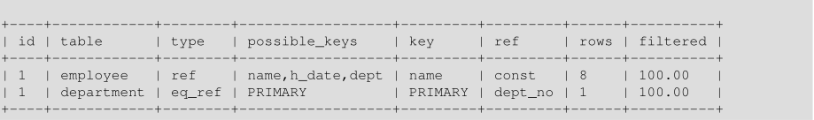
对于`employee`，`name`索引上的访问方法选取与名称`'John'`匹配的8行。 没有进行过滤（`filtered`是100％），因此所有行都是下一个表的前缀行：前缀行计数是`row`×`filtered`= 8×100％= 8。

通过条件筛选，优化器还考虑了来自`WHERE`子句的条件，而访问方法没有考虑这些条件。

在本例中，优化器使用启发式来估计`employee.hire_date`上的`BETWEEN`条件的过滤效果为16.31%。因此，`EXPLAIN`生成如下输出:


现在的前缀行数是`rows`×`filtered` = 8×16.31% = 1.3，更接近真实的数据集。

通常，优化器不会为最后一个连接的表计算条件过滤效果(减少前缀行数)，因为没有下一个表可以传递行。`EXPLAIN`出现异常:为了提供更多信息，计算了所有连接表(包括最后一个表)的过滤效果。

要控制优化器是否考虑其他过滤条件，请使用`optimizer_switch`系统变量的`condition_fanout_filter`标志。默认情况下启用此标志，但可以禁用此标志来抑制条件筛选(例如，如果发现某个特定查询在不使用该查询的情况下性能更好)。

如果优化器过高估计条件过滤的影响，则性能可能比不使用条件过滤时更差。 在这种情况下，这些技术可能有所帮助：

- 如果未对列建立索引，请对其进行索引，以便优化程序具有有关列值分布的一些信息，并可以改进其行估计值。

- 更改连接顺序。 完成此操作的方法包括连接顺序优化器提示，紧跟SELECT后的STRAIGHT_JOIN和STRAIGHT_JOIN连接运算符。

- 禁用会话条件筛选:
```mysql
SET optimizer_switch = 'condition_fanout_filter=off';
```

### 1.1.13 IS NULL优化

MySQL可以对`col_name IS NULL`执行相同的优化，它可以用于`col_name = constant_value`。 例如，MySQL可以使用索引和范围来搜索`NULL`和`IS NULL`。
```mysql
ELECT * FROM tbl_name WHERE key_col IS NULL;
SELECT * FROM tbl_name WHERE key_col <=> NULL;
SELECT * FROM tbl_name
WHERE key_col=const1 OR key_col=const2 OR key_col IS NULL;
```

如果WHERE子句包含声明为`NOT NULL`的列的`col_name IS NULL`条件，则该表达式将被优化掉。 在列的情况下不会发生此优化无论如何都可能产生`NULL`; 例如，如果它来自`LEFT JOIN`右侧的表。

MySQL还可以优化组合`col_name = expr OR col_name IS NULL`，这是一种在已解析的子查询中很常见的形式。 使用此优化时，`EXPLAIN`显示`ref_or_null`。

此优化可以为任何关键部分处理一个`IS NULL`。

一些优化查询的例子，假设表`t2`的`a`和`b`列上有一个索引:

```mysql
SELECT * FROM t1 WHERE t1.a=expr OR t1.a IS NULL;

SELECT * FROM t1, t2 WHERE t1.a=t2.a OR t2.a IS NULL;

SELECT * FROM t1, t2
WHERE (t1.a=t2.a OR t2.a IS NULL) AND t2.b=t1.b;

SELECT * FROM t1, t2
WHERE t1.a=t2.a AND (t2.b=t1.b OR t2.b IS NULL);

SELECT * FROM t1, t2
WHERE (t1.a=t2.a AND t2.a IS NULL AND ...)
OR (t1.a=t2.a AND t2.a IS NULL AND ...);
```
`ref_or_null`首先读取引用键，然后单独搜索具有`NULL`键值的行。

优化只能处理一个是`IS NULL`。在下面的查询中，MySQL只对表达式(`t1.a=t2 and t2.a IS NULL`)使用键查找，不能在`b`上使用`key part`:

```mysql
SELECT * FROM t1, t2
WHERE (t1.a=t2.a AND t2.a IS NULL)
OR (t1.b=t2.b AND t2.b IS NULL);
```


### 1.1.14 ORDER BY优化

本节描述MySQL何时可以使用索引来满足`ORDER BY`子句，何时不能使用索引时使用的`filesort`操作，以及优化器提供的关于`ORDER BY`的执行计划信息。

#### 1.1.14.1 使用索引来满足ORDER BY

在某些情况下，MySQL可能使用索引来满足`ORDER BY`子句，并避免执行`filesort`操作时涉及的额外排序。

即使`ORDER BY`与索引不完全匹配，也可以使用索引，只要索引的所有未使用部分和所有额外的`ORDER BY`列都是`WHERE`子句中的常量。如果索引不包含查询访问的所有列，则仅在索引访问比其他访问方法便宜时才使用索引。

假设有一个索引`(key_part1, key_part2)`，下面的查询可以使用该索引按部分解析顺序。优化器是否真的这样做取决于如果还必须读取索引中不包含的列，那么读取索引是否比表扫描更有效。

- 在此查询中，（key_part1，key_part2）上的索引使优化器能够避免排序：
```mysql
SELECT * FROM t1
ORDER BY key_part1, key_part2;
```
但是，查询使用`SELECT *`，它可以选择比`key_part1`和`key_part2`更多的列。在这种情况下，扫描整个索引并查找表行以找到不在索引中的列可能比扫描表并对结果排序要昂贵。如果是，优化器可能不会使用索引。如果`SELECT *`只选择索引列，则使用索引并避免排序。
如果`t1`是`InnoDB`表，则表主键隐式地是索引的一部分，并且索引可用于解析此查询的`ORDER BY`：
```mysql
SELECT pk, key_part1, key_part2 FROM t1
ORDER BY key_part1, key_part2;
```
- 在这个查询中，`key_part1`是常量，因此通过索引访问的所有行都是按`key_part2`顺序排列的，如果`WHERE`子句的选择性足够好，使得索引范围扫描比表扫描更便宜，则索引`(key_part1, key_part2)`上的索引将避免排序
```mysql
SELECT * FROM t1
WHERE key_part1 = constant
ORDER BY key_part2;
```
- 在接下来的两个查询中，是否使用索引与前面没有`DESC`的查询类似:
```mysql
SELECT * FROM t1
ORDER BY key_part1 DESC, key_part2 DESC;
SELECT * FROM t1
WHERE key_part1 = constant
ORDER BY key_part2 DESC;
```
- 在接下来的两个查询中，将`key_part1`与常量进行比较。如果`WHERE`子句具有足够的选择性，使得索引范围扫描比表扫描更便宜，则使用索引:
```mysql
SELECT * FROM t1
WHERE key_part1 > constant
ORDER BY key_part1 ASC;
SELECT * FROM t1
WHERE key_part1 < constant
ORDER BY key_part1 DESC;
```

- 在下一个查询中，`ORDER BY`没有命名`key_part1`，但是所有选中的行都有一个常量`key_part1`值，所以仍然可以使用索引:
```mysql
SELECT * FROM t1
WHERE key_part1 = constant1 AND key_part2 > constant2
ORDER BY key_part2;
```
在某些情况下，MySQL不能使用索引来解析`ORDER BY`，尽管它仍然可以使用索引来查找匹配`WHERE`子句的行。例子:

- 查询对不同的索引使用`ORDER BY`:
```mysql
SELECT * FROM t1 ORDER BY key1, key2;
```
- 查询对索引的非连续部分使用`ORDER BY`:
```mysql
SELECT * FROM t1 WHERE key2=constant ORDER BY key1_part1, key1_part3;
```

- 查询混合了`ASC`和`DESC`:
```mysql
SELECT * FROM t1 ORDER BY key_part1 DESC, key_part2 ASC;
```

用于获取行的索引与按以下顺序使用的索引不同:
```mysql
SELECT * FROM t1 WHERE key2=constant ORDER BY key1;
```
该查询使用`ORDER BY`，其表达式包含索引列名以外的术语：
```mysql
SELECT * FROM t1 ORDER BY ABS(key);
SELECT * FROM t1 ORDER BY -key;
```
- 查询连接了许多表，`ORDER BY`中的列并非全部来自用于检索行的第一个非常量表。 （这是`EXPLAIN`输出中第一个没有的表`const`连接类型。）
- 该查询具有不同的`ORDER BY`和`GROUP BY`表达式。
- 只有`ORDER BY`子句中指定的列的前缀有一个索引。 在这种情况下，索引不能用于完全解析排序顺序。 例如，如果仅索引`CHAR（20）`列的前`10`个字节，则索引无法区分超过第`10`个字节的值并且需要`filesort`。
- 索引不按顺序存储行。 例如，对于`MEMORY`表中的`HASH`索引，这是正确的。

用于排序的索引的可用性可能受到列别名的使用的影响。 假设列`t1.a`已编入索引。 在此语句中，选择列表中列的名称是`a`。 它指的是`t1.a`，与`ORDER BY`中对`a`的引用一样，因此可以使用`t1.a`上的索引：
```mysql
SELECT a FROM t1 ORDER BY a;
```

在此语句中，选择列表中列的名称也是`a`，但它是别名。 它指的是`ABS（a）`，与`ORDER BY`中的`a`的引用一样，因此不能使用`t1.a`上的索引：
```mysql
SELECT ABS(a) AS a FROM t1 ORDER BY a;
```

在以下语句中，`ORDER BY`引用的名称不是选择列表中列的名称。 但是在`t1`中有一列名为`a`，因此`ORDER BY`引用`t1.a`并且可以使用`t1.a`上的索引。 （当然，生成的排序顺序可能与`ABS（a）`的顺序完全不同。）
```mysql
SELECT ABS(a) AS b FROM t1 ORDER BY a;
```

默认情况下，MySQL对`GROUP BY col1，col2，...`查询进行排序，就好像您还在查询中包含`ORDER BY col1，col2，....`。如果包含一个包含相同列列表的显式`ORDER BY`子句，MySQL会对其进行优化，而不会影响速度，尽管排序仍然会发生。

如果查询包含`GROUP BY`，但希望避免对结果排序的开销，可以通过指定`ORDER BY NULL`来抑制排序。例如:
```mysql
INSERT INTO foo
SELECT a, COUNT(*) FROM bar GROUP BY a ORDER BY NULL;
```
优化器仍然可以选择使用排序来实现分组操作。`ORDER BY NULL`会抑制结果的排序，而不是通过分组操作来确定结果的排序。

---

注意：默认情况下，`GROUP BY`隐式排序(也就是说，在没有`ASC`或`DESC`指定符的情况下，`GROUP BY`列)。但是，不推荐依赖于隐式`GROUP BY`排序（即，在没有`ASC`或`DESC`指示符的情况下进行排序）或`GROUP BY`的显式排序（即，通过对`GROUP BY`列使用显式`ASC`或`DESC`指示符）。若要生成给定的排序顺序，请提供`ORDER BY`子句。

---

#### 1.1.14.2 使用filesort来满足ORDER BY

如果不能使用索引来满足`ORDER BY子`句，MySQL将执行`filesort`操作，读取表行并对其进行排序。`filesort`在查询执行中构成一个额外的排序阶段

要获取`filesort`操作的内存，优化器会预先分配固定数量的sort_buffer_size字节。 单个会话可以根据需要更改此变量的会话值，以避免过多的内存使用，或根据需要分配更多内存。

如果结果集太大而无法放入内存，则`filesort`操作会根据需要使用临时磁盘文件。 某些类型的查询特别适合于完全内存的文件存储操作。例如，优化器可以使用`filesort`在内存中有效地处理以下形式的查询（和子查询）的`ORDER BY`操作，而无需临时文件：
```mysql
ELECT ... FROM single_table ... ORDER BY non_index_column [DESC] LIMIT [M,]N;
```
这种查询在web应用程序中很常见，web应用程序只显示较大结果集中的几行。
例子:
```mysql
SELECT col1, ... FROM t1 ... ORDER BY name LIMIT 10;
SELECT col1, ... FROM t1 ... ORDER BY RAND() LIMIT 15;
```

#### 1.1.14.3 影响ORDER BY优化

对于未使用`filesort`的慢`ORDER BY`查询，请尝试将`max_length_for_sort_data`系统变量降低为适合触发`filesort`的值。 （将此变量的值设置得过高的症状是高磁盘活动和低磁盘活动的组合CPU活动。）

要提高`ORDER BY`速度，请检查是否可以让MySQL使用索引而不是额外的排序阶段。 如果无法做到这一点，请尝试以下策略：

- 增加`sort_buffer_size`变量值。 理想情况下，该值应足够大，以使整个结果集适合排序缓冲区（以避免写入磁盘和合并传递），但至少应该值必须足够大才能容纳15个元组。 （最多可以合并15个临时磁盘文件，并且每个文件至少有一个元组在内存中必须有空间。）

考虑到存储在排序缓冲区中的列值的大小受`max_sort_length`系统变量值的影响。例如，如果元组存储长字符串列的值，并且增加`max_sort_length`的值，排序缓冲区元组的大小也会增加，可能需要增加`sort_buffer_size`。对于作为字符串表达式的结果计算的列值(例如调用字符串值函数的列值)，`filesort`算法不能告诉表达式值的最大长度，因此必须为每个元组分配`max_sort_length`字节。

若要监视合并传递的数量(要合并临时文件)，请选中`Sort_merge_passes`状态变量。

- 增加read_rnd_buffer_size变量值，以便一次读取更多行。

- 将`tmpdir`系统变量更改为指向具有大量空闲空间的专用文件系统。变量值可以列出几种循环方式使用的路径;您可以使用此功能将负载分散到多个目录。用冒号分隔路径(`:`)在Unix上，分号字符(`;`)在Windows上。路径应该命名位于不同物理磁盘上的文件系统中的目录，而不是同一磁盘上的不同分区。


#### 1.1.14.4 ORDER BY执行计划可用信息

使用EXPLAIN，您可以检查MySQL是否可以使用索引来解析ORDER BY子句：

- 如果EXPLAIN output的额外列不包含Using filesort，则使用索引，而不执行filesort。
- 如果EXPLAIN output的额外列包含Using filesort，则不使用索引并执行filesort。

此外，如果执行了`filesort`，优化器跟踪输出将包含`filesort_summary`块。
例如: 
```json
"filesort_summary": {
"rows": 100,
"examined_rows": 100,
"number_of_tmp_files": 0,
"sort_buffer_size": 25192,
"sort_mode": "<sort_key, packed_additional_fields>"
}
```
`sort_mode`值提供了关于排序缓冲区中元组内容的信息:

`<sort_key，rowid>`：这表示排序缓冲区元组是包含原始表行的排序键值和行ID的对。 元组按排序键值排序，行ID用于从表中读取行。
`<sort_key，additional_fields>`：这表示排序缓冲区元组包含排序键值和查询引用的列。 元组按排序键值排序，列值直接从元组中读取。
`<sort_key，packed_additional_fields>`：与前一个变体类似，但是其他列紧密排列在一起，而不是使用固定长度编码。
`EXPLAIN`不区分优化器是否在内存中执行文件排序。 在优化器跟踪输出中可以看到内存中文件排序的使用。 查找`filesort_priority_queue_optimization`。


### 1.1.15 GROUP BY优化

满足`GROUP BY`子句的最常用方法是扫描整个表并创建一个新的临时表，其中每个组的所有行都是连续的，然后使用此临时表发现组并应用聚合函数（如果有的话）。 在某些情况下，MySQL能够做得更好，并通过使用索引访问来避免创建临时表。

为`GROUP BY`使用索引的最重要先决条件是，所有`GROUP BY`列都引用来自同一索引的属性，并且索引按顺序存储键(例如，对于`BTREE`索引是这样，但是对于`HASH`索引则不是这样)。是否可以用索引访问替换临时表还取决于在查询中使用索引的哪些部分、为这些部分指定的条件以及所选的聚合函数。

通过索引访问通过查询执行`GROUP BY`有两种方法，如下面的部分所详细介绍。第一个方法将分组操作与所有范围谓词(如果有的话)一起应用。第二种方法首先执行范围扫描，然后对生成的元组进行分组。

在MySQL中，`GROUP BY`用于排序，因此服务器也可以通过优化对分组应用`ORDER BY`。但是，不赞成通过排序依赖于隐式或显式`GROUP BY`。

#### 1.1.15.1 Loose Index (松散索引)扫描

处理`GROUP BY`的最有效方法是使用索引直接检索分组列。使用这种访问方法，MySQL使用一些索引类型的属性，这些索引类型的键是有序的(例如，`BTREE`)。此属性允许在索引中使用查找组，而不必考虑索引中满足所有`WHERE`条件的所有键。这种访问方法只考虑索引中键的一小部分，因此称为松散索引扫描。当没有`WHERE子`句时松散索引扫描读取的键数与组的数量相同，这可能比所有键的数量要小得多。
如果WHERE子句包含范围判断，松散索引扫描查找满足范围条件的每个组的第一个键，并再次读取尽可能少的键。这在下列条件下是可能的:

- 查询位于单个表之上。
- `GROUP BY`仅命名形成索引最左前缀而不包含其他列的列。（如果查询具有`DISTINCT`子句而不是`GROUP BY`，则所有不同的属性引用形成索引的最左前缀的列。）例如，如果表`t1`上有一个索引`(c1,c2,c3)`，松散索引扫描适用于按`c1`、`c2`分组的查询。如果查询的组为`c2`、`c3`(列不是最左边的前缀)或组为`c1`、`c2`、`c4` (`c4`不在索引中)，则不适用。
- select列表中使用的惟一聚合函数(如果有的话)是`MIN()`和`MAX()`，它们都引用同一列。列必须在索引中，并且必须立即跟随`GROUP BY`中的列。
- 索引的任何其他部分，除了在查询中引用的来自组的部分之外，都必须是常量(也就是说，它们必须以与常量相等的方式引用)，除了参数`MIN()`或`MAX()`函数。
- 对于索引中的列，必须索引全列值，而不仅仅是前缀。例如，对于`c1 VARCHAR(20)`、`INDEX (c1(10))`，索引只使用`c1`值的前缀，不能用于松散索引扫描。

如果松散索引扫描适用于查询，则`EXPLAIN`输出将在额外列中显示`Using index for group-by`。
假设表`t1(c1,c2,c3,c4)`上有一个索引`idx(c1,c2,c3,c3)`。松散索引扫描访问方法可用于以下查询:
```mysql
SELECT c1, c2 FROM t1 GROUP BY c1, c2;
SELECT DISTINCT c1, c2 FROM t1;
SELECT c1, MIN(c2) FROM t1 GROUP BY c1;
SELECT c1, c2 FROM t1 WHERE c1 < const GROUP BY c1, c2;
SELECT MAX(c3), MIN(c3), c1, c2 FROM t1 WHERE c2 > const GROUP BY c1, c2;
SELECT c2 FROM t1 WHERE c1 < const GROUP BY c1, c2;
SELECT c1, c2 FROM t1 WHERE c3 = const GROUP BY c1, c2;
```

以下查询无法使用此快速选择方法执行，原因如下:

- 除`MIN()`或`MAX()`外，还有其他聚合函数:
```mysql
SELECT c1, SUM(c2) FROM t1 GROUP BY c1;
```

- `GROUP BY`子句中的列不构成索引的最左前缀
```mysql
SELECT c1, c2 FROM t1 GROUP BY c2, c3;
```

- 查询引用了`GROUP BY`部分之后的键的一部分，并且与常量不相等：
```mysql
SELECT c1, c3 FROM t1 GROUP BY c1, c2;
```
查询是否包括`c3 = const`，可以使用松散索引扫描

松散索引扫描访问方法除了已经支持的`MIN()`和`MAX()`引用外，还可以应用于select列表中其他形式的聚合函数引用:

- 支持`AVG(DISTINCT)`、`SUM(DISTINCT)`和`COUNT(DISTINCT)`。`AVG(DISTINCT)`和`SUM(DISTINCT)`取一个参数。`COUNT(DISTINCT)`可以有多个列参数。
- 查询中必须没有`GROUP BY`或`DISTINCT`子句。
- 前面描述的松散索引扫描限制仍然适用。

假设表`t1(c1,c2,c3,c4)`上有一个索引`idx(c1,c2,c3,c3)`。松散索引扫描访问方法可用于以下查询:
```mysql
SELECT COUNT(DISTINCT c1), SUM(DISTINCT c1) FROM t1;
SELECT COUNT(DISTINCT c1, c2), COUNT(DISTINCT c2, c1) FROM t1;
```

#### 1.1.15.2 Tight Index (紧凑索引)扫描

根据查询条件，紧凑索引扫描可以是完整索引扫描，也可以是范围索引扫描。

不满足松散索引扫描的条件时，仍然可以避免为`GROUP BY`查询创建临时表。如果`WHERE`子句中有范围条件，则此方法只读取满足这些条件的键。否则，它执行索引扫描。因为这个方法读取`WHERE`子句定义的每个范围中的所有键，或者如果没有范围条件，则扫描整个索引，所以它被称为紧索引扫描。在紧密索引扫描中，只有在找到所有满足范围条件的键之后，才执行分组操作。

要使此方法有效，查询中的所有列都有一个常量相等条件就足够了，该条件指的是在`GROUP BY `key之前或之间的键的部分。相等条件中的常量填充搜索键中的任何“空白”，以便能够形成索引的完整前缀。然后可以使用这些索引前缀进行索引查找。如果该`GROUP BY`根据结果需要排序，并且可以形成索引前缀的搜索键，MySQL也避免了额外的排序操作，因为在有序索引中使用前缀搜索已经按顺序检索了所有键。


假设表`t1(c1,c2,c3,c4)`上有一个索引`idx(c1,c2,c3,c3)`。下面的查询不能使用前面描述的松散索引扫描访问方法，但仍然可以使用紧索引扫描访问方法。

- `GROUP BY`中存在间隙，但它由条件`c2 ='a'`覆盖：
```mysql
ELECT c1, c2, c3 FROM t1 WHERE c2 = 'a' GROUP BY c1, c3;
```

- `GROUP BY`并不以key的第一部分开始，但是有一个条件为该部分提供了一个常量:
```mysql
SELECT c1, c2, c3 FROM t1 WHERE c1 = 'a' GROUP BY c2, c3;
```


### 1.1.16 DISTINCT 优化

在许多情况下，`DISTINCT`与`ORDER BY`组合需要一个临时表

因为`DISTINCT`可以使用`GROUP BY`，所以了解MySQL如何使用不属于所选列的`ORDER BY`或`HAVING`子句中的列。


在大多数情况下，可以将独立子句视为`GROUP BY`的特殊情况。例如，以下两个查询是等价的:
```mysql
SELECT DISTINCT c1, c2, c3 FROM t1
WHERE c1 > const;
SELECT c1, c2, c3 FROM t1
WHERE c1 > const GROUP BY c1, c2, c3;
```

由于这种等价性，适用于`GROUP BY`查询的优化也可以应用于`DISTINCT`子句的查询。
当将`LIMIT row_count`和`DISTINCT`组合在一起时，MySQL会在找到`row_count`惟一行时立即停止。

如果您没有使用查询中命名的所有表中的列，MySQL将在找到第一个匹配项时停止扫描任何未使用的表。在下面的例子中，假设在`t2`之前使用了`t1`(你可以通过`EXPLAIN`来检查)，当MySQL找到`t2`中的第一行时，它将停止从`t2`读取(对于`t1`中的任何特定行):

```mysql
SELECT DISTINCT t1.a FROM t1, t2 where t1.a=t2.a;
```

### 1.1.17 限制查询(limit query)优化

如果只需要结果集中指定数量的行，那么在查询中使用`LIMIT`子句，而不是获取整个结果集并丢弃额外的数据。

MySQL有时会优化一个有`LIMIT row_count`子句和`no HAVING`子句的查询:

- 如果只选择几行通过`LIMIT`，MySQL在某些情况下会使用索引，而通常它更愿意执行全表扫描。

- 如果将`LIMIT row_count`和`ORDER BY`组合在一起，`MySQL`会在找到排序结果的第一行`row_count`后立即停止排序，而不是对整个结果进行排序。如果使用索引来完成排序，这将非常快。如果必须执行文件排序，则在找到第一个`row_count`之前，选择所有与查询匹配但没有`LIMIT`子句的行，并对其中大部分或所有行进行排序。找到初始行之后，`MySQL`不会对结果集的任何剩余部分进行排序。
这种行为的一种表现形式是，`ORDER BY`查询有和没有`LIMIT`都可以以不同的顺序返回行，如本节后面所述。

- 如果将`LIMIT row_count`与`DISTINCT`组合使用，MySQL会在找到`row_count`惟一行时立即停止。

- 在某些情况下，可以通过按顺序读取索引(或对索引进行排序)来解析`GROUP BY`，然后计算汇总，直到索引值发生更改。在本例中，`LIMIT row_count`不计算任何不必要的`GROUP BY`值。

- 一旦MySQL向客户机发送了所需的行数，它就会中止查询，除非您使用`SQL_CALC_FOUND_ROWS`。在这种情况下，可以使用`SELECT FOUND_ROWS ()`检索行数。

- `LIMIT 0`快速返回一个空集。这对于检查查询的有效性非常有用。它还可以用于在使用MySQL的应用程序中获取结果列的类型使结果集元数据可用的API。使用`mysql`客户机程序，您可以使用`--column-type-info`选项来显示结果列类型。

- 如果服务器使用临时表来解析查询，它将使用`LIMIT row_count`子句来计算需要多少空间。

- 如果`ORDER BY`不使用索引，但是还存在`LIMIT`子句，那么优化器可能可以避免使用合并文件，并使用内存中的`filesort`操作对内存中的行进行排序。

如果多行具有相同的按列`ORDER BY`的值，服务器可以自由地以任何顺序返回这些行，并且根据总体执行计划可能以不同的方式返回。换句话说，这些行的排序顺序对于无序列是不确定的。

影响执行计划的一个因素是`LIMIT`，因此使用和不使用`LIMIT`的`ORDER BY`查询可能会返回不同顺序的行。 考虑这个查询，它按类别列排序但是关于`id`和`rating`列的不确定性：

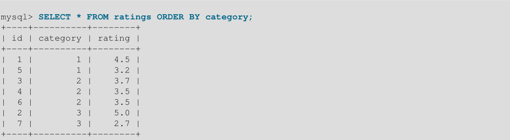

包含`LIMIT`可能会影响每个类别值中的行顺序。例如，这是一个有效的查询结果:

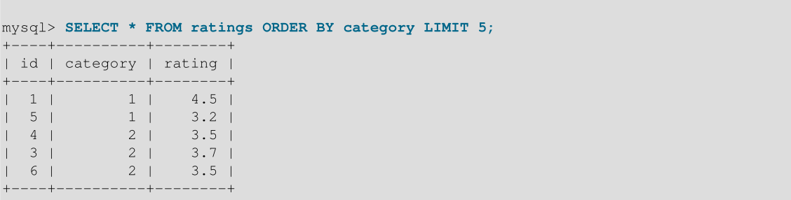

在每种情况下，行都按ORDER BY列进行排序，这是SQL标准所需的全部内容。

如果确保使用和不使用`LIMIT`的相同行顺序很重要，请在`ORDER BY`子句中包含其他列以使订单具有确定性。 例如，如果id值是唯一的，则可以通过如下排序使得给定`category`值的行以`id`顺序显示：

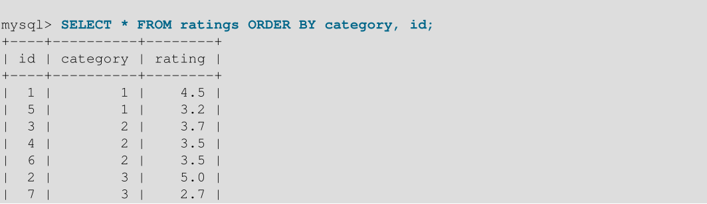
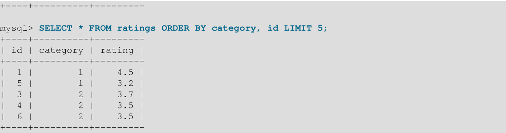

### 1.1.18 函数调用优化

MySQL函数在内部被标记为确定性或非确定性。如果一个函数的参数给定一个固定值，它可以为不同的调用返回不同的结果，那么这个函数就是不确定的。非确定性函数的例子:`RAND()`、`UUID()`。

如果一个函数被标记为不确定的，那么在`WHERE`子句中对它的引用将对每一行求值(从一个表中选择时)或行组合(从多个表连接中选择时)。

MySQL还决定何时根据参数类型计算函数，参数是表列还是常量值。当表列更改值时，必须计算以该列为参数的确定性函数。

非确定性函数可能会影响查询性能。例如，一些优化可能不可用，或者可能需要更多的锁定。下面的讨论使用`RAND()`，但也适用于其他非确定性函数。
假设一个表t有这样的定义:
```mysql
CREATE TABLE t (id INT NOT NULL PRIMARY KEY, col_a VARCHAR(100));
```
考虑这两个查询:
```mysql
SELECT * FROM t WHERE id = POW(1,2);
SELECT * FROM t WHERE id = FLOOR(1 + RAND() * 49);
```
这两个查询似乎都使用了主键查找，因为对主键进行了相等性比较，但这只适用于第一个查询:

- 第一个查询总是生成最多一行，因为带有常量参数的`POW()`是一个常量值，用于索引查找。
- 第二个查询包含一个使用非确定性函数`RAND（）`的表达式，该函数在查询中不是常量，但实际上对于表t的每一行都有一个新值。 所以，查询读取表的每一行，基于每一行去计算( evaluates the predicate for each row)，并输出主键与随机值匹配的所有行。 这可能是零行，一行或多行，取决于`id`列值和`RAND（）`序列中的值。
- 非决定论的影响并不局限于`SELECT`语句。这个`UPDATE`语句使用一个不确定函数来选择要修改的行:
```mysql
UPDATE t SET col_a = some_expr WHERE id = FLOOR(1 + RAND() * 49);
```
假定其意图是最多更新主键与表达式匹配的一行。但是，根据`id`列值和`RAND()`序列中的值，它可能更新0、1或多个行。

刚才描述的行为对性能和复制有影响:

- 由于不确定函数不产生常量，优化器不能使用其他可能适用的策略，比如索引查找。结果可能是表扫描。
- `InnoDB`可能会升级为一个范围键锁，而不是为一个匹配的行获取一个行锁。
- 不能确定执行的更新对于复制是不安全的。

困难的根源在于，`RAND()`函数对表的每一行求一次值。为了避免多重功能评估，请使用以下技术之一:

- 将包含不确定函数的表达式移动到单独的语句中，将值保存在变量中。在原始语句中，将表达式替换为对变量的引用，优化器可以将该变量视为常量:
```mysql
SET @keyval = FLOOR(1 + RAND() * 49);
UPDATE t SET col_a = some_expr WHERE id = @keyval;
```
- 将随机值赋给派生表中的变量。这种技术使变量在`WHERE`子句的比较中使用之前，被赋值一次:
```mysql
SET optimizer_switch = 'derived_merge=off';
UPDATE t, (SELECT @keyval := FLOOR(1 + RAND() * 49)) AS dt
SET col_a = some_expr WHERE id = @keyval;
```
如前所述，`WHERE`子句中的非确定性表达式可能会阻止优化并导致表扫描。但是，如果其他表达式是确定的，则可以部分优化`WHERE`子句。例如:

```mysql
SELECT * FROM t WHERE partial_key=5 AND some_column=RAND();
```

如果优化器可以使用partial_key来减少所选择的行集，那么RAND()的执行次数就会减少，从而减少了非确定性对优化的影响。


### 1.1.19 行构造函数表达式优化

行构造函数允许同时比较多个值。例如，这两个语句在语义上是等价的:
```mysql
SELECT * FROM t1 WHERE (column1,column2) = (1,1);
SELECT * FROM t1 WHERE column1 = 1 AND column2 = 1;
```
此外，优化器以相同的方式处理这两个表达式。

如果行构造函数列没有覆盖索引的前缀，优化器不太可能使用可用索引。考虑下表，它有一个主键`(c1, c2, c3)`:
```mysql
CREATE TABLE t1 (
c1 INT, c2 INT, c3 INT, c4 CHAR(100),
PRIMARY KEY(c1,c2,c3)
);
```
在这个查询中，`WHERE`子句使用索引中的所有列。但是，行构造函数本身不包含索引前缀，因此优化器只使用`c1` (`key_len=4`, `c1`的大小):

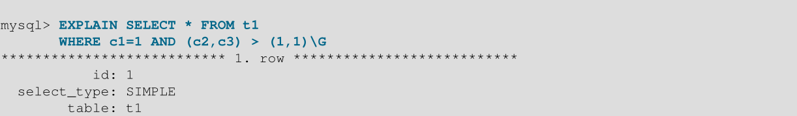
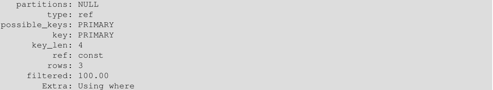

在这种情况下，使用等效的非构造函数表达式重写行构造函数表达式可能会导致更完整的索引使用。对于给定的查询，行构造函数和等价的非构造函数表达式为:

```mysql
(c2,c3) > (1,1)
c2 > 1 OR ((c2 = 1) AND (c3 > 1))
```
重写查询以使用非构造函数表达式会导致优化器使用索引中的所有三列(`key_len=12`):

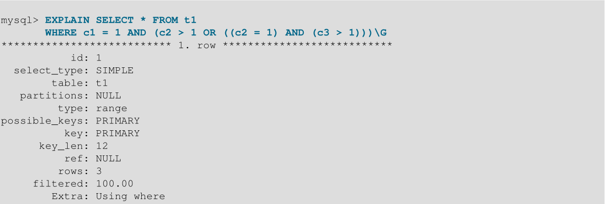

因此，为了获得更好的结果，请避免将行构造函数与`AND`/`OR`表达式混合。使用其中一个。
在某些条件下，优化器可以将范围访问方法应用于具有行构造函数参数的`IN()`表达式。


### 1.1.20 避免全表扫描

当MySQL使用全表扫描去处理一个查询的时候，在`EXPLAIN`输出显示的`type`列上显示为`ALL`。这种情况通常发生在下列情况下:

- 表非常小，执行表扫描比进行键查找要快。对于少于10行且行长度较短的表，这是很常见的。
- 对于索引列，`ON`或`WHERE`子句中没有可用的限制。
- 您将索引列与常量值进行比较，MySQL已经计算出(基于索引树)常量覆盖了表中太大的一部分，表扫描会更快。
- 您正在通过另一列使用基数较低的键(许多行匹配键值)。在本例中，MySQL假设通过使用键，它可能会执行许多键查找，并且表扫描会更快。

对于小表，表扫描通常是合适的，性能影响可以忽略不计。对于大型表，请尝试以下技术，以避免优化器错误地选择表扫描:

- 使用`ANALYZE TABLE tbl_name`更新已扫描表的密钥分布。
- 对被扫描的表使用`FORCE INDEX`来告诉MySQL，与使用给定索引相比，表扫描非常昂贵:

```mysql
SELECT * FROM t1, t2 FORCE INDEX (index_for_column)
WHERE t1.col_name=t2.col_name;
```

使用`--max-seeking-for-key = 1000`选项启动`mysqld`或使用`SET max_seeks_for_key = 1000`告诉优化器假设没有密钥扫描导致超过`1,000`次密钥搜索。

## 1.2  Optimizing Subqueries, Derived Tables, and View References

...

## 1.3 优化INFORMATION_SCHEMA查询

...

## 1.4 优化数据更改语句(Optimizing Data Change Statements)

本节解释如何加快数据更改语句的速度:`INSERT`, `UPDATE`, and `DELETE`。传统OLTP应用程序和现代web应用程序通常执行许多小型数据更改操作，其中并发性非常重要。数据分析和报告应用程序通常会同时运行影响多行的数据更改操作，其中主要考虑因素是I/O写入大量数据并使索引保持最新。对于插入和更新大量数据（在行业中称为 ETL，即 “extract-transform-load”），有时您使用其他SQL语句或外部命令来模仿`INSERT`，`UPDATE`和`DELETE`语句的影响。

### 1.4.1 优化INSERT语句

要优化插入速度，可以将许多小操作合并到一个大操作中。理想情况下，您可以建立一个连接，一次发送许多新行的数据，并将所有索引更新和一致性检查延迟到最后。

插入一行所需的时间由以下因素决定，其中数字表示大致的比例:

- 连接:(3)
- 发送查询到服务器:(2)
- 解析查询:(2)
- 插入行:(1 × size of row)
- 插入索引:(1 × number of indexes)
- 关闭:(1)

这没有考虑打开表的初始开销，每个并发运行的查询只需要打开一次表。

假设是B-tree索引，表的大小会以对数N为单位减慢索引的插入。（此处翻译的可能差距较大）

您可以使用以下方法来加速插入:

- 如果要同时插入来自同一客户机的多行，请使用具有多个`VALUES`列表的`INSERT`语句一次插入多行。这比使用单独的单行`INSERT`语句快得多(在某些情况下快很多倍)。如果要向非空表添加数据，可以调优`bulk_insert_buffer_size`变量，使数据插入更快。

- 从文本文件加载表时，请使用`LOAD DATA`。 这通常比使用`INSERT`语句快20倍。

- 利用列具有默认值这一事实。只有当要插入的值与默认值不同时，才显式地插入值。这减少了MySQL必须进行的解析，并提高了插入速度。

### 1.4.2 优化UPDATE语句

update语句就像`SELECT`查询一样进行优化，但是会增加写操作的开销。写操作的速度取决于更新的数据量和更新的索引数量。没有更改的索引不会得到更新。

获得快速更新的另一种方法是延迟更新，然后在一行中执行许多更新。如果锁定表，同时执行多个更新要比一次执行一个更新快得多。

对于使用动态行格式的`MyISAM`表，将行更新为更长的总长度可能会分割行。如果您经常这样做，那么偶尔使用` OPTIMIZE TABLE`是非常重要的。


### 1.4.2 优化DELETE语句

删除`MyISAM`表中的单个行所需的时间与索引的数量成正比。要更快地删除行，可以通过增加`key_buffer_size`系统变量来增加键缓存的大小。

要从`MyISAM`表中删除所有行，`TRUNCATE TABLE tbl_name`比`DELETE FROM tbl_name`更快。 截断操作不是事务安全的; 在活动事务或活动表锁定过程中尝试一个错误时发生错误。


## 1.5 优化数据库权限

您的权限设置越复杂，所有SQL语句的开销就越大。 简化`GRANT`语句建立的权限使MySQL能够在客户端执行语句时减少权限检查开销。例如，如果您不授予任何表级或列级权限，则服务器无需检查`tables_priv`和`columns_priv`表的内容。同样，如果您对任何帐户都没有资源限制，则服务器不必执行资源计数。如果您的语句处理负载非常高，请考虑使用简化的`grant`结构来减少权限检查开销。


## 1.6 其他的优化技巧

本节列出了一些提高查询处理速度的杂项技巧:

- 如果您的应用程序发出多个数据库请求来执行相关的更新，那么将这些语句组合到一个存储的例程中可以帮助提高性能。类似地，如果应用程序基于多个列值或大量数据计算单个结果，那么将计算组合成UDF(用户定义函数)可以提高性能。由此产生的快速数据库操作可以被其他查询、应用程序甚至用不同编程语言编写的代码重用。

- 要解决`ARCHIVE`表发生的任何压缩问题，请使用`OPTIMIZE TABLE`。

- 如果可能，将报告分类为“live”或“statistical”，其中统计报告所需的数据仅从定期从实时数据生成的汇总表中创建。

- 如果您的数据不符合行列表结构，则可以将数据打包并存储到`BLOB`列中。 在这种情况下，您必须在应用程序中提供要打包的代码解压缩信息，但这可能会节省I/O操作以读取和写入相关值集。

- 对于Web服务器，将图像和其他二进制资产存储为文件，路径名存储在数据库中，而不是文件本身。大多数Web服务器在缓存文件方面比数据库内容更好，因此使用文件通常更快。 （尽管在这种情况下您必须自己处理备份和存储问题。）

- 如果您需要非常高的速度，请查看 low-level MySQL接口。 例如，通过直接访问MySQL `InnoDB`或`MyISAM`存储引擎，与使用SQL接口相比，可以大幅提高速度。

- 复制可以为某些操作提供性能优势。 您可以在复制服务器之间分发客户端检索以分割负载。 为避免在进行备份时减慢主服务器的速度，可以使用从服务器进行备份。


