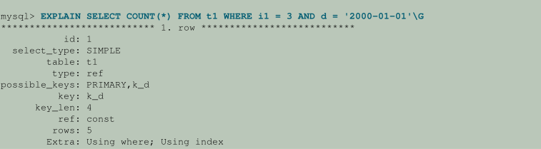

# 索引优化

提高`SELECT`操作性能的最佳方法是在查询中测试的一个或多个列上创建索引。索引条目的作用类似于表行的指针，允许查询快速确定哪些行与`WHERE`子句中的条件匹配，并检索这些行的其他列值。 可以索引所有MySQL数据类型。

尽管为查询中使用的每一列创建索引很有吸引力，但是不必要的索引会浪费MySQL确定使用哪些索引的空间和时间。索引还会增加插入、更新和删除的成本，因为必须更新每个索引。您必须找到正确的平衡，才能使用最优索引集实现快速查询

## 2.1 MySQL如何使用索引

索引用于快速查找具有特定列值的行。如果没有索引，MySQL必须从第一行开始，然后遍历整个表来找到相关的行。表越大，花费越多。如果表中有相关列的索引，MySQL可以快速确定要查找的位置，而不需要查看所有数据。这比按顺序读取每一行要快得多。

大多数MySQL索引(`PRIMARY KEY`, `UNIQUE`, `INDEX`, 和 `FULLTEXT`)都存储在`B-trees`中。例外：`空间数据类型`的索引使用 `R-trees`; `MEMORY`表也支持`hash indexes`; `InnoDB`对`FULLTEXT`索引使用 `inverted lists`。

一般来说，索引的使用方法如下所述。

MySQL使用索引进行这些操作：

- 快速查找匹配WHERE子句的行。
- 消除行的考虑。 如果在多个索引之间有选择，MySQL通常使用找到最小行数（最具选择性的索引）的索引。
- 如果表具有多列索引，优化器可以使用索引的任何最左前缀来查找行。例如，如果您对`(col1, col2, col3)`有一个三列索引，那么您就可以对`(col1)`、`(col1, col2)`和`(col1, col2, col3)`有索引搜索功能。
- 在执行联接时从其他表检索行。如果将列声明为相同的类型和大小，MySQL可以更有效地使用列上的索引。在这个上下文中，如果`VARCHAR`和`CHAR`被声明为相同的大小，那么它们就被认为是相同的。例如，`VARCHAR(10)`和`CHAR(10)`大小相同，但是`VARCHAR(10)`和`CHAR(15)`大小不同。

对于非二进制字符串列之间的比较，两列应该使用相同的字符集。例如，将`utf8`列与`latin1`列进行比较，就不能使用索引。

如果在不进行转换的情况下不能直接比较值，那么比较不同的列(例如，将字符串列与时态列或数字列进行比较)可能会阻止使用索引。对于数值列中的给定值(如`1`)，它可能与字符串列中的任意数量的值(如`'1'`、`'1'`、`'00001'`或`'01.e1'`)进行比较。这排除了对字符串列使用任何索引。

- 查找特定索引列`key_col`的`MIN()`或`MAX()`值。是由预处理程序优化的，它检查您是否对索引中`key_col`之前的所有关键部分使用`WHERE key_part_N = constant`。在本例中，MySQL为每个键执行一个键查找表达式，并用常量替换它。如果所有表达式都替换为常量，查询将立即返回。例如:

```mysql
SELECT MIN(key_part2),MAX(key_part2)
FROM tbl_name WHERE key_part1=10;
```

- 对表进行排序或分组，如果排序或分组是在可用索引的最左前缀上完成的(例如，按`key_part1`、`key_part2`排序)。如果所有关键部件后面都跟着`DESC`，则按相反的顺序读取键。

- 在某些情况下，可以优化查询来检索值，而不需要查询数据行。(为查询提供所有必要结果的索引称为覆盖索引。)如果查询只从表中使用某些索引中包含的列，则可以从索引树中检索所选的值，以获得更快的速度:
  
```mysql
SELECT key_part3 FROM tbl_name
WHERE key_part1=1
```

索引对于小表或报表查询处理大部分或所有行的大表上的查询不那么重要。当查询需要访问大多数行时，按顺序读取要比遍历索引快。顺序读取最小化磁盘查找，即使查询不需要所有行。


### 2.1.1 Primary Key优化

表的主键表示在最重要的查询中使用的列或列集。它有一个关联索引，用于快速查询性能。`NOT NULL`优化提高了查询性能，因为它不能包含任何`NULL`值。使用`InnoDB`存储引擎，表数据被物理组织起来，可以根据主键列或多个列进行超高速查找和排序。

如果您的表很大很重要，但是没有一个明显的列或一组列可以用作主键，那么您可以创建一个单独的列，其中包含自动递增的值作为主键。当使用外键连接表时，这些惟一IDS可以作为指向其他表中相应行的指针。

### 2.1.2 Foreign Key优化

如果一个表有很多列,你查询列的许多不同的组合,这可能是有效较少用到的数据分割成独立的表有几列,和与他们回到主表表从主复制数字ID列。这样，每个小表都可以有一个主键来快速查找其数据，并且可以使用join操作查询所需的一组列。根据数据的分布方式，查询可能会执行较少的I / O并占用较少的高速缓存，因为相关列在磁盘上打包在一起。(为了最大化性能，查询尝试从磁盘读取尽可能少的数据块;只有几列的表可以在每个数据块中容纳更多的行。)

### 2.1.3 列索引(Column Indexes)

最常见的索引类型涉及单个列，将该列中的值的副本存储在数据结构中，允许快速查找具有相应列值的行。

B-tree数据结构允许索引在`WHERE`子句中快速找到一个特定的值、一组值或一组值，这些值对应于`=`、`>`、`≤`、`BETWEEN`、`IN`等操作符。

每个表的最大索引数和最大索引长度是由每个存储引擎定义的。所有存储引擎都支持每个表至少16个索引和至少256字节的索引长度。大多数存储引擎都有更高的限制。

#### 2.1.3.1 索引前缀(Index Prefixes)

在字符串列的索引规范中使用`col_name(N)`语法，可以创建只使用列的前`N`个字符的索引。以这种方式只索引列值的前缀可以使索引文件小得多。为`BLOB`或`TEXT`列建立索引时，必须为索引指定前缀长度。例如:

```mysql
CREATE TABLE test (blob_col BLOB, INDEX(blob_col(10)));
```

前缀可以长达1000字节(对于`InnoDB`表，除非设置了`innodb_large_prefix`集，否则为767字节)。

`注意：`
前缀限制以字节为单位，而`CREATE TABLE`，`ALTER TABLE`和`CREATE INDEX`语句中的前缀长度被解释为非二进制字符串类型（`CHAR`，`VARCHAR`，`TEXT`）的字符数和二进制字符串类型的字节数（`BINARY`， `VARBINARY`，`BLOB`）。在为使用多字节字符集的非二进制字符串列指定前缀长度时，请考虑这一点。

---
如果搜索项超过索引前缀长度，则使用索引排除不匹配的行，并检查其余行是否匹配。

#### 2.1.3.2 全文索引(FULLTEXT Indexes)

全文索引用于`FULLTEXT`。只有`InnoDB`和`MyISAM`存储引擎支持`FULLTEXT`，而且只支持`CHAR`、`VARCHAR`和`TEXT`列。索引总是在整个列上执行，不支持列前缀索引。

优化应用于针对单个`InnoDB`表的某些类型的`FULLTEXT`查询。具有这些特征的查询特别有效:

- 只返回文档ID或文档ID和搜索级别的`FULLTEXT`查询。
- `FULLTEXT`按分数降序对匹配行进行排序，并应用`LIMIT`子句获取匹配行的前N行。要应用这种优化，必须没有`WHERE`子句，并且只有一个降序的`ORDER BY`子句。
- `FULLTEXT`查询仅检索与搜索词匹配的行的`COUNT(*)`值，而没有其他`WHERE`子句。 将WHERE子句编码为`WHERE MATCH(text) AGAINST ('other_text')`，不带任何`> 0`比较运算符。

对于包含全文表达式的查询，MySQL在查询执行的优化阶段计算这些表达式。优化器不只是查看全文表达式并进行估计，它实际上是在开发执行计划的过程中评估它们。

这种行为的一个含义是，`EXPLAIN` for全文查询通常比非全文查询慢，后者在优化阶段没有对表达式求值。

由于优化期间发生匹配，全文查询的`EXPLAIN`可能会在`Extra`列中显示`Select tables optimized away`; 在这种情况下，在以后的执行期间不需要访问表。


#### 2.1.3.3 空间索引(Spatial Indexes)

您可以在空间数据类型上创建索引。`MyISAM`和`InnoDB`支持空间类型的`R-tree`索引。其他存储引擎使用b树对空间类型进行索引(`ARCHIVE`除外，存档不支持空间类型索引)。

#### 2.1.3.4 内存存储引擎中的索引(Indexes in the MEMORY Storage Engine)

`MEMORY`存储引擎默认使用`HASH`索引，但也支持`BTREE`索引。

### 2.1.4 多列索引(Multiple-Column Indexes)

MySQL可以创建复合索引(即多个列上的索引)。索引最多可以由16列组成。对于某些数据类型，可以索引列的前缀。

MySQL可以对测试索引中所有列的查询使用多列索引，或者只测试第一列，前两列，前三列等的查询。 如果你指定在索引定义中以正确顺序排列的列，单个复合索引可以加速同一个表上的几种查询。

多列索引可以看作是一个排序数组，其中的行包含通过连接索引列的值创建的值。

注意：作为复合索引的替代方法，可以引入一个列“hashed”基于来自其他列的信息。如果这个列很短，并且有索引，那么它可能比许多列上的“wide”索引更快。在MySQL中，很容易使用这个额外的列:

```mysql
SELECT * FROM tbl_name
WHERE hash_col=MD5(CONCAT(val1,val2))
AND col1=val1 AND col2=val2;
```

假设一个表具有以下规范:

```mysql
CREATE TABLE test (
id INT NOT NULL,
last_name CHAR(30) NOT NULL,
first_name CHAR(30) NOT NULL,
PRIMARY KEY (id),
INDEX name (last_name,first_name)
);
```

`name`索引是`last_name`和`first_name`列上的索引。索引可用于查询中的查找，这些查询为`last_name`和`first_name`值的组合指定一个已知范围内的值。它还可以用于只指定`last_name`值的查询，因为该列是索引的最左前缀(如本节后面所述)。因此，`name`索引用于在以下查询中查找:

```mysql
SELECT * FROM test WHERE last_name='Widenius';

SELECT * FROM test
WHERE last_name='Widenius' AND first_name='Michael';

SELECT * FROM test
WHERE last_name='Widenius'
AND (first_name='Michael' OR first_name='Monty');

SELECT * FROM test
WHERE last_name='Widenius'
AND first_name >='M' AND first_name < 'N';

```

但是，`name`索引不用于以下查询的查找:

```mysql
SELECT * FROM test WHERE first_name='Michael';

SELECT * FROM test
WHERE last_name='Widenius' OR first_name='Michael';

```

假设您发出以下SELECT语句:

```mysql
SELECT * FROM tbl_name
WHERE col1=val1 AND col2=val2;
```

如果`col1`和`col2`上存在多列索引，则可以直接获取适当的行。如果`col1`和`col2`上存在单独的单列索引，则优化程序会尝试使用索引合并优化，或尝试通过确定哪个索引排除更多行并使用该索引来获取行来查找限制性最强的索引。

如果表具有多列索引，优化器可以使用索引的任何最左前缀来查找行。例如，如果您对`(col1, col2, col3)`有一个三列索引，那么您就可以对`(col1)`、`(col1, col2)`和`(col1, col2, col3)`有索引搜索功能。

如果列不构成索引的最左前缀，MySQL就不能使用索引执行查找。假设您有如下所示的`SELECT`语句:

```mysql
SELECT * FROM tbl_name WHERE col1=val1;
SELECT * FROM tbl_name WHERE col1=val1 AND col2=val2;

SELECT * FROM tbl_name WHERE col2=val2;
SELECT * FROM tbl_name WHERE col2=val2 AND col3=val3;

```

如果索引存在于`(col1、col2、col3)`上，则只有前两个查询使用该索引。第三和第四个查询确实涉及索引列，但不使用索引执行查找，因为`(col2)`和`(col2, col3)`不是`(col1, col2, col3)`的最左前缀。


### 2.1.5 验证索引使用(Verifying Index Usage)

始终检查所有查询是否真正使用了在表中创建的索引。

后续章节`EXPLAIN`详细解答。

### 2.1.6 InnoDB和MyISAM索引统计数据收集(InnoDB and MyISAM Index Statistics Collection)

存储引擎收集关于表的统计信息，以便优化器使用。表统计信息基于值组，其中值组是一组具有相同键前缀值的行。出于优化的目的，一个重要的统计数据是平均值组大小。

MySQL使用平均组大小的方法如下:

- 要估计每个ref访问必须读取多少行
- 估计部分连接将产生多少行;也就是说，该表单的操作将产生的行数:

```mysql
(...) JOIN tbl_name ON tbl_name.key = expr
```

作为索引值组的平均尺寸的增加,该指数不太有用的两个目的因为每个查询的平均行数增加:指数有利于优化的目的,最好是每个索引价值目标表中的行数。当给定的索引值产生大量行时，索引的用处就会降低，MySQL也不太可能使用它。

平均值组大小与表基数有关，表基数是值组的数量。`SHOW INDEX`语句根据`N/S`显示基数值，其中`N`是表中的行数，`S`是平均值组大小。这个比率在表中产生了大约数量的值组。

对于基于`<=>`比较运算符的连接，`NULL`与任何其他值都没有区别:`NULL <=> NULL`，就像`N <=> N`对于任何其他N一样。

但是，对于基于`=`操作符的连接，`NULL`不同于non-`NULL`值:当`expr1`或`expr2`(或两者都为`NULL`)为空时，`expr1 = expr2`不为真。这将影响用于比较表单`tbl_name`的`ref`访问。`key = expr`:如果`expr`的当前值为`NULL`, MySQL将不访问该表，因为比较不能为真。

对于`=` 比较，表中有多少空值并不重要。出于优化目的，相关值是non-`NULL`组的平均大小。然而，MySQL目前不支持收集或使用平均大小。

对于`InnoDB`和`MyISAM`表，您可以通过`innodb_stats_method`和`myisam_stats_method`系统变量控制表统计信息的收集。这些变量有三个可能的值，它们的区别如下:

- 当变量被设置为`nulls_equal`时，所有`NULL`值都被视为相同的(也就是说，它们都形成一个值组)。
如果`NULL`组大小远高于平均non-`NULL`组大小，则此方法将使平均值组大小向上倾斜。在优化器看来，这使得索引对于查找non-`NULL`的连接来说没有实际的用处。因此，`nulls_equal`方法可能会导致优化器在应该使用索引访问`ref`时不使用索引。

- 当变量被设置为 `nulls_unequal`, `NULL`值不会被认为是相同的。相反，每个`NULL`值形成一个大小为1的单独值组。
如果有许多`NULL`值，则此方法将平均值组大小向下倾斜。如果平均non-`NULL`组大小很大，将每个`NULL`值计算为大小为1的组会导致优化器高估查找non-`NULL`值的连接的索引的值。因此，`nulls_equals`方法可能会导致优化器在其他方法可能更好的情况下使用该索引进行`ref`查找。

- 当变量被设置为`nulls_ignore`时，`NULL`值将被忽略。

如果您倾向于使用许多使用`<=>`而不是`=`的联接，`NULL`值在比较中并不特殊，一个`NULL`等于另一个。在这种情况下，`nulls_equal`是适当的统计方法。

`innodb_stats_method`系统变量有一个全局值;`myisam_stats_method`系统变量同时具有全局值和会话值。设置全局值会影响从对应存储引擎收集表的统计信息。设置会话值仅影响当前客户端连接的统计信息收集。 这意味着您可以通过设置`myisam_stats_method`的会话值来强制使用给定方法重新生成表的统计信息，而不会影响其他客户端。

要重新生成MyISAM表统计信息，可以使用以下任何一种方法:

- 执行 ` myisamchk --stats_method=method_name --analyze`
- 更改表以使其统计信息过期（例如，插入行然后将其删除），然后设置myisam_stats_method`并发出`ANALYZE TABLE`语句

关于`innodb_stats_method`和`myisam_stats_method`的一些注意事项:

- 前所述，您可以强制显式地收集表统计信息。不过，MySQL也可以自动收集统计数据。例如，如果在执行表语句的过程中，其中一些语句修改了表，MySQL可能会收集统计信息。(例如，对于批量插入或删除，或某些`ALTER TABLE`语句，可能会发生这种情况。)如果发生这种情况，则使用`innodb_stats_method`或`myisam_stats_method`当时的值来收集统计信息。因此，如果使用一种方法收集统计信息，但是在稍后自动收集表的统计信息时将系统变量设置为另一种方法，则将使用另一种方法。

- 无法确定使用哪种方法为给定表生成统计信息。

- 这些变量只适用于`InnoDB`和`MyISAM`表。其他存储引擎只有一种收集表统计信息的方法。通常它更接近于`nulls_equal`方法。


### 2.1.7 比较B-Tree和Hash Indexes(Comparison of B-Tree and Hash Indexes)

理解B-Tree和Hash数据结构可以帮助预测在索引中使用这些数据结构的不同存储引擎上执行不同查询的方式，特别是对于允许选择B-Tree或Hash Indexes的内存存储引擎。

#### 2.1.7.1 B-Tree索引特征

B-Tree索引可用于使用`=`，`>`，`>` `=`，`<`，`<=`或`BETWEEN`运算符的表达式中的列比较。 如果`LIKE`的参数是不以通配符开头的常量字符串，则索引也可用于`LIKE`比较。 例如，以下`SELECT`语句使用索引：

```mysql
SELECT * FROM tbl_name WHERE key_col LIKE 'Patrick%';
SELECT * FROM tbl_name WHERE key_col LIKE 'Pat%_ck%';
```

在第一个语句中，只考虑具有`'Patrick' <= key_col < 'Patricl'`的行。在第二个语句中，只考虑具有`'Pat' <= key_col < 'Pau'`的行。

以下SELECT语句不使用索引:

```mysql
SELECT * FROM tbl_name WHERE key_col LIKE '%Patrick%';
SELECT * FROM tbl_name WHERE key_col LIKE other_col;
```

在第一个语句中，`LIKE`值以通配符开头。 在第二个语句中，`LIKE`值不是常量。

如果您使用`... LIKE'％string％'`和`string`超过三个字符，MySQL使用Turbo Boyer-Moore算法初始化字符串的模式，然后使用此模式更快地执行搜索。

如果索引了`col_name`，那么使用`col_name`的搜索将使用索引。

不跨越`WHERE`子句中所有`AND`级别的任何索引不用于优化查询。 换句话说，为了能够使用索引，必须在每个`AND`组中使用索引的前缀。

以下WHERE子句使用索引:

```mysql
... WHERE index_part1=1 AND index_part2=2 AND other_column=3

/* index = 1 OR index = 2 */
... WHERE index=1 OR A=10 AND index=2

/* optimized like "index_part1='hello'" */
... WHERE index_part1='hello' AND index_part3=5

/* Can use index on index1 but not on index2 or index3 */
... WHERE index1=1 AND index2=2 OR index1=3 AND index3=3;
```

这些WHERE子句不使用索引:

```mysql
/* index_part1 is not used */
... WHERE index_part2=1 AND index_part3=2

/* Index is not used in both parts of the WHERE clause */
... WHERE index=1 OR A=10

/* No index spans all rows */
... WHERE index_part1=1 OR index_part2=10
```

有时候MySQL不使用索引，即使索引是可用的。出现这种情况的一种情况是，优化器估计使用索引将需要MySQL访问表中很大比例的行。(在这种情况下，表扫描可能要快得多，因为它需要更少的查找。)但是，如果这样的查询使用`LIMIT`只检索一些行，MySQL无论如何都会使用索引，因为它可以更快地找到要返回的几行。

#### 2.1.7.2 Hash Index索引特征

哈希索引有一些不同于刚才讨论的特性:

- 它们只用于使用`=`或`<=>`操作符的相等比较(但是非常快)。它们不用于查找值范围的<之类的比较操作符。依赖于这种单值查找类型的系统称为“键-值存储”;要将MySQL用于此类应用程序，请尽可能使用散列索引。

- 优化器无法使用哈希索引来加速ORDER BY操作。 （此类索引不能用于按顺序搜索下一个条目。）

- MySQL无法确定两个值之间大约有多少行（范围优化器使用它来决定使用哪个索引）。 如果您更改一个`MyISAM`或`InnoDB`表到哈希索引的`MEMORY`表，这可能会影响某些查询。
  
- 只能使用整个键来搜索一行。(使用`B-tree`索引，键的任何最左前缀都可以用来查找行。)


### 2.1.8 索引扩展的使用(Use of Index Extensions)

innoDB通过附加主键列自动扩展每个辅助索引。考虑这个表的定义:

```mysql
CREATE TABLE t1 (
i1 INT NOT NULL DEFAULT 0,
i2 INT NOT NULL DEFAULT 0,
d DATE DEFAULT NULL,
PRIMARY KEY (i1, i2),
INDEX k_d (d)
) ENGINE = InnoDB;
```

该表定义列`(i1, i2)`上的主键。它还在列`(d)`上定义了一个二级索引`k_d`，但是在内部`InnoDB`扩展了这个索引，并将它作为列`(d, i1, i2)`处理。

优化器在确定如何以及是否使用该索引时，会考虑扩展辅助索引的主键列。这可以导致更高效的查询执行计划和更好的性能。

优化器可以使用扩展的辅助索引进行`ref`、`range`和`index_merge`索引访问、松散索引扫描访问、连接和排序优化以及`MIN()/MAX()`优化。

下面的示例显示优化器是否使用扩展的辅助索引如何影响执行计划。假设`t1`中填充了这些行:

```mysql
INSERT INTO t1 VALUES
(1, 1, '1998-01-01'), (1, 2, '1999-01-01'),
(1, 3, '2000-01-01'), (1, 4, '2001-01-01'),
(1, 5, '2002-01-01'), (2, 1, '1998-01-01'),
(2, 2, '1999-01-01'), (2, 3, '2000-01-01'),
(2, 4, '2001-01-01'), (2, 5, '2002-01-01'),
(3, 1, '1998-01-01'), (3, 2, '1999-01-01'),
(3, 3, '2000-01-01'), (3, 4, '2001-01-01'),
(3, 5, '2002-01-01'), (4, 1, '1998-01-01'),
(4, 2, '1999-01-01'), (4, 3, '2000-01-01'),
(4, 4, '2001-01-01'), (4, 5, '2002-01-01'),
(5, 1, '1998-01-01'), (5, 2, '1999-01-01'),
(5, 3, '2000-01-01'), (5, 4, '2001-01-01'),
(5, 5, '2002-01-01');
```

现在考虑这个查询:

```mysql
EXPLAIN SELECT COUNT(*) FROM t1 WHERE i1 = 3 AND d = '2000-01-01'
```

执行计划取决于是否使用扩展索引。

当优化器不考虑索引扩展时，它只将索引`k_d`视为`(d)`。



当优化器考虑索引扩展时，它将`k_d`视为`(d, i1, i2)`。在这种情况下，它可以使用最左边的索引前缀`(d, i1)`来产生更好的执行计划:


在这两种情况下，`key`表示优化器将使用辅助索引`k_d`，但是`EXPLAIN`输出显示了使用扩展索引的这些改进:

- `key_len`从`4`字节变为`8`字节，这表明键查找使用的是列`d`和`i1`，而不仅仅是`d`。

- `ref`值从`const`更改为`const`，`const`因为键查找使用两个关键部分，而不是一个。

- `rows`从5减少到1，这表明`InnoDB`应该检查更少的行来生成结果。

- `Extra`值从`Using where`变化; `Using index` to `Using index`。 这意味着只能使用索引读取行，而无需查询数据行中的列。

使用扩展索引的优化器行为的差异也可以通过`SHOW STATUS`看到:

```mysql
FLUSH TABLE t1;
FLUSH STATUS;
SELECT COUNT(*) FROM t1 WHERE i1 = 3 AND d = '2000-01-01';
SHOW STATUS LIKE 'handler_read%'
```

前面的语句包括`FLUSH TABLES` 和 `FLUSH STATUS`，以刷新表缓存并清除状态计数器。

如果没有索引扩展，`SHOW STATUS`将生成以下结果:

```mysql
+-----------------------+-------+
| Variable_name         | Value |
+-----------------------+-------+
| Handler_read_first    | 0     |
| Handler_read_key      | 1     |
| Handler_read_last     | 0     |
| Handler_read_next     | 5     |
| Handler_read_prev     | 0     |
| Handler_read_rnd      | 0     |
| Handler_read_rnd_next | 0     |
+-----------------------+-------+
```

使用索引扩展，`SHOW STATUS`将生成此结果。`Handler_read_next`值从5减少到1，表示索引的使用更加有效:

```mysql
+-----------------------+-------+
| Variable_name         | Value |
+-----------------------+-------+
| Handler_read_first    | 0     |
| Handler_read_key      | 1     |
| Handler_read_last     | 0     |
| Handler_read_next     | 1     |
| Handler_read_prev     | 0     |
| Handler_read_rnd      | 0     |
| Handler_read_rnd_next | 0     |
+-----------------------+-------+
```

`optimizer_switch`系统变量的`use_index_extensions`标志允许控制优化器在决定如何使用`InnoDB`表的辅助索引时是否考虑主键列。默认情况下，`use_index_extensions`是启用的。若要检查禁用索引扩展是否会改善性能，请使用以下语句:

```mysql
SET optimizer_switch = 'use_index_extensions=off';
```

优化器对索引扩展的使用受到索引中关键部件数量(16)和最大键长(3072字节)的通常限制。


### 2.1.9 优化器使用生成的列索引(Optimizer Use of Generated Column Indexes)

MySQL支持生成列的索引。 例如：

```mysql
CREATE TABLE t1 (f1 INT, gc INT AS (f1 + 1) STORED, INDEX (gc));
```

生成的列`gc`定义为表达式`f1 + 1`。列也被索引，优化器可以在执行计划构建期间考虑该索引。在下面的查询中，`WHERE`子句引用`gc`，优化器将考虑该列上的索引是否生成更有效的计划：

```mysql
SELECT * FROM t1 WHERE gc > 9;
```

优化器可以使用生成列上的索引来生成执行计划，即使在查询中没有按名称直接引用这些列的情况下也是如此。这发生在`WHERE`, `ORDER BY`或`GROUP BY`子句引用的表达式匹配某些索引生成列的定义。以下查询并不直接引用`gc`，而是使用一个与`gc`定义相匹配的表达式:

```mysql
SELECT * FROM t1 WHERE f1 + 1 > 9;
```

优化器识别出表达式`f1 + 1`与`gc`的定义匹配并且`gc`被索引，因此它在执行计划构造期间考虑该索引。 你可以使用`EXPLAIN`看到这个：

```mysql
mysql> EXPLAIN SELECT * FROM t1 WHERE f1 + 1 > 9\G
*************************** 1. row ***************************
           id: 1
  select_type: SIMPLE
        table: t1
   partitions: NULL
         type: range
possible_keys: gc
          key: gc
      key_len: 5
          ref: NULL
         rows: 1
     filtered: 100.00
        Extra: Using index condition
```

实际上，优化器已经用与表达式匹配的生成列的名称替换了表达式`f1 + 1`。在`SHOW WARNINGS`显示的扩展`EXPLAIN`信息中可用的重写查询中也很明显：

```mysql
mysql> SHOW WARNINGS\G
*************************** 1. row ***************************
  Level: Note
   Code: 1003
Message: /* select#1 */ select `test`.`t1`.`f1` AS `f1`,`test`.`t1`.`gc`
         AS `gc` from `test`.`t1` where (`test`.`t1`.`gc` > 9)
```

以下限制和条件适用于优化器使用生成的列索引:

- 要使查询表达式匹配生成的列定义，表达式必须相同，并且必须具有相同的结果类型。例如，如果生成的列表达式为`f1 + 1`，则如果查询使用`1 + f1`，或者将`f1 + 1`（整数表达式）与字符串进行比较，则优化程序将无法识别匹配项。

- 优化适用于这些操作符:`=`、`<`、`<=`、`>`、`>=`、`BETWEEN`和`IN()`。

对于`BETWEEN()`和`IN()`之外的操作符，可以用生成的匹配列替换任何一个操作数。对于`BETWEEN`和`IN()`，只有第一个参数可以被匹配的生成列替换，其他参数必须具有相同的结果类型。对于涉及`JSON`值的比较，还不支持`BETWEEN`和`IN()`。

- 生成的列必须定义为包含至少一个函数调用或上一项中提到的操作符之一的表达式。表达式不能包含对另一列的简单引用。例如，`gc INT AS（f1）STORED`仅包含一列引用，因此不考虑gc上的索引。

- 为了将字符串与索引生成的列进行比较，需要在列定义中使用`JSON_UNQUOTE()`从函数值中删除额外的引号。(对于字符串与函数结果的直接比较JSON比较器处理删除引用，但索引查找不执行此操作。例如，不像这样编写列定义:

```mysql
doc_name TEXT AS (JSON_EXTRACT(jdoc, '$.name')) STORED
```

这样写:

```mysql
doc_name TEXT AS (JSON_UNQUOTE(JSON_EXTRACT(jdoc, '$.name'))) STORED
```

使用后一个定义，优化器可以检测到这两个比较的匹配:

```mysql
... WHERE JSON_EXTRACT(jdoc, '$.name') = 'some_string' ...
... WHERE JSON_UNQUOTE(JSON_EXTRACT(jdoc, '$.name')) = 'some_string' ...
```

如果列定义中没有`JSON_UNQUOTE()`，优化器只检测第一次比较的匹配。

- 如果优化器未能选择所需的索引，则可以使用索引提示强制优化器做出不同的选择。


### 1.2.10 TIMESTAMP列的索引查找(Indexed Lookups from TIMESTAMP Columns)

临时值作为UTC值存储在TIMESTAMP列中，插入TIMESTAMP列和从TIMESTAMP列检索的值在会话时区和UTC之间转换。 （这与CONVERT_TZ（）函数执行的转换类型相同。如果会话时区为UTC，则实际上没有时区转换。）

由于夏令时（DST）等本地时区更改的约定，UTC和非UTC时区之间的转换在两个方向上都不是一对一的。 不同的UTC值在另一个时区可能不同。 以下示例显示了在非UTC时区中变为相同的不同UTC值：

```mysql
mysql> CREATE TABLE tstable (ts TIMESTAMP);
mysql> SET time_zone = 'UTC'; -- insert UTC values
mysql> INSERT INTO tstable VALUES
('2018-10-28 00:30:00'),
('2018-10-28 01:30:00');
mysql> SELECT ts FROM tstable;
+---------------------+
| ts                  |
+---------------------+
| 2018-10-28 00:30:00 |
| 2018-10-28 01:30:00 |
+---------------------+
mysql> SET time_zone = 'MET'; -- retrieve non-UTC values
mysql> SELECT ts FROM tstable;
+---------------------+
| ts                  |
+---------------------+
| 2018-10-28 02:30:00 |
| 2018-10-28 02:30:00 |
+---------------------+
```

`注意：`

要使用`'MET'`或`'Europe/Amsterdam'`等指定时区，必须正确设置时区表。
---

您可以看到转换为`MET`时区时两个不同的UTC值相同。 对于给定的`TIMESTAMP`列查询，此现象可能会导致不同的结果，具体取决于优化程序是否使用索引来执行查询。


假设查询使用WHERE子句从前面显示的表中选择值，以在`ts`列中搜索单个特定值，例如用户提供的时间戳文字：

```mysql
SELECT ts FROM tstable
WHERE ts = 'literal';
```

进一步假设查询在以下条件下执行：

- 会话时区不是UTC并且具有DST转换。 例如：

```mysql
SET time_zone = 'MET';
```

- 由于DST转换，存储在`TIMESTAMP`列中的唯一UTC值在会话时区中不是唯一的。 （前面显示的示例说明了如何发生这种情况。）

- 该查询指定在会话时区中进入DST的小时内的搜索值。

在这些条件下，WHERE子句中的比较以不同的方式出现在非索引和索引查找中，并导致不同的结果:

- 如果没有索引或优化程序无法使用它，则会话时区中会进行比较。 优化器执行表扫描，在该扫描中，它检索每个ts列值，将其从UTC转换为会话时区，并将其与搜索值（也在会话时区中解释）进行比较：

```mysql
mysql> SELECT ts FROM tstable
WHERE ts = '2018-10-28 02:30:00';
+---------------------+
| ts                  |
+---------------------+
| 2018-10-28 02:30:00 |
| 2018-10-28 02:30:00 |
+---------------------+
```

因为存储的`ts`值被转换为会话时区，所以查询可以返回两个时间戳值，这两个时间戳值与UTC值不同但在会话时区中相等：在时钟更改时在DST转换之前发生的一个值 ，以及在DST转换后发生的一个值。

- 如果存在可用索引，则以UTC格式进行比较。 优化器执行索引扫描，首先将搜索值从会话时区转换为UTC，然后将结果与UTC索引条目进行比较：

```mysql
mysql> ALTER TABLE tstable ADD INDEX (ts);
mysql> SELECT ts FROM tstable
WHERE ts = '2018-10-28 02:30:00';
+---------------------+
| ts                  |
+---------------------+
| 2018-10-28 02:30:00 |
+---------------------+
```

在本例中，(转换后的)搜索值仅与索引项匹配，而且由于不同存储UTC值的索引项也是不同的，所以搜索值只能匹配其中一个。

由于非索引和索引查找的优化器操作不同，查询在每种情况下都会产生不同的结果。非索引查找的结果返回会话时区中匹配的所有值。索引查找不能这样做:

- 它在存储引擎中执行，存储引擎只知道UTC值。
- 对于映射到相同UTC值的两个不同会话时区值，索引查找只匹配对应的UTC索引条目，并且只返回一行。


在前面的讨论中，存储在tstable中的数据集恰好由不同的UTC值组成。在这种情况下，显示的表单的所有使用索引的查询最多匹配一个索引条目。

如果索引不是惟一的，则表(和索引)可以存储给定UTC值的多个实例。例如，ts列可能包含UTC值'2018-10-28 00:30:00'的多个实例。在这种情况下，使用索引的查询将返回它们中的每一个（在结果集中转换为MET值'2018-10-28 02:30:00'）。使用索引的查询仍然可以将转换后的搜索值与UTC索引条目中的单个值匹配，而不是匹配转换为会话时区中搜索值的多个UTC值。

如果返回在会话时区中匹配的所有ts值很重要，则解决方法是禁止使用带有`IGNORE INDEX`提示的索引：

```mysql
mysql> SELECT ts FROM tstable
IGNORE INDEX (ts)
WHERE ts = '2018-10-28 02:30:00';
+---------------------+
| ts                  |
+---------------------+
| 2018-10-28 02:30:00 |
| 2018-10-28 02:30:00 |
+---------------------+
```


对于两个方向上的时区转换，同样缺少一对一映射也会出现在其他上下文中，例如使用`FROM_UNIXTIME()`和`UNIX_TIMESTAMP()`函数执行的转换。
