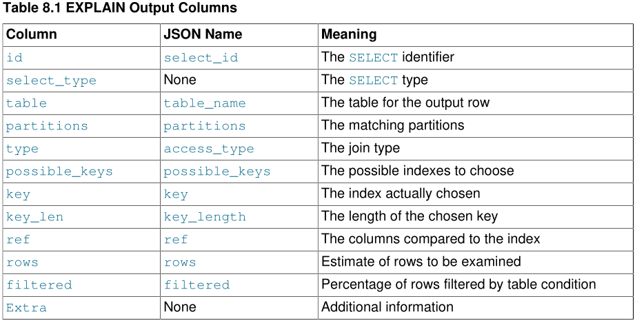
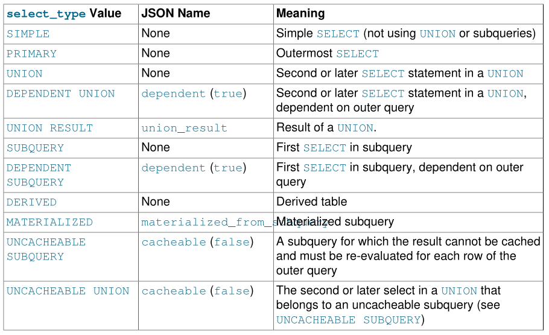
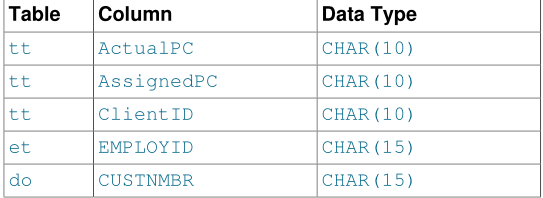
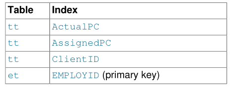
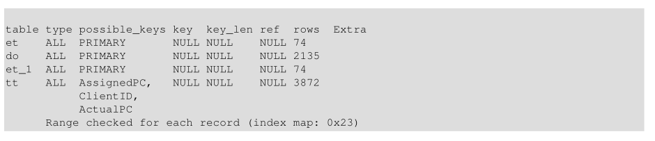
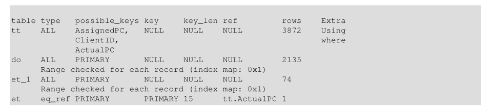
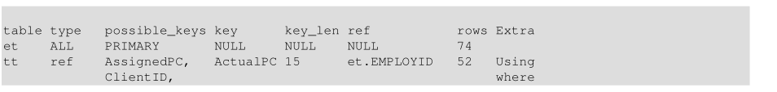
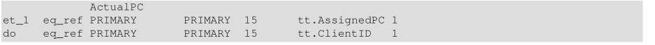
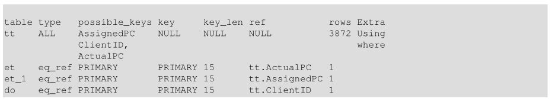

# 理解查询执行计划(Understanding the Query Execution Plan)

根据表、列、索引的详细信息和WHERE子句中的条件，MySQL优化器考虑了许多技术来有效地执行SQL查询中涉及的查找。可以在不读取所有行的情况下执行对大型表的查询;可以在不比较每个行组合的情况下执行涉及多个表的连接。 优化程序选择执行最有效查询的操作集称为“查询执行计划”，也称为EXPLAIN计划。您的目标是识别EXPLAIN计划中表明查询已经过优化的方面，并了解SQL语法和索引技术，以便在看到一些低效的操作时改进计划。

## 5.1 使用EXPLAIN优化查询

`EXPLAIN`语句提供有关MySQL如何执行语句的信息：

- `EXPLAIN`可以处理`SELECT`、`DELETE`、`INSERT`、`REPLACE`和`UPDATE`语句。

- 当`EXPLAIN`与可解释语句一起使用时，MySQL显示来自优化器的关于语句执行计划的信息。也就是说，MySQL解释了它将如何处理语句，包括关于表如何连接以及以何种顺序连接的信息。

- 当`EXPLAIN`与`FOR CONNECTION connection_id`一起使用而不是可解释语句时，它将显示在命名连接中执行的语句的执行计划。

- 对于SELECT语句，`EXPLAIN`会生成可以使用`SHOW WARNINGS`显示的其他执行计划信息。

- `EXPLAIN`对于检查涉及分区表的查询非常有用。

- `FORMAT`选项可用于选择输出格式。 `TRADITIONAL`以表格格式显示输出。 如果不存在`FORMAT`选项，则这是默认值。 `JSON`格式显示`JSON`格式的信息。


在`EXPLAIN`的帮助下，您可以看到应该在何处向表添加索引，以便通过使用索引查找行来加快语句的执行速度。还可以使用`EXPLAIN`检查优化器是否以最佳顺序连接表。要提示优化器使用与`SELECT`语句中表的命名顺序相对应的连接顺序，请以`SELECT STRAIGHT_JOIN`而不是`SELECT`开始该语句。但是，`STRAIGHT_JOIN`可能会阻止使用索引，因为它会禁用半连接转换。

优化器跟踪有时可能提供与EXPLAIN互补的信息。但是，优化器跟踪格式和内容可能在版本之间发生更改。

如果您在认为应该使用索引时遇到问题，请运行`ANALYZE TABLE`以更新表统计信息，例如密钥的基数，这会影响优化程序的选择让。


`注意`
`EXPLAIN`还可用于获取有关表中列的信息。`EXPLAIN tbl_name`与`DESCRIBE tbl_name`和`SHOW COLUMNS FROM tbl_name`同义。
`注意`


## 5.2 EXPLAIN格式化输出

`EXPLAIN`语句提供了关于MySQL如何执行语句的信息。`EXPLAIN`可以处理`SELECT`、`DELETE`、`INSERT`、`REPLACE`和`UPDATE`语句。

`EXPLAIN`为`SELECT`语句中使用的每个表返回一行信息。 它按照MySQL在处理语句时读取它们的顺序列出输出中的表。 MySQL使用嵌套循环连接方法解析所有连接。 这意味着MySQL从第一个表中读取一行，然后在第二个表，第三个表中找到匹配的行，依此类推。 处理完所有表后，MySQL将通过表列表输出所选列和回溯，直到找到有更多匹配行的表。 从该表中读取下一行，并继续下一个表。

`EXPLAIN`输出包括分区信息。 此外，对于`SELECT`语句，`EXPLAIN`生成扩展信息，可以使用`EXPLAIN`后的`SHOW WARNINGS`显示。

`注意`
在较早的MySQL版本中，使用`EXPLAIN PARTITIONS`和`EXPLAIN EXTENDED`生成分区和扩展信息。 这些语法仍然可以向后兼容，但默认情况下现在启用了分区和扩展输出，因此`PARTITIONS`和`EXTENDED`关键字是多余的并且已弃用。 他们的使用会导致警告，他们会在将来的MySQL版本中从`EXPLAIN`语法中删除。

您不能在同一个`EXPLAIN`语句中一起使用已弃用的`PARTITIONS`和`EXTENDED`关键字。 此外，这些关键字都不能与`FORMAT`选项一起使用。


MySQL Workbench具有可视化解释功能，它提供了` EXPLAIN `输出的可视化表示。
`注意`

### 5.2.1 EXPLAIN输出列 

本节介绍EXPLAIN生成的输出列。 后面的部分提供有关`type`和`Extra`列的其他信息。

`EXPLAIN`中的每个输出行提供关于一个表的信息。列名显示在表的第一列中;当使用`FORMAT=JSON`时，第二列提供输出中显示的等效属性名。



`注意`
`NULL`格式的SON属性不以JSON格式显示EXPLAIN输出。
`注意`


- `id` (JSON名称:select_id)

`SELECT`标识符。 这是查询中`SELECT`的序列号。 如果行引用其他行的并集结果，则该值可以为`NULL`。 在这种情况下，表列显示类似`<unionM，N>`的值，表示该行引用`id`值为`M`和`N`的行的并集。

- `select_type` (JSON名称:none)

`SELECT`的类型，可以是下表中显示的任何类型。 JSON格式的`EXPLAIN`将`SELECT`类型公开为`query_block`的属性，除非它是`SIMPLE`或`PRIMARY`。 JSON名称（如果适用）也显示在表中。



`DEPENDENT`通常表示使用关联子查询。

`DEPENDENT SUBQUERY`评估与`UNCACHEABLE SUBQUERY`评估不同。 对于`DEPENDENT SUBQUERY`，子查询仅针对来自其外部上下文的变量的每组不同值重新评估一次。 对于`UNCACHEABLE SUBQUERY`，将为外部上下文的每一行重新评估子查询。

子查询的可缓存性不同于查询缓存中查询结果的缓存。子查询缓存发生在查询执行期间，而查询缓存仅用于在查询执行完成后存储结果。

使用`EXPLAIN`指定`FORMAT = JSON`时，输出没有直接等同于`select_type`的单个属性; `query_block`属性对应于给定的`SELECT`。 可以使用与刚显示的大多数`SELECT`子查询类型等效的属性（示例为`MATERIALIZED`的`materialized_from_subquery）`，并在适当时显示。 `SIMPLE`或`PRIMARY`没有JSON等价物。

non-`SELECT`语句的`select_type`值显示受影响的表的语句类型。例如，对于`DELETE`语句，`select_type`为`DELETE`。

- `table` (JSON名称:table_name)

输出行所指向的表的名称。这也可以是下列值之一:

1. `<unionM,N>`:行表示`id`值为`M`和`N`的行的并集。

2. `<derivedN>`：该行引用`id`值为`N`的行的派生表结果。例如，派生表可能来自`FROM`子句中的子查询。`<derivedN>`：该行引用派生表 `id`值为`N`的行的结果。例如，派生表可能来自`FROM`子句中的子查询。

3. `<subqueryN>`：该行引用`id`值为`N`的行的具体化子查询的结果。


- `partitions`(JSON名称:partition)

查询将匹配记录所在的分区。对于非分区表，该值为`NULL`。

- `type`(JSON名称:access_type)

连接类型。

-  `possible_keys` (JSON名称: possible_keys)

`possible_keys`列指示MySQL可以选择从中查找此表中的行的索引。 请注意，此列完全独立于`EXPLAIN`输出中显示的表的顺序。 这意味着`possible_keys`中的某些键可能无法在生成中使用生成的表顺序。

如果此列为`NULL`（或在JSON格式的输出中未定义），则没有相关索引。 在这种情况下，您可以通过检查WHERE子句来提高查询的性能检查它是否引用了一些适合索引的列或列。 如果是，请创建适当的索引并再次使用`EXPLAIN`检查查询。

要查看表有哪些索引，请使用`SHOW INDEX FROM tbl_name`。

-  `key` (JSON名称: key)

`key`列表示MySQL实际决定使用的键(索引)。如果MySQL决定使用一个`possible le_keys`索引来查找行，那么该索引将作为键值列出。

`key`可能会命名一个不存在于`possible_keys`值中的索引。 如果所有`possible_keys`索引都不适合查找行，则会发生这种情况，但查询选择的所有列都是其他索引的列。 也就是说，命名索引覆盖了所选列，因此虽然它不用于确定要检索的行，但索引扫描比数据行扫描更有效。

对于InnoDB，即使查询还选择主键，辅助索引也可能覆盖所选列，因为InnoDB将主键值与每个辅助索引一起存储。 如果key为NULL，则MySQL找不到用于更有效地执行查询的索引。

要强制MySQL使用或忽略`possible_keys`列中列出的索引，请在查询中使用`FORCE INDEX`，`USE INDEX`或`IGNORE INDEX`。对于`MyISAM`表，运行`ANALYZE TABLE`可帮助优化器选择更好的索引。对于`MyISAM`表，`myisamchk --analyze`也是如此。

- `key_len` (JSON名称：key_length)

`key_len`列指示MySQL决定使用的密钥的长度。 `key_len`的值使您可以确定MySQL实际使用的多部分密钥的多少部分。如果键列显示`NULL`，则`len_len`列也会显示`NULL`。

由于密钥存储格式，对于可以为NULL的列而言，密钥长度比对于NOT NULL列更大。

- ref (JSON名称: ref)

`ref`列显示哪些列或常量与`key`列中指定的索引进行比较，以从表中选择行。

如果值为`func`，则使用的值是某个函数的结果。要查看哪个函数，请使用`EXPLAIN`之后的`SHOW WARNINGS`来查看扩展的`EXPLAIN`输出。该函数实际上可能是算术运算符等运算符。

- rows (JSON名称 rows)

rows列表示MySQL认为必须检查以执行查询的行数。
对于InnoDB表，此数字是估计值，可能并不总是准确的。

-  filtered (JSON名称: filtered)

`filtered`列指示将按表条件筛选的表行的估计百分比。最大值为100，这意味着不会对行进行过滤。值从100开始减少表示过滤量增加。`rows`显示检查的估计行数，`rows`×`filtered`显示将与下表连接的行数。例如，如果`rows`为1000且`filtered`为50.00（50％），则使用下表连接的行数为1000×50％= 500。

- Extra (JSON名称: none)

此列包含有关MySQL如何解析查询的其他信息。

没有与`Extra`列对应的单个JSON属性;但是，此列中可能出现的值将作为JSON属性公开，或者作为`message`属性的文本公开。

### 5.2.2 EXPLAIN Join 类型

`EXPLAIN`输出的`type`列描述了表的连接方式。在JSON格式的输出中，这些是作为`access_type`属性的值找到的。以下列表描述了从最佳类型到最差类型的连接类型：

- system 

该表只有一行（=系统表）。这是`const`连接类型的特例。

- const

该表最多只有一个匹配行，在查询开头读取。因为只有一行，所以优化器的其余部分可以将此行中列的值视为常量。 `const`表非常快，因为它们只读一次。

将`PRIMARY KEY`或`UNIQUE`索引的所有部分与常量值进行比较时使用`const`。在以下查询中，`tbl_name`可用作`const`表：

```mysql
SELECT * FROM tbl_name WHERE primary_key=1;
SELECT * FROM tbl_name
WHERE primary_key_part1=1 AND primary_key_part2=2;
```

- eq_ref

对于前面表格中的每个行组合，从该表中读取一行。除了`system`和`const`类型，这是最好的连接类型。当连接使用索引的所有部分并且索引是`PRIMARY KEY`或`UNIQUE NOT NULL`索引时使用它。

`eq_ref`可用于使用`=`运算符进行比较的索引列。比较value可以是常量，也可以是使用在此表之前读取的表中的列的表达式。在以下示例中，MySQL可以使用`eq_ref`连接来处理`ref_table`：

```mysql
SELECT * FROM ref_table,other_table
WHERE ref_table.key_column=other_table.column;
SELECT * FROM ref_table,other_table
WHERE ref_table.key_column_part1=other_table.column
AND ref_table.key_column_part2=1;
```

- ref

对于每个行的组合，从该表中读取具有匹配索引值的所有行以前的表格。如果连接仅使用键的最左前缀或者键不是`PRIMARY KEY`或`UNIQUE`索引（换句话说，如果连接不能基于键值选择单行），则使用`ref`。如果使用的密钥只匹配几行，这是一个很好的连接类型。

`ref`可用于使用`=`或`<=>`运算符进行比较的索引列。在以下示例中，MySQL可以使用`ref join`来处理`ref_table`：

```mysql
SELECT * FROM ref_table WHERE key_column=expr;
SELECT * FROM ref_table,other_table
WHERE ref_table.key_column=other_table.column;
SELECT * FROM ref_table,other_table
WHERE ref_table.key_column_part1=other_table.column
AND ref_table.key_column_part2=1;
```

- fulltext

使用`FULLTEXT`索引执行连接。

- ref_no_null

这种连接类型与`ref`类似，但附加的是MySQL对包含`NULL`值的行进行额外搜索。此连接类型优化最常用于解析子查询。在以下示例中，MySQL可以使用`ref_or_null`连接来处理`ref_table`：

```mysql
SELECT * FROM ref_table
WHERE key_column=expr OR key_column IS NULL;
```

- index_merge

此连接类型表示使用了索引合并优化。在这种情况下，输出行中的`key`列包含使用的索引列表，`key_len`包含所用索引的最长键部分列表。

- unique_subquery

此类型替换以下形式的某些`IN`子查询的`eq_ref`：

```mysql
value IN (SELECT primary_key FROM single_table WHERE some_expr)
```

`unique_subquery`只是一个索引查找函数，它可以完全替换子查询以提高效率。

-  index_subquery

此连接类型类似于`unique_subquery`。它取代了`IN`子查询，但它适用于以下形式的子查询中的非唯一索引：

```mysql
value IN (SELECT key_column FROM single_table WHERE some_expr)
```

- range

仅检索给定范围内的行，使用索引选择行。输出行中的`key`列指示使用哪个索引。 `key_len`包含使用的最长的关键部分。对于此类型，`ref`列为`NULL`。

使用`=`，`<>`，`>`，`> =`，`<`，`<=`，`IS NULL`，`<=>`，`BETWEEN`，`LIKE`或`IN()`运算符中的任何一个将键列与常量进行比较时，可以使用范围：

```mysql
SELECT * FROM tbl_name
WHERE key_column = 10;
SELECT * FROM tbl_name
WHERE key_column BETWEEN 10 and 20;
SELECT * FROM tbl_name
WHERE key_column IN (10,20,30);
SELECT * FROM tbl_name
WHERE key_part1 = 10 AND key_part2 IN (10,20,30);
```

- index

`index`连接类型与`ALL`相同，只是扫描索引树。这有两种方式：

1.  如果索引是查询的覆盖索引，并且可用于满足表中所需的所有数据，则仅扫描索引树。在这种情况下，`Extra`列显示`Using index`。仅索引扫描通常比`ALL`快，因为索引的大小通常小于表数据。

2.  使用索引中的读取执行全表扫描，以按索引顺序查找数据行。使用索引不会出现在`Extra`列中。

    当查询仅使用属于单个索引的列时，MySQL可以使用此连接类型。

- All

对前面表格中的每个行组合进行全表扫描。如果表是第一个没有标记为`const`的表，这通常是不好的，并且在所有其他情况下通常非常糟糕。通常，您可以通过添加索引来避免`ALL`，这些索引根据以前表中的常量值或列值从表中启用行检索。

### 5.2.3 解释额外信息(EXPLAIN Extra Information)

EXPLAIN输出的Extra列包含有关MySQL如何解析查询的其他信息。以下列表说明了此列中可能出现的值。每个项目还指示JSON格式的输出哪个属性显示Extra值。对于其中一些，有一个特定的属性。其他显示为`message`属性的文本。

如果要尽可能快地进行查询，请查看` Using filesort` 和 `Using temporary `的额外`Extra`值，或者在JSON格式的EXPLAIN输出中查看`using_filesort`和`using_temporary_table`属性等于`true`的`Extra`列值。

• Child of 'table' pushed join@1 (JSON: message text)

此表在连接中被引用为`table`的子节点，可以将其下推到NDB内核。仅当启用了下推式联接时，才适用于NDB群集。有关更多信息和示例，请参阅`ndb_join_pushdown`服务器系统变量的说明。

• const row not found (JSON property: const_row_not_found)

对于诸如`SELECT ... FROM tbl_name`之类的查询，该表为空。

• Deleting all rows (JSON property: message)

对于`DELETE`，某些存储引擎（如`MyISAM`）支持一种处理程序方法，该方法以简单快捷的方式删除所有表行。如果引擎使用此优化，则会显示此`Extra`值。

• Distinct (JSON property: distinct)

MySQL正在寻找不同的值，因此它在找到第一个匹配行后停止为当前行组合搜索更多行。

• FirstMatch(tbl_name) (JSON property: first_match)

半连接FirstMatch连接快捷方式策略用于tbl_name。

• Full scan on NULL key (JSON property: message)

当优化程序无法使用索引查找访问方法时，子查询优化会作为回退策略发生这种情况。

• Impossible HAVING (JSON property: message)

HAVING子句始终为false，无法选择任何行。

• Impossible WHERE (JSON property: message)

WHERE子句始终为false，无法选择任何行。

• Impossible WHERE noticed after reading const tables (JSON property: message)

MySQL已经读取了所有`const`（和`SYSTEM`）表，并注意到WHERE子句始终为false。

• LooseScan(m..n) (JSON property: message)

使用半连接LooseScan策略。 m和n是关键部件号。

• No matching min/max row (JSON property: message)

没有行满足查询的条件，例如`SELECT MIN (...) FROM ... WHERE`条件。

• no matching row in const table (JSON property: message)

对于具有连接的查询，有一个空表或没有满足唯一索引条件的行的表。

• No matching rows after partition pruning (JSON property: message)

对于`DELETE`或`UPDATE`，优化器在分区修剪后未发现任何要删除或更新的内容。它与`SELECT`语句的`Impossible WHERE`的含义相似。

• No tables used (JSON property: message)
 
该查询没有`FROM`子句，或者具有`FROM DUAL`子句。对于`INSERT`或`REPLACE`语句，`EXPLAIN`在没有`SELECT`部分​​时显示该值。例如，它出现在`EXPLAIN INSERT INTO VALUES（10）`中，因为它等同于`EXPLAIN INSERT INTO SELECT 101 FROM DUAL`。

• Not exists (JSON property: message)

MySQL能够对查询执行`LEFT JOIN`优化，并且在找到与`LEFT JOIN`条件匹配的行之后，不会检查此表中针对上一行组合的更多行。以下是可以通过以下方式优化的查询类型的示例：

```mysql
SELECT * FROM t1 LEFT JOIN t2 ON t1.id=t2.id
WHERE t2.id IS NULL;
```

假设`t2.id`被定义为`NOT NULL`。在这种情况下，MySQL扫描`t1`并使用`t1.id`的值在`t2`中查找行。如果MySQL在`t2`中找到匹配的行，则它知道`t2.id`永远不能为`NULL`，并且不会扫描`t2`中具有相同`id`值的其余行。换句话说，对于`t1`中的每一行，MySQL需要在`t2`中只进行一次查找，而不管`t2`中实际匹配多少行。

• Plan isn't ready yet (JSON property: none)

当优化程序尚未完成为在命名连接中执行的语句创建执行计划时，`EXPLAIN FOR CONNECTION`会出现此值。如果执行计划输出包含多行，则它们中的任何一个或全部都可以具有此Extra值，具体取决于优化程序在确定完整执行计划时的进度。

• Range checked for each record (index map: N) (JSON property: message)

MySQL发现没有好的索引可以使用，但发现在前面的表的列值已知之后可能会使用某些索引。对于上表中的每个行组合，MySQL检查是否可以使用`range`或`index_merge`访问方法来检索行。这不是很快，但比执行没有索引的连接更快。适用性标准如第8.2.1.2节“范围优化”和第8.2.1.3节“索引合并优化”中所述，但前一个表的所有列值都是已知的并被视为常量。

索引从1开始编号，顺序与表的`SHOW INDEX`所示的顺序相同。索引映射值`N`是指示哪些索引是候选的位掩码值。例如，值`0x19`（二进制11001）意味着将考虑索引1,4和5。

• Scanned N databases (JSON property: message)

这表示在处理`INFORMATION_SCHEMA`表的查询时服务器执行的目录扫描数，如第8.2.3节“优化INFORMATION_SCHEMA查询”中所述。 N的值可以是0,1或全部。

• Select tables optimized away (JSON property: message)

优化器确定1）应该返回最多一行，以及2）为了产生该行，必须读取确定的行集。当在优化阶段（例如，通过读取索引行）读取要读取的行时，在查询执行期间不需要读取任何表。
The optimizer determined 1) that at most one row should be returned, and 2) that to produce this
row, a deterministic set of rows must be read. When the rows to be read can be read during the
optimization phase (for example, by reading index rows), there is no need to read any tables during
query execution.

当查询被隐式分组时（包含聚合函数但没有`GROUP BY`子句），满足第一个条件。当每个使用的索引执行一行查找时，满足第二个条件。读取的索引数决定了要读取的行数。
The first condition is fulfilled when the query is implicitly grouped (contains an aggregate function but no GROUP BY clause). The second condition is fulfilled when one row lookup is performed per index used. The number of indexes read determines the number of rows to read.

请考虑以下隐式分组查询：

```mysql
SELECT MIN(c1), MIN(c2) FROM t1;
```

假设可以通过读取一个索引行来检索`MIN（c1）`，并且可以通过从不同索引读取一行来检索`MIN（c2）`。也就是说，对于每列`c1`和`c2`，存在索引，其中列是索引的第一列。在这种情况下，返回一行，通过读取两个确定行来生成。

如果要读取的行不是确定性的，则不会发生此`Extra`值。考虑这个查询：

```mysql
SELECT MIN(c2) FROM t1 WHERE c1 <= 10;
```

假设`（c1，c2）`是覆盖索引。使用此索引，必须扫描`c1 <= 10`的所有行以查找最小`c2`值。相比之下，请考虑以下查询：

```mysql
SELECT MIN(c2) FROM t1 WHERE c1 = 10;
```

在这种情况下，`c1 = 10`的第一个索引行包含最小`c2`值。必须只读取一行才能生成返回的行。

对于每个表维护精确行数的存储引擎（例如`MyISAM`，但不包括`InnoDB`），对于缺少`WHERE`子句或始终为`true`并且没有`GROUP BY`子句的`COUNT（*）`查询，可能会出现此`Extra`值。 （这是隐式分组查询的实例，其中存储引擎会影响是否可以读取确定数量的行。）

• Skip_open_table, Open_frm_only, Open_full_table (JSON property: message)

这些值表示适用于`INFORMATION_SCHEMA`表的查询的文件打开优化

1. Skip_open_table: 表文件不需要打开。通过扫描数据库目录，该信息已在查询中可用。
2. Open_frm_only: 只需要打开表的.frm文件。
3. Open_full_table: 未经优化的信息查找。必须打开.frm，.MYD和.MYI文件。

• Start temporary, End temporary (JSON property: message)

这表示临时表用于半连接Duplicate Weedout策略。

• unique row not found (JSON property: message)

对于诸如SELECT ... FROM tbl_name之类的查询，没有行满足表上UNIQUE索引或PRIMARY KEY的条件。

• Using filesort (JSON property: using_filesort)

MySQL必须执行额外的传递以找出如何按排序顺序检索行。排序是通过根据连接类型遍历所有行并将排序键和指针存储到与WHERE子句匹配的所有行的行来完成的。然后对键进行排序，并按排序顺序检索行。

• Using index (JSON property: using_index)

仅使用索引树中的信息从表中检索列信息，而不必执行额外的搜索以读取实际行。当查询仅使用属于单个索引的列时，可以使用此策略。

对于具有用户定义的聚簇索引的`InnoDB`表，即使`Extra`列中不存在使用索引，也可以使用该索引。如果`type`是`index`并且`key`是`PRIMARY`，则会出现这种情况。

Using index condition (JSON property: using_index_condition)

通过访问索引元组并首先测试它们以确定是否读取完整的表行来读取表。以这种方式，索引信息用于推迟（“下推”）读取全表行，除非有必要。

• Using index for group-by (JSON property: using_index_for_group_by)

与`Using index table`访问方法类似，`Using group for group-by`表示`MySQL`找到了一个索引，可用于检索`GROUP BY`或`DISTINCT`查询的所有列，而无需对实际表进行任何额外的磁盘访问。此外，索引以最有效的方式使用，因此对于每个组，只读取少数索引条目。

• Using join buffer (Block Nested Loop), Using join buffer (Batched KeyAccess) (JSON property: using_join_buffer)

将早期联接中的表分成几部分读入连接缓冲区，然后从缓冲区中使用它们的行来执行与当前表的连接。 （`Block Nested Loop`）表示使用块嵌套循环算法，并且（`Batched Key Access`）表示使用批量密钥访问算法。也就是说，来自`EXPLAIN`输出前一行的表中的键将被缓冲，匹配的行将从由出现使用连接缓冲区的行所表示的表中批量提取。

在`JSON`格式的输出中，`using_join_buffer`的值始终是`Block Nested Loop`或`Batched Key Access`之一。

Using MRR (JSON property: message)

使用多范围读取优化策略读取表。

• Using sort_union(...), Using union(...), Using intersect(...) (JSON property:message)

这些指示特定算法显示如何为`index_merge`连接类型合并索引扫描。

• Using temporary (JSON property: using_temporary_table)

要解析查询，MySQL需要创建一个临时表来保存结果。如果查询包含以不同方式列出列的`GROUP BY`和`ORDER BY`子句，则通常会发生这种情况。

• Using where (JSON property: attached_condition)

WHERE子句用于限制哪些行与下一个表匹配或发送到客户端。除非您特意打算从表中获取或检查所有行，否则如果Extra值未使用，则查询可能有问题where和表连接类型是ALL还是索引。
使用where在JSON格式的输出中没有直接的对应物; attached_condition属性包含使用的任何WHERE条件。

• Using where with pushed condition (JSON property: message)

此项仅适用于`NDB`表。这意味着NDB Cluster正在使用条件下推优化来提高非索引列和常量之间直接比较的效率。在这种情况下，条件被“下推”到集群的数据节点，并在所有数据节点上同时进行评估。这消除了通过网络发送不匹配行的需要，并且可以在可以但不使用条件下推的情况下将这种查询加速5到10倍。

• Zero limit (JSON property: message)

该查询具有LIMIT 0子句，无法选择任何行。

### 5.2.4 EXPLAIN输出解释(EXPLAIN Output Interpretation)

通过获取`EXPLAIN`输出的`rows`列中的值的乘积，可以很好地指示连接的好坏程度。这应该大致告诉你MySQL必须检查多少行才能执行查询。如果使用`max_join_size`系统变量限制查询，则此行产品还用于确定要执行哪些多表`SELECT`语句以及要中止哪些。

以下示例显示如何根据EXPLAIN提供的信息逐步优化多表连接。

假设您在此处显示了SELECT语句，并且您计划使用EXPLAIN检查它：

```mysql
EXPLAIN SELECT tt.TicketNumber, tt.TimeIn,
tt.ProjectReference, tt.EstimatedShipDate,
tt.ActualShipDate, tt.ClientID,
tt.ServiceCodes, tt.RepetitiveID,
tt.CurrentProcess, tt.CurrentDPPerson,
tt.RecordVolume, tt.DPPrinted, et.COUNTRY,
et_1.COUNTRY, do.CUSTNAME
FROM tt, et, et AS et_1, do
WHERE tt.SubmitTime IS NULL
AND tt.ActualPC = et.EMPLOYID
AND tt.AssignedPC = et_1.EMPLOYID
AND tt.ClientID = do.CUSTNMBR;
```

对于此示例，请进行以下假设：

• 被比较的列已声明如下。



• 表格具有以下索引。




• tt.ActualPC值不均匀分布。


最初，在执行任何优化之前，EXPLAIN语句会生成以下信息：



因为每个表的`type`都是`ALL`，所以此输出表明MySQL正在生成所有表的笛卡尔积;也就是说，每一行的组合。这需要相当长的时间，因为必须检查每个表中行数的乘积。对于手头的情况，该产品为74×2135×74×3872 = 45,268,558,720行。如果表格更大，你只能想象需要多长时间。

这里的一个问题是MySQL可以更有效地使用列上的索引，如果它们被声明为相同的类型和大小。在此上下文中，如果将`VARCHAR`和`CHAR`声明为相同大小，则认为它们是相同的。 `tt.ActualPC`声明为`CHAR（10）`，`et.EMPLOYID`声明为`CHAR（15）`，因此存在长度不匹配。

要修复列长度之间的这种差异，请使用`ALTER TABLE`将`ActualPC`从10个字符延长到15个字符：

```mysql
mysql> ALTER TABLE tt MODIFY ActualPC VARCHAR(15);
```

现在tt.ActualPC和et.EMPLOYID都是VARCHAR（15）。再次执行EXPLAIN语句会产生以下结果：



这并不完美，但要好得多：行值的乘积小于74.这个版本在几秒钟内执行。

可以进行第二次更改以消除tt.AssignedPC = et_1.EMPLOYID和tt.ClientID = do.CUSTNMBR比较的列长度不匹配：

```mysql
mysql> ALTER TABLE tt MODIFY AssignedPC VARCHAR(15),
MODIFY ClientID VARCHAR(15);
```

在修改之后，EXPLAIN生成如下所示的输出：




此时，查询几乎尽可能地优化。剩下的问题是，默认情况下，MySQL假定tt.ActualPC列中的值是均匀分布的，而tt表则不是这种情况。幸运的是，很容易告诉MySQL分析密钥分发：

```mysql
mysql> ANALYZE TABLE tt;
```

使用附加索引信息，连接是完美的，EXPLAIN产生以下结果：



EXPLAIN输出中的rows列是来自MySQL连接优化器的有根据的猜测。通过将行产品与查询返回的实际行数进行比较，检查数字是否接近真实。如果数字完全不同，则可以通过在SELECT语句中使用STRAIGHT_JOIN并尝试在FROM子句中以不同顺序列出表来获得更好的性能。 （但是，STRAIGHT_JOIN可能会阻止使用索引，因为它会禁用半连接转换。

在某些情况下，当EXPLAIN SELECT与子查询一起使用时，可以执行修改数据的语句;

## 5.3 扩展的EXPLAIN输出格式

对于SELECT语句，EXPLAIN语句生成额外的（“扩展”）信息，这些信息不是EXPLAIN输出的一部分，但可以通过在EXPLAIN之后发出SHOW WARNINGS语句来查看。 SHOW WARNINGS输出中的Message值显示优化程序如何限定SELECT语句中的表名和列名，SELECT应用重写和优化规则后的样子，以及可能有关优化过程的其他说明。

可以使用EXPLAIN之后的SHOW WARNINGS语句显示的扩展信息仅针对SELECT语句生成。 SHOW WARNINGS显示其他可解释语句的空结果（DELETE，INSERT，REPLACE和UPDATE）。

`注意`
在较早的MySQL版本中，扩展信息是使用EXPLAIN EXTENDED生成的。该语法仍然可以向后兼容，但默认情况下现在启用了扩展输出，因此EXTENDED关键字是多余的并且已弃用。它的使用会导致警告，并且在将来的MySQL版本中它将从EXPLAIN语法中删除。
`注意`

以下是扩展EXPLAIN输出的示例：

```mysql
mysql> EXPLAIN
SELECT t1.a, t1.a IN (SELECT t2.a FROM t2) FROM t1\G
*************************** 1. row ***************************
            id: 1
   select_type: PRIMARY
         table: t1
          type: index
 possible_keys: NULL
           key: PRIMARY
       key_len: 4
           ref: NULL
          rows: 4
      filtered: 100.00
         Extra: Using index
*************************** 2. row ***************************
            id: 2
   select_type: SUBQUERY
         table: t2
          type: index
 possible_keys: a
           key: a
       key_len: 5
           ref: NULL
          rows: 3
      filtered: 100.00
         Extra: Using index
2 rows in set, 1 warning (0.00 sec)

mysql> SHOW WARNINGS\G
*************************** 1. row ***************************
  Level: Note
   Code: 1003
Message: /* select#1 */ select `test`.`t1`.`a` AS `a`,
        <in_optimizer>(`test`.`t1`.`a`,`test`.`t1`.`a` in
        ( <materialize> (/* select#2 */ select `test`.`t2`.`a`
        from `test`.`t2` where 1 having 1 ),
        <primary_index_lookup>(`test`.`t1`.`a` in
        <temporary table> on <auto_key>
        where ((`test`.`t1`.`a` = `materialized-subquery`.`a`))))) AS `t1.a
        IN (SELECT t2.a FROM t2)` from `test`.`t1`
1 row in set (0.00 sec)
```

由于SHOW WARNINGS显示的语句可能包含特殊标记以提供有关查询重写或优化程序操作的信息，因此该语句不一定是有效的SQL，也不打算执行。输出还可能包含具有Message值的行，这些行提供有关优化程序所执行操作的其他非SQL解释性说明。

以下列表描述了可以出现在SHOW WARNINGS显示的扩展输出中的特殊标记：

• <auto_key>

自动生成的临时表密钥。

• <cache>(expr)

表达式（例如标量子查询）执行一次，结果值保存在内存中供以后使用。对于由多个值组成的结果，可能会创建一个临时表，您将看到<temporary table>。

• <exists>(query fragment)

The subquery predicate is converted to an EXISTS predicate and the subquery is transformed so that it can be used together with the EXISTS predicate.
子查询谓词转换为EXISTS谓词，子查询被转换，以便它可以与EXISTS谓词一起使用。

• <in_optimizer>(query fragment)

This is an internal optimizer object with no user significance.
这是一个没有用户意义的内部优化器对象。

• <index_lookup>(query fragment)

The query fragment is processed using an index lookup to find qualifying rows.
使用索引查找处理查询片段以查找符合条件的行。

• <if>(condition, expr1, expr2)

如果条件为真，则计算为expr1，否则为expr2。

• <is_not_null_test>(expr)

用于验证表达式不计算为NULL的测试。

• <materialize>(query fragment)

Subquery materialization is used.

• `materialized-subquery`.col_name

对内部临时表中列col_name的引用，该列实现为保存评估子查询的结果。

• <primary_index_lookup>(query fragment)

使用主键查找处理查询片段以查找符合条件的行。

• <ref_null_helper>(expr)

This is an internal optimizer object with no user significance.
这是一个没有用户意义的内部优化器对象。

• /* select#N */ select_stmt

The SELECT is associated with the row in non-extended EXPLAIN output that has an id value of N.
SELECT与非扩展EXPLAIN输出中具有id值N的行相关联。

• outer_tables semi join (inner_tables)

半连接操作。 inner_tables显示未拉出的表。请参见第8.2.2.1节“使用半连接优化子查询，派生表和视图引用”
转变”。

• <temporary table>

这表示为缓存中间结果而创建的内部临时表。


当某些表是const或系统类型时，优化程序会尽早评估涉及这些表中列的表达式，而这些表达式不是显示语句的一部分。但是，使用FORMAT = JSON，一些const表访问显示为使用const值的ref访问。

## 5.4 获取命名连接的执行计划信息

要获取在命名连接中执行的可解释语句的执行计划，请使用以下语句：

```mysql
EXPLAIN [options] FOR CONNECTION connection_id;
```

`EXPLAIN FOR CONNECTION`返回当前用于在给定连接中执行查询的`EXPLAIN`信息。由于数据（和支持统计信息）的更改，它可能会产生与在等效查询文本上运行`EXPLAIN`不同的结果。这种行为差异可用于诊断更多瞬态性能问题。例如，如果您在一个会话中运行语句需要很长时间才能完成，则在另一个会话中使用`EXPLAIN FOR CONNECTION`可能会产生有关延迟原因的有用信息。

`connection_id`是从`INFORMATION_SCHEMA PROCESSLIST`表或`SHOW PROCESSLIST`语句获得的连接标识符。如果您具有`PROCESS`权限，则可以指定任何连接的标识符。否则，您只能为自己的连接指定标识符。

如果指定的连接未执行语句，则结果为空。否则，仅当可以解释在命名连接中执行的语句时，`EXPLAIN FOR CONNECTION`才适用。这包括SELECT，DELETE，INSERT，REPLACE和UPDATE。 （但是，EXPLAIN FOR CONNECTION不适用于预处理语句，甚至是那些类型的预处理语句。）

如果命名连接正在执行可解释语句，则输出是您在语句本身上使用EXPLAIN获得的输出。

如果命名连接正在执行不可解释的语句，则会发生错误。例如，您无法为当前会话命名连接标识符，因为`EXPLAIN`不可解释：

```mysql
mysql> SELECT CONNECTION_ID();
+-----------------+
| CONNECTION_ID() |
+-----------------+
| 373 |
+-----------------+
1 row in set (0.00 sec)
mysql> EXPLAIN FOR CONNECTION 373;
ERROR 1889 (HY000): EXPLAIN FOR CONNECTION command is supported
only for SELECT/UPDATE/INSERT/DELETE/REPLACE
```

Com_explain_other状态变量指示已执行的EXPLAIN FOR CONNECTION语句的数量。

## 5.5 估计查询性能

在大多数情况下，您可以通过计算磁盘搜索来估计查询性能。对于小型表，通常可以在一个磁盘查找中找到一行（因为索引可能已缓存）。对于更大的表，您可以估计，使用B树索引，您需要这么多寻找行：`log（row_count）/ log（index_block_length / 3 * 2 /（index_length + data_pointer_length））+ 1`。

在MySQL中，索引块通常为1,024字节，数据指针通常为4字节。对于密钥值长度为3个字节（MEDIUMINT大小）的500,000行表，该公式表示log（500,000）/ log（1024/3 * 2 /（3 + 4））+ 1 = 4 seek。

该索引需要存储大约500,000 * 7 * 3/2 = 5.2MB（假设典型的索引缓冲区填充率为2/3），因此您可能在内存中有很多索引，因此只需要一次或两次调用读取数据以查找行。

但是，对于写入，您需要四个搜索请求来查找放置新索引值的位置，通常两个寻求更新索引并写入行。

前面的讨论并不意味着你的应用程序性能会慢慢退化log N.只要所有内容都被操作系统或MySQL服务器缓存，随着表变大，事情就会变得稍微慢一些。在数据太大而无法缓存之后，事情开始变得慢得多，直到您的应用程序仅受磁盘搜索的约束（其增加了log N）。为避免这种情况，请在数据增长时增加密钥缓存大小。对于MyISAM表，密钥缓存大小由key_buffer_size系统变量控制。


