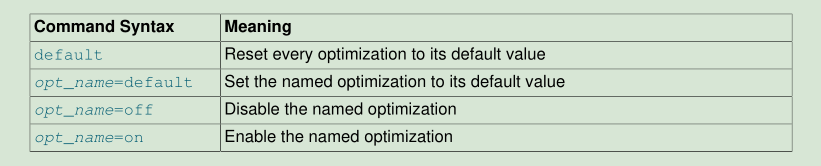
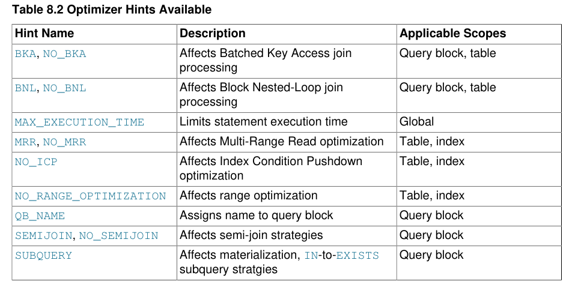
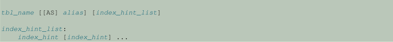

# 6.1 控制查询优化器

MySQL通过影响查询计划评估方式的系统变量，可切换优化，优化器和索引提示以及优化器成本模型来提供优化器控制。

## 6.1.1 控制查询计划评估

查询优化器的任务是找到执行SQL查询的最佳计划。因为“好”和“差”计划之间的性能差异可能是数量级（即秒与小时甚至数天），所以大多数查询优化器（包括MySQL的查询优化器）执行或多或少的详尽搜索以获得最佳计划所有可能的查询评估计划。对于连接查询，MySQL优化器调查的可能计划数量随着查询中引用的表的数量呈指数增长。对于少量表（通常小于7到10），这不是问题。但是，当提交较大的查询时，在查询优化中花费的时间可能很容易成为服务器性能的主要瓶颈。

更灵活的查询优化方法使用户能够控制优化器在搜索最佳查询评估计划时的详尽程度。一般的想法是，优化器调查的计划越少，编译查询所花费的时间就越少。另一方面，由于优化器会跳过某些计划，因此可能无法找到最佳计划。

可以使用两个系统变量来控制优化程序相对于其计算的计划数量的行为：

- `optimizer_prune_level`变量告诉优化器根据对每个表访问的行数的估计跳过某些计划。我们的经验表明，这种“有根据的猜测”很少会错过最佳计划，并且可能会大大缩短查询编译时间。这就是默认情况下此选项打开（optimizer_prune_level = 1）的原因。但是，如果您认为优化程序错过了更好的查询计划，则可以关闭此选项（`optimizer_prune_level = 0`），但存在查询编译可能需要更长时间的风险。请注意，即使使用此启发式算法，优化程序仍会探索大致指数的计划。

- `optimizer_search_depth`变量告诉优化器应该查看每个未完成计划的“未来”多长时间，以评估是否应该进一步扩展该计划。`optimizer_search_depth`值越小，查询编译时间可能会缩短几个数量级。例如，如果`optimizer_search_depth`接近查询中的表数，那么包含12、13或更多表的查询很容易需要数小时甚至数天的时间来编译。同时，如果使用`optimizer_search_depth`等于3或4编译，优化器可能在不到一分钟的时间内编译相同的查询。如果您不确定`optimizer_search_depth`的合理值是多少，可以将该变量设置为0，以告诉优化器自动确定该值。

## 6.1.2 可切换的优化

`optimizer_switch`系统变量启用对优化器行为的控制。它的值是一组标志，每个标志的值都是`on`或`off`，以指示是否启用或禁用了相应的优化器行为。此变量具有全局值和会话值，可以在运行时更改。可以在服务器启动时设置全局缺省值。

要查看当前优化器标志集，请选择变量值:

```mysql
mysql> SELECT @@optimizer_switch\G
*************************** 1. row ***************************
@@optimizer_switch: index_merge=on,index_merge_union=on,
                    index_merge_sort_union=on,
                    index_merge_intersection=on,
                    engine_condition_pushdown=on,
                    index_condition_pushdown=on,
                    mrr=on,mrr_cost_based=on,
                    block_nested_loop=on,batched_key_access=off,
                    materialization=on,semijoin=on,loosescan=on,
                    firstmatch=on,duplicateweedout=on,
                    subquery_materialization_cost_based=on,
                    use_index_extensions=on,
                    condition_fanout_filter=on,derived_merge=on
```

要更改`optimizer_switch`的值，请指定一个值，该值由一个或多个命令的逗号分隔列表组成:

```mysql
SET [GLOBAL|SESSION] optimizer_switch='command[,command]...';
```

每个`command`值都应该具有如下表所示的表单之一。



值中命令的顺序并不重要，尽管`default`命令在出现时先执行。将`opt_name`标志设置为`default`将其设置为`on`或`off`中的任意一个为其默认值。不允许在值中多次指定任何给定的`opt_name`，这会导致错误。值中的任何错误都会导致赋值失败，并产生一个错误，从而使`optimizer_switch`的值保持不变。


下面的列表描述了允许的`opt_name`标志名，按优化策略分组:

- 批量密钥访问标志
    1. batched_key_access (default off)
    
控件使用BKA连接算法。
    
要使`batched_key_access`在设置为`on`时具有任何效果，`mrr`标志也必须是`on`的。目前，`MRR`的成本估算过于悲观。因此，为了使用`BKA`，还需要关闭基于`mrr_cost_based`的命令。

- 块嵌套循环标志
    1. block_nested_loop (default on)

    控件使用BNL连接算法。

- 条件过滤标志
    1. condition_fanout_filter (default on)

    控制条件筛选的使用。

- 派生表合并标志
    1.  derived_merge (default on)
    
    控件将派生表和视图合并到外部查询块中。
    

`derived_merge`标志控制优化器是否尝试将派生表和视图引用合并到外部查询块中，假设没有其他规则阻止合并;例如,一个视图的算法指令优先于`derived_merge`设置。默认情况下，`on`合并标志。

- 引擎条件下推
    1. engine_condition_pushdown (default on)
    
    控制引擎条件下推
    
- Index Condition Pushdown Flags
    1. index_condition_pushdown (default on)

    控制索引条件下推
    
- 索引扩展标志

    1. use_index_extensions (default on)
    
    控制索引扩展的使用。
    
- 索引合并标志
    1. index_merge (default on)

    控制所有索引合并优化

    2. index_merge_intersection (default on)

    控制索引合并交集的访问优化。
    
    3. index_merge_sort_union (default on)

    控制索引合并、排序和联合访问优化。
    
    4. index_merge_union (default on)

    控制索引合并联合访问优化。

- 多范围读标志
    
    1. mrr (default on)

    控制多范围读取策略。

    2. mrr_cost_based (default on)

    如果MRR =on，控制基于成本的MRR的使用。
    
- Semi-Join 标志

    1. semijoin (default on)

    控制所有半连接策略。

    2• duplicateweedout (default on)

    控制半连接重复Weedout策略。
    
    3• firstmatch (default on)

    控制半连接FirstMatch策略。

- loosescan (default on)

    控制半连接松散扫描策略(不要与松散的`GROUP BY`索引扫描混淆)。

    `semijoin`、`firstmatch`、`loosescan`和`duplicateweedout·标志允许控制半连接策略。半连接标志控制是否使用半连接。如果将其设置为`on`，则`firstmatch`和`loosescan`标志可以更好地控制允许的半连接策略。

    如果禁用了`duplicateweedout`半连接策略，则除非禁用所有其他适用的策略，否则不会使用该策略。

    如果`semijoin`和`materialization`都处于`on`状态，那么半连接也可以在适用的情况下使用物化。默认情况下，这些标志是`on`的。

    
- 子查询实体化的标志
    1. materialization (default `on`)

        Controls materialization (including semi-join materialization).
    
    2. subquery_materialization_cost_based (default `on`)
    
        Use cost-based materialization choice.
        

`materialization`标志控制是否使用子查询物化。如果`semijoin`和`materialization`都处于`on`状态，那么半连接也可以在适用的情况下使用物化。默认情况下，这些标志是`on`的。

`subquery_materialization_cost_based`标志可以控制子查询实现和`IN`-to-`EXISTS`子查询转换之间的选择。 如果标志处于`on`状态（默认值），则优化程序会在子查询实现和`IN`-to-`EXISTS`子查询转换之间执行基于成本的选择（如果可以使用任一方法）。 如果该标志处于`off`状态，优化程序将通过`IN`-to-`EXISTS`子查询转换选择子查询实现。


当您将一个值赋给`optimizer_switch`时，没有提到的标志将保留它们的当前值。这使得在一条语句中启用或禁用特定的优化器行为而不影响其他行为成为可能。该语句不依赖于存在哪些其他优化器标志及其值。假设启用了所有索引合并优化:

```mysql
mysql> SELECT @@optimizer_switch\G
*************************** 1. row ***************************
@@optimizer_switch: index_merge=on,index_merge_union=on,
                    index_merge_sort_union=on,
                    index_merge_intersection=on,
                    engine_condition_pushdown=on,
                    index_condition_pushdown=on,
                    mrr=on,mrr_cost_based=on,
                    block_nested_loop=on,batched_key_access=off,
                    materialization=on,semijoin=on,loosescan=on,
                    firstmatch=on,
                    subquery_materialization_cost_based=on,
                    use_index_extensions=on,
                    condition_fanout_filter=on
```

如果服务器对某些查询使用索引合并联合或索引合并排序联合访问方法，而您想要检查优化器在没有这些方法的情况下是否会执行得更好，请像这样设置变量值:

```mysql
mysql> SET optimizer_switch='index_merge_union=off,index_merge_sort_union=off';

mysql> SELECT @@optimizer_switch\G
*************************** 1. row ***************************
@@optimizer_switch: index_merge=on,index_merge_union=off,
                    index_merge_sort_union=off,
                    index_merge_intersection=on,
                    engine_condition_pushdown=on,
                    index_condition_pushdown=on,
                    mrr=on,mrr_cost_based=on,
                    block_nested_loop=on,batched_key_access=off,
                    materialization=on,semijoin=on,loosescan=on,
                    firstmatch=on,
                    subquery_materialization_cost_based=on,
                    use_index_extensions=on,
                    condition_fanout_filter=on
```


## 6.1.3 Optimizer Hints

控制优化器策略的一种方法是设置`optimizer_switch`系统变量。对该变量的更改会影响所有后续查询的执行;为了以不同的方式影响一个查询，有必要在每个查询之前更改`optimizer_switch`。

另一种控制优化器的方法是使用优化器提示，它可以在单个语句中指定。因为优化器提示适用于每个语句，所以它们对语句执行计划提供了比使用`optimizer_switch`更好的控制。例如，可以在语句中为一个表启用优化，而为另一个表禁用优化。语句中的提示优先于`optimizer_switch`标志。

例如：

```mysql
SELECT /*+ NO_RANGE_OPTIMIZATION(t3 PRIMARY, f2_idx) */ f1
FROM t3 WHERE f1 > 30 AND f1 < 33;
SELECT /*+ BKA(t1) NO_BKA(t2) */ * FROM t1 INNER JOIN t2 WHERE ...;
SELECT /*+ NO_ICP(t1, t2) */ * FROM t1 INNER JOIN t2 WHERE ...;
SELECT /*+ SEMIJOIN(FIRSTMATCH, LOOSESCAN) */ * FROM t1 ...;
EXPLAIN SELECT /*+ NO_ICP(t1) */ * FROM t1 WHERE ...;
```

`注意`
默认情况下，`mysql`客户机将删除发送到服务器的`SQL`语句中的注释(包括优化器提示)，直到`mysql 5.7.7`将其更改为向服务器传递优化器提示为止。如果您使用的是`mysql`客户机的旧版本，而服务器的版本能够理解优化器提示，为了确保不会删除优化器提示，可以使用`--comments`选项调用`mysql`。
`注意`


这里描述的优化器提示与8.9.4节“索引提示”中描述的索引提示不同。优化器和索引提示可以单独使用，也可以一起使用。

### 6.1.3.1 Optimizer Hint Overview

优化提示适用于不同的范围级别:


• Global: 提示会影响整个语句
• Query block: 提示影响语句中的特定查询块
• Table-level: 提示影响查询块中的特定表
• Index-level: 提示影响表中的特定索引

下表总结了可用的优化器提示、它们影响的优化器策略以及它们应用的范围。稍后将给出更多细节。



禁用优化会阻止优化器使用它。启用优化意味着如果策略应用于语句执行，优化器可以自由地使用该策略，但优化器不一定会使用它。


### 6.1.3.2 Optimizer Hint Syntax

MySQL支持SQL语句中的注释，如第9.6节“注释语法”中所述。必须在/ * + ... * / comments中指定优化提示。也就是说，优化器提示使用/ * ... * / C样式注释语法的变体，在/ *注释开始序列后面加上`+`字符。例子：

```mysql
/*+ BKA(t1) */
/*+ BNL(t1, t2) */
/*+ NO_RANGE_OPTIMIZATION(t4 PRIMARY) */
/*+ QB_NAME(qb2) */
```

+字符后面允许有空格。

解析器在`SELECT`，`UPDATE`，`INSERT`，`REPLACE`和`DELETE`语句的初始关键字之后识别优化程序提示注释。在这些情况下允许提示：

- 在查询和数据更改语句的开头：

```mysql
SELECT /*+ ... */ ...
INSERT /*+ ... */ ...
REPLACE /*+ ... */ ...
UPDATE /*+ ... */ ...
DELETE /*+ ... */ ...
```

- 在查询块的开头:

```mysql
(SELECT /*+ ... */ ... )
(SELECT ... ) UNION (SELECT /*+ ... */ ... )
(SELECT /*+ ... */ ... ) UNION (SELECT /*+ ... */ ... )
UPDATE ... WHERE x IN (SELECT /*+ ... */ ...)
INSERT ... SELECT /*+ ... */ ...
```

- 在以`EXPLAIN`开头的暗示语句中。例如

```mysql
EXPLAIN SELECT /*+ ... */ ...
EXPLAIN UPDATE ... WHERE x IN (SELECT /*+ ... */ ...)
```

这意味着您可以使用`EXPLAIN`来查看优化程序提示如何影响执行计划。在`EXPLAIN`之后立即使用`SHOW WARNINGS`来查看提示的使用方式。由以下`SHOW WARNINGS`显示的扩展`EXPLAIN`输出指示使用了哪些提示。忽略的提示不会显示。


提示注释可能包含多个提示，但查询块不能包含多个提示注释。这是有效的：

```mysql
SELECT /*+ BNL(t1) BKA(t2) */ ...
```

但这是无效的:

```mysql
SELECT /*+ BNL(t1) */ /* BKA(t2) */ ...
```

当提示注释包含多个提示时，存在重复和冲突的可能性。以下一般准则适用。对于特定提示类型，可能会应用其他规则，如提示说明中所示。

• 重复提示：对于诸如/ * + MRR（idx1）MRR（idx1）* /的提示，MySQL使用第一个提示并发出有关重复提示的警告。

• 冲突提示：对于诸如/ * + MRR（idx1）NO_MRR（idx1）* /的提示，MySQL使用第一个提示并发出有关第二个冲突提示的警告。

查询块名称是标识符，并遵循有关哪些名称有效以及如何引用它们的常规规则（请参见第9.2节“模式对象名称”）。

提示名称，查询块名称和策略名称不区分大小写。对表和索引名称的引用遵循通常的标识符区分大小写规则（请参见第9.2.2节“标识符区分大小写”）。

### 6.1.3.3 Table-Level Optimizer Hints

表级提示会影响块嵌套循环（BNL）和批量密钥访问（BKA）连接处理算法的使用（请参见第8.2.1.11节“块嵌套循环和批量密钥访问连接”）。这些提示类型适用到特定表或查询块中的所有表。

表级提示的语法：

```mysql
hint_name([@query_block_name] [tbl_name [, tbl_name] ...])

hint_name([tbl_name@query_block_name [, tbl_name@query_block_name] ...])
```

语法指的是这些术语:

- hint_name:这些提示名是允许的:

    • BKA, NO_BKA: 为指定的表启用或禁用BKA。
    
    • BNL, NO_BNL: 为指定的表启用或禁用BNL。
    
    `注意`
    
        要使用BNL或BKA提示为外部连接的任何内部表启用连接缓冲，必须为外部连接的所有内部表启用连接缓冲。
    
    `注意`

- tbl_name：语句中使用的表的名称。提示适用于它命名的所有表。如果提示没有命名表，则它适用于发生它的查询块的所有表。

如果表具有别名，则提示必须引用别名，而不是表名。

提示中的表名不能使用模式名限定。

- query_block_name: 提示适用的查询块。如果提示不包含前导`@query_block_name`，则提示将应用于发生它的查询块。对于`tbl_name @ query_block_name`语法，提示适用于命名查询块中的命名表。要为查询块指定名称，请参阅命名查询块的优化程序提示。

例如:

```mysql
SELECT /*+ NO_BKA(t1, t2) */ t1.* FROM t1 INNER JOIN t2 INNER JOIN t3;
SELECT /*+ NO_BNL() BKA(t1) */ t1.* FROM t1 INNER JOIN t2 INNER JOIN t3;
```

表级提示适用于从先前表接收记录的表，而不是发送者表。请考虑以下语句：

```mysql
SELECT /*+ BNL(t2) */ FROM t1, t2;
```

如果优化器选择首先处理`t1`，则在开始从`t2`读取之前，通过缓冲来自`t1`的行，将块嵌套循环连接应用于`t2`。如果优化器首先选择处理`t2`，则提示无效，因为`t2`是发送方表。

### 6.1.3.4 Index-Level Optimizer Hints

索引级提示会影响优化程序用于特定表或索引的索引处理策略。这些提示类型会影响索引条件下推（ICP），多范围读取（MRR）和范围优化的使用（请参见第8.2.1节“优化SELECT语句”）。

索引级提示的语法：

```mysql
hint_name([@query_block_name] tbl_name [index_name [, index_name] ...])
hint_name(tbl_name@query_block_name [index_name [, index_name] ...])
```

语法指的是这些术语：

- hint_name: 允许使用以下提示名称：
    
    • MRR, NO_MRR: 为指定的表或索引启用或禁用MRR。 `MRR`提示仅适用于`InnoDB`和`MyISAM`表。
    
    • NO_ICP: 禁用指定表或索引的ICP。默认情况下，ICP是候选优化策略，因此没有提示启用它。

        • NO_RANGE_OPTIMIZATION: 禁用指定表或索引的索引范围访问。此提示还会禁用表或索引的索引合并和松散索引扫描。默认情况下，范围访问是候选优化策略，因此没有提示启用它。当范围的数量可能很高并且范围优化需要许多资源时，该提示可能是有用的。

    • tbl_name: 提示适用的表。
    
    • index_name: 命名表中索引的名称。提示适用于它命名的所有索引。如果提示不指定索引，则它适用于表中的所有索引。要引用主键，请使用名称PRIMARY。要查看表的索引名称，请使用SHOW INDEX。

    • query_block_name: 提示适用的查询块。如果提示不包含前导`@query_block_name`，则提示将应用于发生它的查询块。对于`tbl_name@query_block_name`语法，提示适用于命名查询块中的命名表。要为查询块指定名称，请参阅命名查询块的优化程序提示。

例如:

```mysql
SELECT /*+ MRR(t1) */ * FROM t1 WHERE f2 <= 3 AND 3 <= f3;
SELECT /*+ NO_RANGE_OPTIMIZATION(t3 PRIMARY, f2_idx) */ f1
FROM t3 WHERE f1 > 30 AND f1 < 33;
INSERT INTO t3(f1, f2, f3)
(SELECT /*+ NO_ICP(t2) */ t2.f1, t2.f2, t2.f3 FROM t1,t2
WHERE t1.f1=t2.f1 AND t2.f2 BETWEEN t1.f1
AND t1.f2 AND t2.f2 + 1 >= t1.f1 + 1);
```

### 6.1.3.5 Subquery Optimizer Hints

查询提示会影响是否使用半连接转换以及允许使用哪些半连接策略，以及在不使用半连接时，是否使用子查询物化或现有的转换。

影响半连接策略的提示语法:

```mysql
hint_name([@query_block_name] [strategy [, strategy] ...])
```

语法指的是这些术语:

- hint_name: 允许使用以下提示名称：

    • SEMIJOIN, NO_SEMIJOIN: 启用或禁用指定的半连接策略。

- strategy: 要启用或禁用的半连接策略。允许使用以下策略名称：`DUPSWEEDOUT`，`FIRSTMATCH`，`LOOSESCAN`，`MATERIALIZATION`。对于`SEMIJOIN`提示，如果未命名策略，则根据`optimizer_switch`系统变量启用的策略，如果可能，将使用半连接。如果策略被命名但不适用于该语句，则使用`DUPSWEEDOUT`。对于`NO_SEMIJOIN`提示，如果未命名策略，则不使用半连接。如果命名策略排除该语句的所有适用策略，则使用`DUPSWEEDOUT`。


如果一个子查询嵌套在另一个子查询中并且两者都合并为外部查询的半连接，则忽略最内层查询的任何半连接策略规范。 `SEMIJOIN`和`NO_SEMIJOIN`提示仍可用于启用或禁用此类嵌套子查询的半连接转换。如果禁用`DUPSWEEDOUT`，优化器有时可能会生成远不是最优的查询计划。这是由于贪婪搜索过程中的启发式剪枝导致的，可以通过设置`optimizer_prune_level=0`来避免这种情况。

例如：

```mysql
SELECT /*+ NO_SEMIJOIN(@subq1 FIRSTMATCH, LOOSESCAN) */ * FROM t2
WHERE t2.a IN (SELECT /*+ QB_NAME(subq1) */ a FROM t3);
SELECT /*+ SEMIJOIN(@subq1 MATERIALIZATION, DUPSWEEDOUT) */ * FROM t2
WHERE t2.a IN (SELECT /*+ QB_NAME(subq1) */ a FROM t3);
```

影响是否使用子查询实现或`IN`-to-`EXISTS`转换的提示语法：

```mysql
SUBQUERY([@query_block_name] strategy)
```

提示名称始终为`SUBQUERY`。

对于`SUBQUERY`提示，允许使用这些策略值：`INTOEXISTS`，`MATERIALIZATION`。

例如：

```mysql
SELECT id, a IN (SELECT /*+ SUBQUERY(MATERIALIZATION) */ a FROM t1) FROM t2;
SELECT * FROM t2 WHERE t2.a IN (SELECT /*+ SUBQUERY(INTOEXISTS) */ a FROM t1);
```

对于半连接和`SUBQUERY`提示，前导`@query_block_name`指定提示适用的查询块。如果提示不包含前导`@query_block_name`，则提示将应用于发生它的查询块。

如果提示注释包含多个子查询提示，则使用第一个提示。如果有其他类似的提示，则会发出警告。其他类型的提示将被悄然忽略。

### 6.1.3.6 语句执行时间优化器提示(Statement Execution Time Optimizer Hints)

`MAX_EXECUTION_TIME`提示仅允许用于`SELECT`语句。它在服务器终止语句之前允许执行语句的时间长度为`N`（超时值，以毫秒为单位）：

```mysql
MAX_EXECUTION_TIME(N)
```

超时时间为1秒(1000毫秒)的例子:

```mysql
SELECT /*+ MAX_EXECUTION_TIME(1000) */ * FROM t1 INNER JOIN t2 WHERE ...
```

`MAX_EXECUTION_TIME(N)`提示将语句执行超时设置为`N`毫秒。如果没有此选项或`N`为`0`，则应用`max_execution_time`系统变量所建立的语句超时。

`MAX_EXECUTION_TIME`提示如下:

• 对于具有多个`SELECT`关键字的语句，例如联合或带子查询的语句，`MAX_EXECUTION_TIME`适用于整个语句，并且必须出现在第一个`SELECT`之后。

• 它适用于只读`SELECT`语句。不是只读的语句是那些调用存储函数的语句，该函数将数据修改为副作用。

• 它不适用于存储程序中的`SELECT`语句而被忽略。

### 6.1.3.7 用于命名查询块的优化器提示(Optimizer Hints for Naming Query Blocks)

表级、索引级和子查询优化器提示允许将特定的查询块命名为参数语法的一部分。要创建这些名称，请使用`QB_NAME`提示，它将一个名称分配给查询块，查询块在查询中发生:

```mysql
QB_NAME(name)
```

可以使用`QB_NAME`提示以一种清晰的方式显式显示其他提示应用于哪些查询块。它们还允许在一个提示注释中指定所有非查询块名提示，以便更容易理解复杂语句。考虑以下陈述:

```mysql
SELECT ...
FROM (SELECT ...
FROM (SELECT ... FROM ...)) ...
```

`QB_NAME`提示为语句中的查询块分配名称:

```mysql
SELECT /*+ QB_NAME(qb1) */ ...
FROM (SELECT /*+ QB_NAME(qb2) */ ...
FROM (SELECT /*+ QB_NAME(qb3) */ ... FROM ...)) ...
```

然后其他提示可以使用这些名称来引用适当的查询块:

```mysql
SELECT /*+ QB_NAME(qb1) MRR(@qb1 t1) BKA(@qb2) NO_MRR(@qb3t1 idx1, id2) */ ...
FROM (SELECT /*+ QB_NAME(qb2) */ ...
FROM (SELECT /*+ QB_NAME(qb3) */ ... FROM ...)) ...
```

其结果如下:

• `MRR(@qb1 t1)`适用于查询块`qb1`中的表`t1`。

• `BKA(@ qb2)`适用于查询块`qb2`。

• `NO_MRR(@ qb3 t1 idx1，id2)`适用于查询块`qb3`中的表`t1`中的索引`idx1`和`idx2`。


查询块名称是标识符，并遵循关于哪些名称是有效的以及如何引用它们的常见规则(请参阅9.2节“模式对象名称”)。例如，必须引用包含空格的查询块名，可以使用反号:

```mysql
SELECT /*+ BKA(@`my hint name`) */ ...
FROM (SELECT /*+ QB_NAME(`my hint name`) */ ...) ...
```

如果启用了`ANSI_QUOTES` SQL模式，也可以用双引号引用查询块名:

```mysql
SELECT /*+ BKA(@"my hint name") */ ...
FROM (SELECT /*+ QB_NAME("my hint name") */ ...) ...
```


## 6.1.4  Index Hints

索引提示为优化程序提供有关如何在查询处理期间选择索引的信息。此处描述的索引提示与优化程序提示不同。索引和优化器提示可以单独使用，也可以一起使用。

索引提示仅适用于`SELECT`语句。 （它们被`UPDATE`语句的解析器接受但被忽略并且没有效果。）

索引提示在表名后面指定。引用单个表的语法（包括索引提示）如下所示：




`USE INDEX（index_list）`提示告诉MySQL只使用其中一个命名索引来查找表中的行。替代语法`IGNORE INDEX（index_list）`告诉MySQL不使用某些特定索引或索引。如果`EXPLAIN`显示MySQL正在使用可能索引列表中的错误索引，则这些提示很有用。

`FORCE INDEX`提示的作用类似于`USE INDEX（index_list）`，并且假设表扫描非常昂贵。换句话说，仅当无法使用其中一个命名索引查找表中的行时，才使用表扫描。

每个提示都需要索引名称，而不是列名。要引用主键，请使用名称`PRIMARY`。若要查看表的索引名称，请使用`SHOW INDEX`语句或`INFORMATION_SCHEMA.STATISTICS`表。

`index_name`值不必是完整的索引名称。它可以是索引名称的明确前缀。如果前缀不明确，则会发生错误。

例如：

```mysql
SELECT * FROM table1 USE INDEX (col1_index,col2_index)
WHERE col1=1 AND col2=2 AND col3=3;

SELECT * FROM table1 IGNORE INDEX (col3_index)
WHERE col1=1 AND col2=2 AND col3=3;
```

索引提示的语法具有以下特征：

• 省略`USE INDEX`的`index_list`在语法上是有效的，这意味着“不使用索引。”省略`FORCE INDEX`或`IGNORE INDEX`的`index_list`是语法错误。

• 您可以通过向提示添加`FOR`子句来指定索引提示的范围。这为查询处理的各个阶段的执行计划的优化器选择提供了更细粒度的控制。要仅影响MySQL决定如何在表中查找行以及如何处理联接时使用的索引，请使用`FOR JOIN`。要影响对行进行排序或分组的索引用法，请使用`FOR ORDER BY`或`FOR GROUP BY`。

• 您可以指定多个索引提示：

```mysql
SELECT * FROM t1 USE INDEX (i1) IGNORE INDEX FOR ORDER BY (i2) ORDER BY a;
```

在几个提示中命名相同的索引（即使在相同的提示中）也不是错误：

```mysql
SELECT * FROM t1 USE INDEX (i1) USE INDEX (i1,i1);
```

但是，将`USE INDEX`和`FORCE INDEX`混合到同一个表中是错误的：

```mysql
SELECT * FROM t1 USE INDEX FOR JOIN (i1) FORCE INDEX FOR JOIN (i2);
```

如果索引提示不包含FOR子句，则提示的范围将应用于语句的所有部分。
例如，这个提示：

```mysql
IGNORE INDEX (i1)
```

等同于这种提示组合：

```mysql
IGNORE INDEX FOR JOIN (i1)
IGNORE INDEX FOR ORDER BY (i1)
IGNORE INDEX FOR GROUP BY (i1)
```

在MySQL 5.0中，没有`FOR`子句的提示范围仅适用于行检索。要在没有`FOR`子句时使服务器使用此旧行为，请在服务器启动时启用`old`系统变量。请注意在复制设置中启用此变量。使用基于语句的二进制日志记录，为主服务器和从服务器设置不同的模式可能会导致复制错误。

处理索引提示时，它们按类型（`USE`，`FORCE`，`IGNORE`）和范围（`FOR JOIN`，`FOR ORDER BY`，`FOR GROUP BY`）收集在单个列表中。例如：

```mysql
SELECT * FROM t1
    USE INDEX () IGNORE INDEX (i2) USE INDEX (i1) USE INDEX (i2);
```

相当于：

```mysql
SELECT * FROM t1
    USE INDEX (i1,i2) IGNORE INDEX (i2);
```

然后按以下顺序为每个范围应用索引提示：

1. 如果存在，则使用`{USE | FORCE} INDEX`。 （如果不是，优化器确定的索引集是用过的。）

2. IGNORE INDEX应用于上一步的结果。例如，以下两个查询是等效的：

```mysql
SELECT * FROM t1 USE INDEX (i1) IGNORE INDEX (i2) USE INDEX (i2);

SELECT * FROM t1 USE INDEX (i1);
```

对于`FULLTEXT`搜索，索引提示的工作方式如下：

• 对于自然语言模式搜索，将默默忽略索引提示。例如，`IGNORE INDEX（i1）`，没有警告，仍然使用索引。

• 对于布尔模式搜索，使用`FOR ORDER BY`或`FOR GROUP BY`的索引提示是静默的忽略。使用`FOR JOIN`或没有`FOR`修饰符的索引提示受到尊重。与提示如何应用于非`FULLTEXT`搜索相反，提示用于查询执行的所有阶段（查找行和检索，分组和排序）。即使为非`FULLTEXT`索引提供了提示，也是如此。例如，以下两个查询是等效的：

```mysql
SELECT * FROM t
    USE INDEX (index1)
    IGNORE INDEX (index1) FOR ORDER BY
    IGNORE INDEX (index1) FOR GROUP BY
    WHERE ... IN BOOLEAN MODE ... ;

SELECT * FROM t
    USE INDEX (index1)
    WHERE ... IN BOOLEAN MODE ... ;
```


## 6.1.5  The Optimizer Cost Model

为了生成执行计划，优化程序使用基于对查询执行期间发生的各种操作的成本的估计的成本模型。优化器有一组可编译的默认“成本常量”，可用于制定有关执行计划的决策。

优化器还具有在执行计划构建期间使用的成本估算数据库。这些估计值存储在`mysql`系统数据库的`server_cost`和`engine_cost`表中，并且可以随时进行配置。这些表的目的是使得可以轻松调整优化程序在尝试获取查询执行计划时使用的成本估算。

### 6.1.5.1 Cost Model General Operation

可配置的优化器成本模型的工作方式如下：

• 服务器在启动时将成本模型表读入内存，并在运行时使用内存中的值。表中指定的任何no-`NULL`成本估算优先于相应的已编译默认成本常量。任何`NULL`估计都指示优化器使用编译的默认值。

• 在运行时，服务器可能会重新读取成本表。当动态加载存储引擎或执行`FLUSH OPTIMIZER_COSTS`语句时，会发生这种情况。

• 成本表使服务器管理员可以通过更改表中的条目轻松调整成本估算。通过将条目的开销设置为`NULL`，还可以轻松恢复为默认值。优化程序使用内存中的成本值，因此对表的更改应遵循`FLUSH OPTIMIZER_COSTS`生效。

• 客户端会话开始时当前的内存中成本估算在整个会话期间应用，直到结束。特别是，如果服务器重新读取成本表，则任何更改的估计值仅适用于随后启动的会话。现有会话不受影响。

• 成本表特定于给定的服务器实例。服务器不会将成本表更改复制到复制从属服务器。

### 6.1.5.2 The Cost Model Database

优化器成本模型数据库由`mysql`系统数据库中的两个表组成，其中包含查询执行期间发生的操作的成本估计信息:

• server_cost: 一般服务器操作的优化程序成本估算

• engine_cost: 特定于特定存储引擎的操作的优化程序成本估算`server_cost`表包含以下列：

• cost_name

成本模型中使用的成本估算的名称。 该名称不区分大小写。 如果服务器在读取此表时无法识别成本名称，则会向错误日志写入警告。

• cost_value

成本估算值。 如果该值为no-`NULL`，则服务器将其用作成本。 否则，它使用默认估计值（已编译的值）。 DBA可以通过更新此列来更改成本估算。 如果服务器在读取此表时发现成本值无效（非正数），则会向错误日志写入警告。

要覆盖默认成本估算（对于指定`NULL`的条目），请将成本设置为no-`NULL`值。 要恢复为默认值，请将值设置为`NULL`。 然后执行`FLUSH OPTIMIZER_COSTS`告诉服务器重新读取成本表。

• last_update

最后一行更新的时间。

• comment

    与成本估算相关的描述性注释。dba可以使用此列提供关于为什么成本估算行存储特定值的信息。

`server_cost`表的主键是`cost_name`列，因此无法为任何成本估算创建多个条目。

服务器识别`server_cost`表的这些`cost_name`值:

• `disk_temptable_create_cost`（默认值为40.0），`disk_temptable_row_cost`（默认值为1.0）

存储在基于磁盘的存储引擎（`InnoDB`或`MyISAM`）中的内部创建的临时表的成本估算值。 增加这些值会增加使用内部临时表的成本估算，并使优化程序更喜欢使用查询计划。

与相应内存参数（`memory_temptable_create_cost`，`memory_temptable_row_cost`）的默认值相比，这些磁盘参数的较大默认值反映了处理基于磁盘的表的更高成本。

• key_compare_cost (default 0.1)

比较记录键的成本。增加此值会导致比较许多键的查询计划变得更加昂贵。 例如，与避免使用索引进行排序的查询计划相比，执行文件排序的查询计划变得相对更昂贵。

• `memory_temptable_create_cost`（默认值为2.0），`memory_temptable_row_cost`（默认值为0.2）存储在MEMORY存储引擎中的内部创建的临时表的成本估算值。增加这些值会增加使用内部临时表的成本估算，并使优化程序更喜欢使用查询计划。

与相应磁盘参数（`disk_temptable_create_cost`，`disk_temptable_row_cost`）的默认值相比，这些内存参数的较小默认值反映了处理基于内存的表的较低成本。

• row_evaluate_cost (default 0.2)

评估记录条件的成本。与检查较少行的查询计划相比，增加此值会导致检查许多行的查询计划变得更加昂贵。例如，与读取较少行的范围扫描相比，表扫描变得相对更昂贵。

`engine_cost`表包含以下列：

• engine_name

此成本估算适用的存储引擎的名称。该名称不区分大小写。如果该值为default，则它适用于没有自己的命名条目的所有存储引擎。如果服务器在读取此表时无法识别引擎名称，则会向错误日志写入警告。

• device_type

此成本估算适用的设备类型。该列旨在为不同的存储设备类型指定不同的成本估算，例如硬盘驱动器与固态驱动器。目前，不使用此信息，0是唯一允许的值。


• cost_name

与server_cost表中的相同。

• cost_value

与`server_cost`表中的相同。

• last_update

与`server_cost`表中的相同。

• comment

与`server_cost`表中的相同。

`engine_cost`表的主键是包含（`cost_name`，`engine_name`，`device_type`）列的元组，因此无法为这些列中的任何值组合创建多个条目。

服务器识别`engine_cost`表的这些`cost_name`值：

• io_block_read_cost（默认1.0）

从磁盘读取索引或数据块的成本。与读取较少磁盘块的查询计划相比，增加此值会导致读取许多磁盘块的查询计划变得更加昂贵。例如，与读取较少块的范围扫描相比，表扫描变得相对更昂贵。

• memory_block_read_cost（默认1.0）

与`io_block_read_cost`类似，但表示从内存数据库缓冲区读取索引或数据块的开销。

如果`io_block_read_cost`和`memory_block_read_cost`值不同，则执行计划可能在同一查询的两次运行之间更改。假设内存访问的成本低于磁盘访问的成本。在这种情况下，在数据被读入缓冲池之前的服务器启动时，您可能会获得与运行查询之后不同的计划，因为这样数据将在内存中。

### 6.1.5.3 Making Changes to the Cost Model Database

对于希望更改Cost Model参数的dba，可以尝试将值加倍或减半，并测量效果。

更改`io_block_read_cost`和`memory_block_read_cost`参数最有可能产生有价值的结果。这些参数值使数据访问方法的成本模型考虑到从不同来源读取信息的成本;也就是说，从磁盘读取信息与从内存缓冲区中读取信息相比的成本。例如，在所有其他条件相同的情况下，将`io_block_read_cost`设置为大于`memory_block_read_cost`的值，会导致优化器更喜欢读取内存中已经保存的信息的查询计划，而不是必须读取的计划。

这个例子展示了如何更改`io_block_read_cost`的默认值:

```mysql
UPDATE mysql.engine_cost
    SET cost_value = 2.0
    WHERE cost_name = 'io_block_read_cost';
FLUSH OPTIMIZER_COSTS;
```

这个例子展示了如何仅为`InnoDB`存储引擎更改`io_block_read_cost`的值:

```mysql
INSERT INTO mysql.engine_cost
    VALUES ('InnoDB', 0, 'io_block_read_cost', 3.0,
    CURRENT_TIMESTAMP, 'Using a slower disk for InnoDB');
FLUSH OPTIMIZER_COSTS;
```


