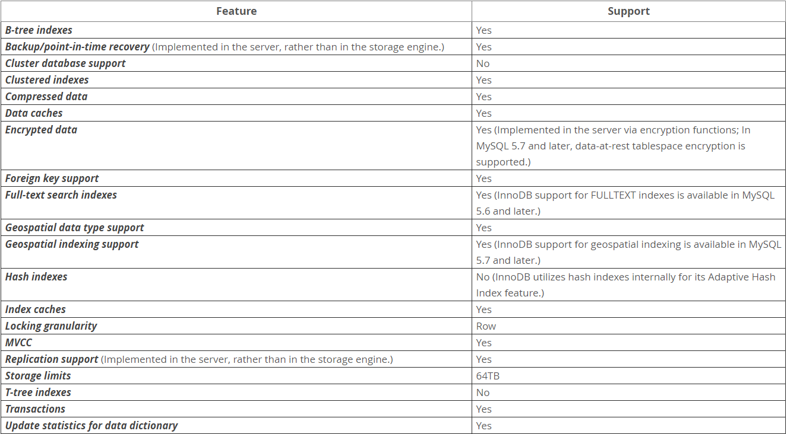

# InnoDB简介

InnoDB是一种平衡高可靠性和高性能的通用存储引擎。在MySQL 5.7中，InnoDB也是默认的MySQL存储引擎。除非在创建表格前配置不同的存储引擎，
否则当去执行一个不包含`ENGING=`条件声明的`CREATE_TABLE`语句时，将创建一个存储引擎为InnoDB的数据表。

## InnoDB存储引擎主要优势
- 它的DML操作遵循 ACID模型，具有提交、回滚和崩溃恢复特色功能的事务处理机制来保护用户数据。
- 行级别的锁机制(Row-level locking)以及Oracle方式的一致性读取，可提高并发性能。
- 使用InnoDB作为存储引擎的表格将您的数据排列在磁盘上，并基于主键优化查询。每个 InnoDB表都有一个称为聚簇索引的主键索引，使数据系统化，以实现
最小化I/O查询.
- 为保证数据的完整性，InnoDB支持 外键(FOREIGN KEY)约束。使用外键，将使得插入、更新和删除操作被约束，以避免不同关联数据表数据处理不一致的
情况。

InnoDB存储引擎功能特性： 

## 2.1.1 使用InnoDB引擎的好处
#### 你可能会从以下一些方面发现使用InnoDB的意义
- 如果您的服务器因硬件或者软件问题导致崩溃，无论当时数据库中发生了什么，您都无需再重启数据库后做任何特殊处理。InnoDB 崩溃恢复机制
会自动完成崩溃前提交的修改，并撤销正在进行但并未提交的修改。只需重新启动便可。
- InnoDB存储引擎维护自己的缓冲池，当访问数据时，缓存池将表和索引数据缓存在主内存中。常用数据直接从内存中处理。此缓存适用于许多类型的信息，
并加快处理速度。在专用数据库服务器上，高达80%的物理内存通常分配给缓存池。
- 如果将相关数据分割到不同的表中，可以设置外键来强制引用完整性。更新或删除数据，并自动更新或删除其他表中的相关数据。尝试在主表中
没有对应数据的情况下将数据插入辅助表，则会自动删除脏数据。
- 如果磁盘或内存中的数据损坏，校验机制会在您使用伪数据之前提醒您。
- 当为每个表使用适当的主键列设计数据库时，将自动优化涉及这些列的操作。在WHERE子句、ORDER BY子句、GROUP BY子句和join操作中引用
主键列非常快。
- 插入、更新和删除都通过被称作‘更改缓存’的自动机制进行优化。InnoDB不仅允许对同一个表进行并发读写访问，它还缓存了更改后的数据，
以简化磁盘I/O。
- 性能优势并不局限于那些查询耗时的巨型表。当从一个表一次又一次地访问相同的行时，一个称为Adaptive Hash Index的特性将接管，
使这些查找变得更快，就好像它们来自一个Hash表一样。
- 您可以压缩表和相关索引。
- 您可以在对性能和可用性影响最小的前提下添加和删除索引。
- 截断每个表的文件表空间非常快，并且可以释放磁盘空间供操作系统重用，而不是释放系统表空间中只有InnoDB可以重用的空间。
- 使用DYNAMIC行格式，对于BLOB和长文本字段，表数据的存储布局更有效。
- 您可以通过查询INFORMATION_SCHEMA表来监视存储引擎的内部工作。
- 您可以通过查询 Performance_Schema表来监视存储引擎的性能细节。
- 您可以自由地将InnoDB表与来自其他MySQL存储引擎的表混合使用，即使是在同一语句中。例如，可以使用join操作在一个查询中组合来自
InnoDB和MEMORY表的数据。
- InnoDB的设计初衷是在处理大量数据时提高CPU效率和性能最大化。
- InnoDB表可以处理大量数据，即使在文件大小限制为2GB的操作系统上也是如此。

## 2.1.2 InnoDB引擎的最佳实践
### 本节描述使用InnoDB引擎时的最佳实践
- 使用查询最为频繁的某个或多个列，作为每个表的主键，如果没有明显的主键，则指定auto-increment值。
- 在基于相同关联ID的多个表格中，通过使用joins关键字对这些表格进行联表数据获取。为了快速连接性能，在连接列上定义外键，并在每个表中声明具有相同数
据类型的列。添加外键可以确保引用的列被索引，从而提高性能。外键还将删除或更新传达到所有关联的表，并防止在父表中没有对应的ID时将数据插入子表中。
- 关闭autocommit（自动提交）,每秒提交数百次则会限制性能(受存储设备写入速度的限制)。
- 通过使用 START TRANSACTION（事务开启） 和 COMMIT（提交）语句将相关的DML操作分组到事务中。虽然你不想过于频繁的进行commit提交操作，但你肯定
也不希望在数小时没有提交的情况下，执行大量的INSERT、UPDATE或者DELETE语句。
- 不要使用LOCK TABLES(锁表)语句。InnoDB可以同时处理对同一个表读写的多个会话，而不会牺牲可靠和高效的性能。要获得对一组行的独有的写权限，请使用
 SELECT ... FOR UPDATE语法仅锁定要更新的行。
- 启用innodb_file_per_table选项或使用通用表空间将表的数据和索引放入单独的文件中，而不是系统表空间。
  innodb_file_per_table 默认情况下是开启的。
- 评估你的数据和访问模式是否受益于InnoDB表或页面压缩功能。您可以在不牺牲读/写功能的情况下压缩InnoDB表。
- 在运行服务时加上 `--sql_mode=NO_ENGINE_SUBSTITUTION` 选项,以防止在运行CREATE TABLE语句时由于存储引擎在`ENGINE=`子句中被定义而创建
出其他存储引擎的表。

## 2.1.3 查验InnoDB是否是默认的存储引擎
### 执行`SHOW ENGINES`语句查看可用的MySQL存储引擎。在InnoDB行中寻找默认值
#### `mysql> SHOW ENGINES;`
### 或者通过查询 INFORMATION_SCHEMA.ENGINES表
#### `mysql> SELECT * FROM INFORMATION_SCHEMA.ENGINES;`

 