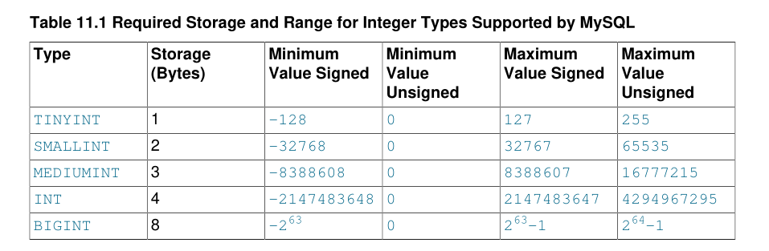

# 3.2 数字类型

MySQL支持所有标准SQL数值数据类型。这些类型包括精确的数值数据类型（`INTEGER`，`SMALLINT`，`DECIMAL`和`NUMERIC`），以及近似数值数据类型（`FLOAT`，`REAL`和`DOUBLE PRECISION）`。关键字`INT`是`INTEGER`的同义词，关键字`DEC`和`FIXED`是`DECIMAL`的同义词。 MySQL将`DOUBLE`视为`DOUBLE PRECISION`（非标准扩展）的同义词。除非启用`REAL_AS_FLOAT` SQL模式，否则MySQL还将`REAL`视为`DOUBLE PRECISION`（非标准变体）的同义词。

`BIT`数据类型存储位值，并支持`MyISAM`，`MEMORY`，`InnoDB`和`NDB`表。

有关MySQL如何处理在表达式评估期间将超出范围值分配给列和溢出的信息，请参见第11.2.6节“超出范围和溢出处理”。

有关数字类型存储要求的信息，请参见第11.8节“数据类型存储要求”。

用于计算数字操作数的结果的数据类型取决于操作数的类型和对它们执行的操作。有关更多信息，请参见第12.6.1节“算术运算符”。

## 3.2.1 Integer Types (Exact Value) - INTEGER, INT, SMALLINT, TINYINT,MEDIUMINT, BIGINT

MySQL支持SQL标准整数类型`INTEGER`（或`INT`）和`SMALLINT`。 作为标准的扩展，MySQL还支持整数类型`TINYINT`，`MEDIUMINT`和`BIGINT`。 下表显示了每种整数类型所需的存储和范围。



## 3.2.2 Fixed-Point Types (Exact Value) - DECIMAL, NUMERIC

DECIMAL和NUMERIC类型存储精确的数值数据值。 在保持精确精度很重要时使用这些类型，例如使用货币数据。 在MySQL中，`NUMERIC`实现为`DECIMAL`，因此以下关于`DECIMAL`的评论同样适用于`NUMERIC`。

MySQL以二进制格式存储`DECIMAL`值。 请参见第12.22节“精确数学”。

在`DECIMAL`列声明中，精度和比例可以（通常是）指定; 

例如：

```mysql
salary DECIMAL(5,2)
```

在这个例子中，`5`是精度，`2`是刻度。 精度表示为值存储的有效位数，刻度表示小数点后可存储的位数。

标准SQL要求`DECIMAL（5,2）`能够存储五位数和两位小数的任何值，因此可存储在`salary`列中的值范围为`-999.99`到`999.99`。

在标准SQL中，语法`DECIMAL（M）`等同于`DECIMAL（M，0）`。 类似地，语法`DECIMA`L等同于`DECIMAL（M，0）`，其中允许实现决定`M`的值。MySQL支持这两种`DECIMAL`语法的变体形式。 `M`的默认值为`10`。

如果比例为0，则`DECIMAL`值不包含小数点或小数部分。

`DECIMAL`的最大位数为65，但给定`DECIMAL`列的实际范围可能受给定列的精度或比例限制。 如果为这样的列分配了小数点后面的位数超过指定比例允许的值，则该值将转换为该比例。 （精确的行为是特定于操作系统的，但通常效果是截断到允许的位数。）

## 3.2.3 Floating-Point Types (Approximate Value) - FLOAT, DOUBLE

`FLOAT`和`DOUBLE`类型表示近似数值数据值。 MySQL对于单精度值使用四个字节，对于双精度值使用八个字节。

对于`FLOAT`，SQL标准允许在括号中的关键字`FLOAT`后面的位中选择性地指定精度（但不是指数的范围）; ;也就是`FLOAT（p）`。 MySQL也
支持此可选精度规范，但`FLOAT（p）`中的精度值仅用于确定存储大小。精度从`0`到`23`会产生一个`4`字节的单精度`FLOAT`列。从`24`到`53`的精度产生`8`字节双精度`DOUBLE`列。

MySQL允许非标准语法：`FLOAT（M，D）`或`REAL（M，D）`或`DOUBLE PRECISION（M，D）`。这里，`（M，D）`意味着值可以存储最多`M`个数字，哪个`D`位可能在小数点后面。例如，定义为`FLOAT（7,4）`的列在显示时将显示为`-999.9999`。 MySQL在存储值时执行舍入，因此如果将`999.00009`插入`FLOAT（7,4）`列，则近似结果为`999.0001`。

由于浮点值是近似值而未存储为精确值，因此尝试在比较中将它们视为精确值可能会导致问题。它们还受平台或实现依赖性的影响。有关更多信息，请参见第B.4.4.8节“浮点值的问题”

为了获得最大的可移植性，需要存储近似数值数据值的代码应使用`FLOAT`或`DOUBLE PRECISION`，不指定精度或位数。

## 3.2.4 Bit-Value Type - BIT

`BIT`数据类型用于存储位值。 一种`BIT（M）`允许存储`M`位值。 M的范围为1到64。

要指定位值，可以使用`b'value'`表示法。 value是使用零和1写的二进制值。 例如，`b'111'`和`b'10000000'`分别代表`7`和`128`。 见9.1.5节，
“比特值文字”。

如果为`BIT（M）`列分配一个小于M位长的值，则该值将在左侧用零填充。 例如，将`b'101'`的值分配给BIT（6）列实际上与...相同分配`b'000101'`。

NDB Cluster.。 给定NDB表中使用的所有`BIT`列的最大组合大小不得超过`4096`位。

## 3.2.5  Numeric Type Attributes

MySQL支持扩展，可以选择在类型的base关键字后面的括号中指定整数数据类型的显示宽度。例如，`INT（4）`指定显示宽度为四位的`INT`。应用程序可以使用此可选显示宽度来显示宽度小于为列指定的宽度的整数值，方法是用空格填充它们。 （也就是说，此宽度存在于使用结果集返回的元数据中。是否使用它取决于应用程序。）

显示宽度不会限制可以存储在列中的值的范围。它也不会阻止比列显示宽度更宽的值正确显示。例如，指定为`SMALLINT（3）`的列的通常`SMALLINT`范围为`-32768`到`32767`，超出三位数允许的范围之外的值将使用三位数以上的方式完整显示

与可选（非标准）ZEROFILL属性一起使用时，默认的空格填充将替换为零。例如，对于声明为`INT（4）ZEROFILL`的列，值为`5`被检索为`0005`。

`注意`

对于表达式或`UNION`查询中涉及的列，将忽略`ZEROFILL`属性。

如果将大于显示宽度的值存储在具有`ZEROFILL`属性的整数列中，则当MySQL为某些复杂连接生成临时表时，可能会遇到问题。 在这些情况下，MySQL假定数据值符合列显示宽度。

`注意`

所有整数类型都可以有一个可选(非标准)无符号属性。无符号类型可用于只允许列中的非负数，或者当您需要列的较大的数字上限时。例如，如果一个`INT`列是无符号的，那么列的范围大小是相同的，但是它的端点向上移动，从`-2147483648`和`2147483647`到`0`和`4294967295`。

浮点和定点类型也可以是`UNSIGNED`。与整数类型一样，此属性可防止负值存储在列中。与整数类型不同，列值的上限范围保持不变。

如果为数字列指定`ZEROFILL`，MySQL会自动添加`UNSIGNED`属性。

整数或浮点数据类型可以具有`AUTO_INCREMENT`属性。将值`NULL`插入索引的`AUTO_INCREMENT`列时，该列将设置为下一个序列值。通常，这是`value+1`，其中`value`是表中当前列的最大值。 （`AUTO_INCREMENT`序列以`1`开头。）

将`0`存储到`AUTO_INCREMENT`列与存储`NULL`具有相同的效果，除非启用了`NO_AUTO_VALUE_ON_ZERO`SQL模式。

插入`NULL`以生成`AUTO_INCREMENT`值需要将该列声明为`NOT NULL`。如果列声明为`NULL`，则插入`NULL`将存储`NULL`。当您将任何其他值插入`AUTO_INCREMENT`列时，该列将设置为该值并重置序列，以便下一个自动生成的值依次来自插入的值。

不支持`AUTO_INCREMENT`列的负值。

## 3.2.6 超出范围和溢出处理( Out-of-Range and Overflow Handling )

当MySQL将值存储在超出列数据类型允许范围的数值列中时，结果取决于当时生效的SQL模式：

• 如果启用了严格的SQL模式，则MySQL会根据SQL标准拒绝带有错误的超出范围的值，并且插入失败。

• 如果未启用限制模式，MySQL会将值剪辑到列数据类型范围的相应端点，并存储结果值。


当超出范围的值分配给整数列时，MySQL会存储表示列数据类型范围的相应端点的值。

当为浮点或定点列分配的值超出指定（或默认）精度和比例所隐含的范围时，MySQL会存储表示该范围的相应端点的值。

假设表t1具有以下定义：

```mysql
CREATE TABLE t1 (i1 TINYINT, i2 TINYINT UNSIGNED);
```

启用严格的SQL模式后，会出现超出范围的错误:

```mysql
mysql> SET sql_mode = 'TRADITIONAL';
mysql> INSERT INTO t1 (i1, i2) VALUES(256, 256);
ERROR 1264 (22003): Out of range value for column 'i1' at row 1
mysql> SELECT * FROM t1;
Empty set (0.00 sec)
```

如果没有启用严格的SQL模式，就会出现带有警告的裁剪:

```mysql
mysql> SET sql_mode = '';
mysql> INSERT INTO t1 (i1, i2) VALUES(256, 256);
mysql> SHOW WARNINGS;
+---------+------+---------------------------------------------+
| Level | Code | Message |
+---------+------+---------------------------------------------+
| Warning | 1264 | Out of range value for column 'i1' at row 1 |
| Warning | 1264 | Out of range value for column 'i2' at row 1 |
+---------+------+---------------------------------------------+
mysql> SELECT * FROM t1;
+------+------+
| i1   | i2   |
+------+------+
| 127  | 255  |
+------+------+
```

如果未启用严格SQL模式，则由于剪切而发生的列分配转换将报告为`ALTER TABLE`，`LOAD DATA`，`UPDATE`和多行`INSERT`语句的警告。在严格模式下，这些语句失败，部分或全部 不会插入或更改值，具体取决于表是否为事务表和其他因素。 有关详细信息，请参见第5.1.10节“Server SQL Modes”。

数值表达式求值过程中的溢出会导致错误。 例如，最大的带符号`BIGINT`值为`9223372036854775807`，因此以下表达式会产生错误：

```mysql
mysql> SELECT 9223372036854775807 + 1;
ERROR 1690 (22003): BIGINT value is out of range in '(9223372036854775807 + 1)'
```

若要使操作在这种情况下成功，请将值转换为无符号;

```mysql
mysql> SELECT CAST(9223372036854775807 AS UNSIGNED) + 1;
+-------------------------------------------+
| CAST(9223372036854775807 AS UNSIGNED) + 1 |
+-------------------------------------------+
|                       9223372036854775808 |
+-------------------------------------------+
```

是否发生溢出取决于操作数的范围，因此处理前一个表达式的另一种方法是使用精确值算术，因为`DECIMAL`值的范围大于整数：

```mysql
mysql> SELECT 9223372036854775807.0 + 1;
+---------------------------+
| 9223372036854775807.0 + 1 |
+---------------------------+
|     9223372036854775808.0 |
+---------------------------+
```

在整数值之间进行减法（其中一个类型为`UNSIGNED`）默认情况下会生成无符号结果。 如果结果否则为负，则会导致错误：

```mysql
mysql> SET sql_mode = '';
Query OK, 0 rows affected (0.00 sec)

mysql> SELECT CAST(0 AS UNSIGNED) - 1;
ERROR 1690 (22003): BIGINT UNSIGNED value is out of range in '(cast(0 as unsigned) - 1)'
```

如果启用`no_unsigned_minus` SQL模式，结果为负数:

```mysql
mysql> SET sql_mode = 'NO_UNSIGNED_SUBTRACTION';
mysql> SELECT CAST(0 AS UNSIGNED) - 1;
+-------------------------+
| CAST(0 AS UNSIGNED) - 1 |
+-------------------------+
| -1                      |
+-------------------------+
```

如果使用此类操作的结果更新`UNSIGNED`整数列，则结果将剪切为列类型的最大值，如果启用了`NO_UNSIGNED_SUBTRACTION`，则剪切为0。 如果启用了严格的SQL模式，则会发生错误并且列保持不变。


