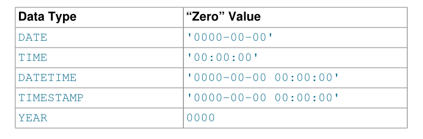

# 3.1 日期和时间类型 ( Date and Time Types )

表示时间值的日期和时间类型是`DATE`，`TIME`，`DATETIME`，`TIMESTAMP`和`YEAR`。每个时间类型都有一系列有效值，以及当您指定MySQL无法表示的无效值时可以使用的“零”值。 `TIMESTAMP`类型具有特殊的自动更新行为，稍后将对此进行描述。

使用日期和时间类型时，请记住以下一般注意事项：

- MySQL以标准输出格式检索给定日期或时间类型的值，但它会尝试解释您提供的输入值的各种格式（例如，当您指定要分配给日期的值或与日期进行比较时或时间类型）。有关日期和时间类型的允许格式的说明，请参见第9.1.3节“日期和时间字面值”。预计您提供有效值。如果您使用其他格式的值，可能会出现不可预测的结果。

- 虽然MySQL尝试以几种格式解释值，但日期部分必须始终以 年-月-日 顺序给出(例如，`'98-09-04'`)，而不是以其他地方常用的 月-日-年 或 日-月-年 顺序给出（例如，'09 -04-98'，'04 -09-98'）。

- 包含两位数年份值的日期不明确，因为这个世纪未知。 MySQL使用以下规则解释两位数的年份值：

    • `70-99`范围内的年份值转换为`1970-1999`。

    • `00-69`范围内的年份值转换为`2000-2069`。另见第11.3.8节“日期中的两位数年份”。

- 根据第11.3.7节“日期和时间类型之间的转换”中的规则，将值从一种时间类型转换为另一种时间类型。

- 如果在数值上下文中使用该值，MySQL会自动将日期或时间值转换为数字，反之亦然。

- 默认情况下，当MySQL遇到超出范围的日期或时间类型的值或对该类型无效时，它会将该值转换为该类型的“零”值。例外情况是超出范围的`TIME`值被剪切到`TIME`范围的适当端点。

- 通过将SQL模式设置为适当的值，您可以更准确地指定希望MySQL支持的日期类型。 （请参见第5.1.10节 “Server SQL Modes”。）通过启用`ALLOW_INVALID_DATES` SQL模式，您可以让MySQL接受某些日期，例如`'2009-11-31'`。当您希望存储用户在数据库中指定的“可能错误”值（例如，在Web表单中）以供将来处理时，这非常有用。在此模式下，MySQL仅验证月份的范围是1到12，并且该日期的范围是1到31。

- MySQL允许您在`DATE`或`DATETIME`列中存储日期或月份和日期为零的日期。这对于需要存储您可能不知道确切日期的生日的应用程序非常有用。在这种情况下，您只需将日期存储为`'2009-00-00'`或`'2009-01-00'`。如果存储诸如此类的日期，则不应期望获得需要完整日期的`DATE_SUB()`或`DATE_ADD()`等函数的正确结果。要禁止日期中零月或日零件，请启用`NO_ZERO_IN_DATE`模式。

- MySQL允许您将`'0000-00-00'`的“零”值存储为“虚拟日期”。这在某些情况下比使用`NULL`值更方便，并且使用更少的数据和索引空间。要禁止`'0000-00-00'`，请启用`NO_ZERO_DATE`模式。

- 通过Connector / ODBC使用的“零”日期或时间值自动转换为`NULL`，因为ODBC无法处理此类值。

下表显示了每种类型的“零”值的格式。 “零”值是特殊的，但您可以使用表中显示的值显式地存储或引用它们。您也可以使用值`'0'`或`0`来执行此操作，这样更容易编写。对于包含日期部分（`DATE`，`DATETIME`和`TIMESTAMP`）的时态类型，如果启用了`NO_ZERO_DATE` SQL模式，则使用这些值会产生警告。

## 3.1.1 日期、日期时间和时间戳类型(  The DATE, DATETIME, and TIMESTAMP Types )

`DATE`，`DATETIME`和`TIMESTAMP`类型是相关的。本节介绍它们的特征，它们的相似之处以及它们的区别。 MySQL识别`DATE`，`DATETIME`和`TIMESTAMP`，第9.1.3节“日期和时间文字”中描述的几种格式的值。对于`DATE`和`DATETIME`范围描述，“支持”意味着尽管早期值可能有效，但无法保证。

`DATE`类型用于具有日期部分但没有时间部分的值。 MySQL以`'YYYY-MM-DD'`格式检索并显示`DATE`值。支持的范围是`'1000-01-01'`到`'9999-12-31'`。

`DATETIME`类型用于包含日期和时间部分的值。 MySQL以`'YYYY-MM-DD hh：mm：ss'`格式检索并显示`DATETIME`值。支持的范围是`'1000-01-01 00:00:00'`到`'9999-12-31 23:59:59'`。

`TIMESTAMP`数据类型用于包含日期和时间部分的值。 `TIMESTAMP`的范围为`'1970-01-01 00：00：01'`UTC到`'2038-01-19 03:14:07'`UTC。

`DATETIME`或`TIMESTAMP`值可以包括高达微秒（6位）精度的尾随小数秒部分。特别是，插入`DATETIME`或`TIMESTAMP`列的值中的任何小数部分都将被存储而不是被丢弃。包含小数部分，这些值的格式为`'YYYY-MM-DD hh：mm：ss [.fraction]'`，`DATETIME`值的范围为`'1000-01-01 00：00：00.000000'`至`'9999-12-31 23：59：59.999999'`，`TIMESTAMP`值的范围为`'1970-01-01 00：00：01.000000'`至`'2038-01-19 03:14:07.999999'` 。小数部分应始终与其余时间分开一个小数点;没有其他分数秒分隔符被识别。有关MySQL中小数秒支持的信息，请参见第11.3.6节“时间值中的小数秒”。

`TIMESTAMP`和`DATETIME`数据类型提供自动初始化和更新到当前日期和时间。

无效的`DATE`，`DATETIME`或`TIMESTAMP`值将转换为相应类型的“零”值（`'0000-00-00'`或`'0000-00-00 00:00:00'`）。

请注意MySQL中日期值解释的某些属性：

- MySQL允许为指定为字符串的值使用“宽松”格式，其中任何标点字符都可以用作日期部分或时间部分之间的分隔符。在某些情况下，这种语法可能是欺骗性的。例如，`'10：11：12'`之类的值可能看起来像时间值，因为`:`，但如果在日期上下文中使用，则会被解释为年份`'2010-11-12'`。值`'10：45：15'`被转换为`'0000-00-00'`，因为`'45'`不是有效月份。在日期和时间部分与小数秒部分之间识别的唯一分隔符是小数点。

- 服务器要求月和日值有效，而不仅仅分别在1到12和1到31的范围内。禁用严格模式后，`'2004-04-31'`等无效日期将转换为`'0000-00-00'`，并生成警告。启用严格模式后，无效日期会生成错误。要允许此类日期，请启用`ALLOW_INVALID_DATES`。有关更多信息，请参见第5.1.10节“Server SQL Modes”。

- MySQL不接受包含日期或月份列中的零的`TIMESTAMP`值或不是有效日期的值。该规则的唯一例外是特殊的“零”值`'0000-00-00 00:00:00'`。

- 包含两位数年份值的日期不明确，因为这个世纪未知。 MySQL使用以下规则解释两位数的年份值：

    • `00-69`范围内的年份值转换为`2000-2069`。

    • `70-99`范围内的年份值转换为`1970-1999`。

`注意`

可以在启用MAXDB SQL模式的情况下运行MySQL服务器。 在这种情况下，`TIMESTAMP`与`DATETIME`相同。 如果在创建表时启用此模式，则会将`TIMESTAMP`列创建为`DATETIM`列。 因此，此类列使用`DATETIME`显示格式，具有相同的值范围，并且不会自动初始化或更新到当前日期和时间。

从MySQL 5.7.22开始，不推荐使用`MAXDB`。 它将在未来的MySQL版本中删除。

`注意`

## 3.1.2 时间类型 (The TIME Type)

MySQL以`'hh：mm：ss'`格式（或大小时值的`'hhh：mm：ss'`格式）检索并显示TIME值。`TIME`值的范围可以从`'-838：59：59'`到`'838：59：59'`。小时部分可能太大，因为TIME类型不仅可以用来表示一天中的时间（必须小于24小时），还可以用于表示两个事件之间的经过时间或时间间隔（可能远大于24小时，甚至是负面的）。

MySQL以多种格式识别`TIME`值，其中一些格式可包括精确到微秒（6位）的尾随小数秒部分。请参见第9.1.3节“日期和时间字面值”。有关MySQL中小数秒支持的信息，请参见第11.3.6节“时间值中的小数秒”。特别是，存储而不是丢弃插入到`TIME`列中的值中的任何小数部分。包含小数部分，`TIME`值的范围是`'-838：59：59.000000'`到`'838：59：59.000000'`。

将缩写值分配给`TIME`列时要小心。 MySQL用冒号解释缩写的`TIME`值作为一天中的时间。也就是说，`'11：12'`表示`'11：12：00'`，而不是`'00：11：12'`。 MySQL使用假设最右边的两个数字代表秒数（即经过时间而不是时间）来解释没有冒号的缩写值。例如，您可能会将`'1112'`和`1112`视为`'11：12：00'`（11点后12分钟），但MySQL会将其解释为`'00：11：12'（11分12秒）` 。类似地，`'12'`和`12`被解释为`'00：00：12'`。

在时间部分和小数秒部分之间识别的唯一分隔符是小数点。

默认情况下，位于`TIME`范围之外但其他方式有效的值将剪切到范围的最近端点。例如，`'-850：00：00'`和`'850：00：00'`被转换为`'-838：59：59'`和`'838：59：59'`。无效的`TIME`值将转换为`'00：00：00'`。请注意，因为`'00：00：00'`本身是一个有效的`TIME`值，所以无法从表中存储的'00：00：00'值中判断原始值是否指定为`'00： 00:00'`或是否无效。要对无效TIME值进行更严格的处理，请启用严格SQL模式以导致错误发生。

## 3.1.3 年类型(The YEAR Type)

`YEAR`类型是1字节类型，用于表示年份值。它可以声明为`YEAR`或`YEAR（4）`，显示宽度为四个字符。

`注意：不推荐使用YEAR（2）数据类型，并在MySQL 5.7.5中删除对它的支持。把YEAR（2）列转换为YEAR（4）`

MySQL以`YYYY`格式显示`YEAR`值，范围为`1901`到`2155`或`0000`。

您可以指定各种格式的输入`YEAR`值：

- 作为`1901`至`2155`范围内的`4`位数字。

- 作为`'1901'`到`'2155'`范围内的`4`位数字符串。

- 作为`1`到`99`范围内的1位或2位数字。MySQL将范围`1`到`69`和`70`到`99`的值转换为`2001`到`2069`和`1970`到`1999`范围内的`YEAR`值。

- 作为`'0'`到`'99'`范围内的1位或2位数字符串。 MySQL将范围`'0'`中的值转换为`'69'`和`'70'`到`'99'`到`YEAR`的值在`2000`到`2069`和`1970`到`1999`之间。

- 插入数字`0`的结果显示值为`0000`，内部值为`0000`.要插入零并将其解释为`2000`，请将其指定为字符串`'0'`或`'00'`。

- 作为返回`YEAR`上下文中可接受的值的函数的结果，例如`NOW()`。 MySQL将无效的`YEAR`值转换为`0000`。

