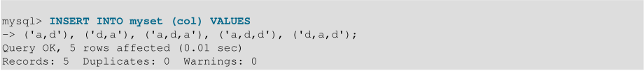

# 3.1 字符串类型

字符串类型是`CHAR`，`VARCHAR`，`BINARY`，`VARBINARY`，`BLOB`，`TEXT`，`ENUM`和`SET`。这个部分介绍了这些类型的工作方式以及如何在查询中使用它们。

## 3.1.1 CHAR和VARCHAR类型

`CHAR`和`VARCHAR`类型类似，但它们的存储和检索方式不同。它们的最大长度和尾随空间是否保留也不同。

声明`CHAR`和`VARCHAR`类型的长度指示要存储的最大字符数。例如，`CHAR（30）`最多可以包含30个字符。

`CHAR`列的长度固定为您在创建表时声明的长度。长度可以是0到255之间的任何值。当存储`CHAR`值时，它们用空格填充到指定的长度。检索`CHAR`值时，除非启用PAD_CHAR_TO_FULL_LENGTH SQL模式，否则将删除尾随空格。

`VARCHAR`列中的值是可变长度字符串。长度可以指定为0到65,535之间的值。 `VARCHAR`的有效最大长度取决于最大行大小（65,535字节，在所有列之间共享）和使用的字符集。请参见第C.10.4节“表列数和行大小的限制”。

与`CHAR`相比，`VARCHAR`值存储为1字节或2字节长度前缀加数据。长度前缀表示值中的字节数。如果值不超过255个字节，则列使用一个长度字节;如果值可能需要超过255个字节，则列使用两个长度字节。

如果未启用严格SQL模式，并且您为`CHAR`或`VARCHAR`列分配的值超出了列的最大长度，则会截断该值以适合并生成警告。对于非空格字符的截断，可以导致发生错误（而不是警告），并通过使用严格的SQL模式来禁止插入值。请参见第5.1.10节“服务器SQL模式”。

对于`VARCHAR`列，在插入之前会截断超出列长度的尾随空格，并且无论使用何种SQL模式，都会生成警告。对于`CHAR`列，无论SQL模式如何，都会以静默方式截断插入值中的多余尾随空格。

存储`VARCHAR`值时不会填充它们。存储和检索值时，将保留尾随空格，符合标准SQL。

下表通过显示将各种字符串值存储到`CHAR（4）`和`VARCHAR（4）`列中的结果（假设该列使用单字节字符集，如latin1）来说明`CHAR`和`VARCHAR`之间的差异。


显示为存储在表的最后一行中的值仅在不使用严格模式时适用; 如果MySQL在严格模式下运行，则不会存储超过列长度的值，并且会产生错误。

`InnoDB`将长度大于或等于768字节的固定长度字段编码为可变长度字段，可以在页外存储。 例如，如果字符集的最大字节长度大于3，则`CHAR（255）`列可以超过768字节，就像使用`utf8mb4`一样。

如果给定值存储在`CHAR（4）`和`VARCHAR（4）`列中，则从列中检索的值并不总是相同，因为在检索时会从`CHAR`列中删除尾随空格。 以下示例说明了这种差异：


`CHAR`和`VARCHAR`列中的值将根据分配给列的字符集排序规则进行排序和比较。

所有MySQL排序规则都是PAD SPACE类型。 这意味着将比较所有`CHAR`，`VARCHAR`和`TEXT`值，而不考虑任何尾随空格。 此上下文中的“比较”不包括`LIKE`模式匹配运算符，尾随空格很重要。 例如：


这适用于所有MySQL版本，并且不受服务器SQL模式的影响。

对于剥离尾随填充字符或比较忽略它们的情况，如果列具有需要唯一值的索引，则插入仅在尾随填充字符数不同的列值中将导致重复键错误。 例如，如果表包含`'a'`，则尝试存储`'a '`会导致重复键错误。

## 3.1.2 BINARY和VARBINARY类型

`BINARY`和`VARBINARY`类型与`CHAR`和`VARCHAR`类似，不同之处在于它们包含二进制字符串而不是非二进制字符串。也就是说，它们包含字节字符串而不是字符串。这意味着它们具有`binary`字符集和排序规则，并且比较和排序基于值中字节的数值。

对于`BINARY`和`VARBINARY`，允许的最大长度与`CHAR`和`VARCHAR`的相同，除了`BINARY`和`VARBINARY`的长度是以字节为单位而不是以字符为单位的长度。

`BINARY`和`VARBINARY`数据类型与`CHAR BINARY`和`VARCHAR BINARY`数据类型不同。对于后面的类型，`BINARY`属性不会将列视为二进制字符串列。相反，它会导致使用列字符集的二进制（_bin）排序规则，并且列本身包含非二进制字符串而不是二进制字节字符串。例如，`CHAR（5）BINARY`被视为`CHAR（5）CHARACTER SET latin1 COLLATE latin1_bin`，假设默认字符集是`latin1`。这与`BINARY（5）`不同，后者存储具有二进制字符集和排序规则的5字节`binary`字符串。有关非二进制字符串的二进制字符串和二进制排序规则之间差异的信息，请参见第10.8.5节“二进制排序规则与_bin排序规则比较”。

如果未启用严格SQL模式，并且您为`BINARY`或`VARBINARY`列分配的值超出了列的最大长度，则会截断该值以使其适合并生成警告。对于截断的情况，您可以导致发生错误（而不是警告）并通过使用严格的SQL模式来禁止插入值。请参见第5.1.10节“Server SQL Modes”。

存储`BINARY`值时，将它们右键填充，填充值为指定长度。填充值为`0x00`（零字节）。值在插入时右边填充`0x00`，没有尾随字节在select上删除。所有字节在比较中都很重要，包括`ORDER BY`和`DISTINCT`操作。比较中`0x00`字节和空格不同，`0x00`<空格。

示例：对于`BINARY（3）`列，插入时`'a '`变为`'a \0'`。 `'a\0'`在插入时变为`'a\0\0'`。 选中时，两个插入值都保持不变。

对于`VARBINARY`，插入时没有填充，并且select上没有删除任何字节。 所有字节在比较中都很重要，包括`ORDER BY`和`DISTINCT`操作。 比较中`0x00`字节和空格不同，`0x00`<空格。

对于剥离尾随填充字节或比较忽略它们的情况，如果列具有需要唯一值的索引，则插入仅在尾随填充字节数方面不同的列值将导致重复键错误。 例如，如果表包含`'a'`，则尝试存储`'a\0'`会导致重复键错误。

如果计划使用BINARY数据类型存储二进制数据，并且要求检索的值与存储的值完全相同，则应仔细考虑前面的填充和剥离特性。 以下示例说明了`BINARY`值的`0x00`填充如何影响列值比较：


如果检索的值必须与没有填充的存储指定的值相同，则最好使用`VARBINARY`或其中一个`BLOB`数据类型。

## 3.1.3 BLOB和TEXT类型

`BLOB`是一个二进制大对象，可以容纳可变数量的数据。四种BLOB类型是`TINYBLOB`，`BLOB`，`MEDIUMBLOB`和`LONGBLOB`。它们的区别仅在于它们可以容纳的值的最大长度。四种TEXT类型是`TINYTEXT`，`TEXT`，`MEDIUMTEXT`和`LONGTEXT`。这些对应于四种BLOB类型，并具有相同的最大长度和存储要求。请参见第11.8节“数据类型存储要求”。

`BLOB`值被视为二进制字符串（字节字符串）。它们具有`binary`字符集和排序规则，并且比较和排序基于列值中字节的数值。 `TEXT`值被视为非二进制字符串（字符串）。它们具有`binary`以外的字符集，并根据字符集的排序规则对值进行排序和比较。

如果未启用严格SQL模式，并且您为BLOB或TEXT列分配的值超出了列的最大长度，则会截断该值以使其适合并生成警告。对于非空格字符的截断，可以导致发生错误（而不是警告），并通过使用严格的SQL模式来禁止插入值。请参见第5.1.10节“服务器SQL模式”。

无论SQL模式如何，从要插入TEXT列的值中截断多余的尾随空格始终会生成警告。

对于`TEXT`和`BLOB`列，插入时没有填充，并且`select`上没有删除任何字节。

如果索引TEXT列，则索引条目比较在末尾进行空格填充。这意味着，如果索引需要唯一值，则对于仅在尾随空格数方面不同的值，将出现重复键错误。例如，如果表包含`'a'`，则尝试存储`'a '`会导致重复键错误。对于BLOB列，情况并非如此。

在大多数方面，您可以将`BLOB`列视为`VARBINARY`列，可以根据需要大小。同样，您可以将`TEXT`列视为`VARCHAR`列。 `BLOB`和`TEXT`在以下方面与`VARBINARY`和`VARCHAR`不同：

•对于`BLOB`和`TEXT`列上的索引，必须指定索引前缀长度。对于`CHAR`和 
`VARCHAR`，前缀长度是可选的。请参见第8.3.4节“列索引”。

• `BLOB`和`TEXT`列不能具有DEFAULT值。

如果将`BINARY`属性与`TEXT`数据类型一起使用，则会为该列分配列字符集的二进制（`_bin`）排序规则。

`LONG`和`LONG VARCHAR`映射到`MEDIUMTEXT`数据类型。这是兼容性功能。

MySQL Connector/ODBC将BLOB值定义为`LONGVARBINARY`，文本值定义为用`LONGVARCHAR`。

因为`BLOB`和`TEXT`可能非常长，所以在使用它们时可能会遇到一些限制:

- 排序时只使用列的第一个`max_sort_length`字节。`max_sort_length`的默认值是1024。通过在服务器启动或运行时增加`max_sort_length`的值，可以使更多字节在排序或分组中发挥重要作用。任何客户机都可以更改其会话`max_sort_length`变量的值:

```mysql
mysql> SET max_sort_length = 2000;
mysql> SELECT id, comment FROM t
-> ORDER BY comment;
```

- `BLOB`或`TEXT`的实例在处理一个查询的结果,使用临时表导致服务器使用一个表在磁盘上,而不是在内存中因为`MEMORY`存储引擎不支持这些数据类型(参见8.4.4内部临时表中使用MySQL)。
  使用磁盘会导致性能损失，因此只有在确实需要时才在查询结果中包含`BLOB`或`TEXT`。例如，避免使用`SELECT *`，它选择所有列。

- `BLOB`或`TEXT`对象的最大大小由其类型决定，但实际可以在客户端和服务器之间传输的最大值取决于可用内存量和通信缓冲区的大小。您可以通过更改`max_allowed_pa​​cket`变量的值来更改消息缓冲区大小，但必须同时为服务器和客户端程序执行此操作。例如，`mysql`和`mysqldump`都允许您更改客户端`max_allowed_pa​​cket`值。请参见第5.1.1节“配置服务器”，第4.5.1节“mysql  -  MySQL命令行客户端”和第4.5.4节“mysqldump  - 数据库备份程序”。您可能还希望将数据包大小和存储的数据对象的大小与存储要求进行比较，请参见第11.8节“数据类型存储要求”


每个`BLOB`或`TEXT`都由一个单独分配的对象在内部表示。这与所有其他数据类型形成了对比，当打开表时，每列分配一次存储。

在某些情况下，可能需要将二进制数据(如媒体文件)存储在`BLOB`或`TEXT`中。您可能会发现MySQL的字符串处理函数对于处理这样的数据很有用。参见12.5节,“字符串函数”。出于安全性和其他原因，通常最好使用应用程序代码，而不是给应用程序用户文件特权。您可以在MySQL论坛(http://forums.mysql.com/)中讨论各种语言和平台的细节。

## 3.1.4 ENUM类型

`ENUM`是一个字符串对象，其值从表创建时列规范中显式枚举的允许值列表中选择。它有以下优点:

- 在列的可能值集有限的情况下压缩数据存储。指定为输入值的字符串将自动编码为数字。

- 可读查询和输出。这些数字被转换回查询结果中的相应字符串。

以及这些需要考虑的潜在问题:

- 如果使枚举值看起来像数字，则很容易将文字值与其内部索引号混淆，如枚举限制中所述。

- 按照ORDER BY子句使用枚举列需要额外的注意，如枚举排序中所述。

- Creating and Using ENUM Columns

- Index Values for Enumeration Literals

- Handling of Enumeration Literals

- Empty or NULL Enumeration Values

- Enumeration Sorting

- Enumeration Limitations


### 3.1.4.1 Creating and Using ENUM Columns

枚举值必须是带引号的字符串文字。例如，您可以创建一个包含`ENUM`列的表，如下所示：

```mysql
CREATE TABLE shirts (
name VARCHAR(40),
size ENUM('x-small', 'small', 'medium', 'large', 'x-large')
);
INSERT INTO shirts (name, size) VALUES ('dress shirt','large'), ('t-shirt','medium'),
('polo shirt','small');
SELECT name, size FROM shirts WHERE size = 'medium';
+---------+--------+
| name | size |
+---------+--------+
| t-shirt | medium |
+---------+--------+
UPDATE shirts SET size = 'small' WHERE size = 'large';
COMMIT;
```

如果将实际字符串`'medium'`存储在VARCHAR列中，则将值为`'medium'`的100万行插入此表中将需要100万字节的存储空间，而不是600万字节。

### 3.1.4.2 Index Values for Enumeration Literals

每个枚举值都有一个索引：

• 列规范中列出的元素将分配索引号，从1开始。

• 空字符串错误值的索引值为0.这意味着您可以使用以下`SELECT`语句查找分配了无效`ENUM`值的行：

```mysql
mysql> SELECT * FROM tbl_name WHERE enum_col=0;
```

• `NULL`值的索引为`NULL` 。

• 此处的术语“索引”是指枚举值列表中的位置。它与表索引无关。

例如，指定为 `ENUM('Mercury', 'Venus', 'Earth')`的列可以具有此处显示的任何值。还显示了每个值的索引。


`ENUM`列最多可包含65,535个不同的元素。 （实际限制小于3000.）一个表在其被视为一个组的`ENUM`和`SET`列中不能超过255个唯一元素列表定义。有关这些限制的更多信息，请参见第C.10.5节“.frm文件结构所施加的限制”。

如果在数字上下文中检索`ENUM`值，则返回列值的索引。例如，您可以从`ENUM`列中检索数值，如下所示：

```mysql
mysql> SELECT enum_col + 0 FROM tbl_name;
```

期望数字参数的`SUM()`或`AVG()`等函数在必要时将参数强制转换为数字。对于`ENUM`值，索引号用于计算。

### 3.1.4.3 处理枚举文字 (Handling of Enumeration Literals）

创建表时，会自动从表定义中的ENUM成员值中删除尾随空格。

检索时，使用列定义中使用的字母显示存储在`ENUM`列中的值。请注意，可以为`ENUM`列分配字符集和排序规则。对于二进制或区分大小写的排序规则，在为列分配值时会考虑字母大小写。

如果将数字存储到`ENUM`列中，则将该数字视为可能值的索引，并且存储的值是具有该索引的枚举成员。 （但是，这不适用于`LOAD DATA`，它将所有输入视为字符串。）如果引用了数值，如果枚举值列表中没有匹配的字符串，它仍会被解释为索引。由于这些原因，不建议使用看起来像数字的枚举值来定义`ENUM`列，因为这很容易让人感到困惑。例如，以下列的枚举成员的字符串值为`'0'`,`'1'`,`'2'`，但数字索引值为`1`,`2`和`3`：

```mysql
numbers ENUM('0','1','2')
```

如果存储2，则将其解释为索引值，并变为`'1'`（索引为2的值）。如果存储`'2'`，则它与枚举值匹配，因此它存储为`'2'`。如果存储`'3'`，则它与任何枚举值都不匹配，因此它被视为索引并变为`'2'`（索引为3的值）。

```mysql
mysql> INSERT INTO t (numbers) VALUES(2),('2'),('3');
mysql> SELECT * FROM t;
+---------+
| numbers |
+---------+
| 1       |
| 2       |
| 2       |
+---------+
```

要确定`ENUM`列的所有可能值，请使用`SHOW COLUMNS FROM tbl_name LIKE 'enum_col'`并在输出的`Type`列中解析`ENUM`定义。

在C API中，枚举值作为字符串返回。

### 3.1.4.4 Empty or NULL Enumeration Values

在某些情况下，枚举值也可以是空字符串（`''`）或`NULL`：

• 如果在`ENUM`中插入无效值（即，允许值列表中不存在的字符串），则会插入空字符串作为特殊错误值。此字符串可以通过此字符串具有数字值0来区分“正常”空字符串。有关枚举值的数字索引的详细信息，请参阅枚举文字的索引值。

如果启用了严格的SQL模式，则尝试插入无效的`ENUM`值会导致错误。

• 如果声明`ENUM`列允许`NULL`，则`NULL`值是列的有效值，默认值为`NULL`。如果`ENUM`列声明为`NOT NULL`，则其默认值是允许值列表的第一个元素。

### 3.1.4.5 枚举排序 ( Enumeration Sorting )

`ENUM`值根据其索引号进行排序，这取决于列规范中列出枚举成员的顺序。例如，对于`ENUM（'b'，'a'）`，`'b'`在`'a'`之前排序。空字符串在非空字符串之前排序，`NULL`值在所有其他枚举值之前排序。

要在`ENUM`列上使用`ORDER BY`子句时防止出现意外结果，请使用以下技术之一：

• 按字母顺序指定`ENUM`列表。

• 通过编码`ORDER BY CAST（col AS CHAR）`或`ORDER BY CONCAT（col）`确保列按词汇顺序而不是索引号排序。

### 3.1.4.6 枚举限制 ( Enumeration Limitations )

枚举值不能是表达式，即使是计算字符串值的表达式也是如此。

例如，此`CREATE TABLE`语句不起作用，因为`CONCAT`函数不能用于构造枚举值：

```mysql
CREATE TABLE sizes (
size ENUM('small', CONCAT('med','ium'), 'large')
);
```

还不能将用户变量用作枚举值。这两句话不管用:

```mysql
SET @mysize = 'medium';

CREATE TABLE sizes (
size ENUM('small', @mysize, 'large')
);
```

我们强烈建议您不要将数字用作枚举值，因为它不会通过适当的`TINYINT`或`SMALLINT`类型保存在存储上，并且很容易混淆字符串和基础数字值（可能不相同）如果你错误引用`ENUM`值。如果确实使用数字作为枚举值，请始终将其括在引号中。如果省略引号，则将该数字视为索引。请参阅枚举文字的处理，以查看即使引用的数字可能被错误地用作数字索引值。

如果启用了严格的SQL模式，定义中的重复值会导致警告或错误。

## 3.1.5 SET 类型

SET是一个字符串对象，可以包含零个或多个值，每个值都必须从创建表时指定的允许值列表中选择。由多个集成员组成的SET列值由成员用逗号（`,`）分隔。这样做的结果是`SET`成员值本身不应包含逗号。

例如，指定为`SET（'one'，'two'）NOT NULL`的列可以具有以下任何值：

```mysql
''
'one'
'two'
'one,two'
```

`SET`列最多可包含64个不同的成员。一个表在其被视为一个组的`ENUM`和`SET`列中可以包含不超过255个唯一元素列表定义。有关此限制的更多信息，请参见第C.10.5节“.frm文件结构所施加的限制”。

如果启用了严格的SQL模式，定义中的重复值会导致警告或错误。

创建表时，会自动从表定义中的`SET`成员值中删除尾随空格。

检索时，使用列定义中使用的字母显示存储在`SET`列中的值。请注意，可以为SET列分配字符集和排序规则。对于二进制或区分大小写的排序规则，在为列分配值时会考虑字母大小写。

MySQL以数字方式存储`SET`值，其中存储值的低位对应于第一组成员。如果在数字上下文中检索`SET`值，则检索的值将设置与组成列值的集成员对应的位。例如，您可以从`SET`列中检索数值，如下所示：

```mysql
mysql> SELECT set_col+0 FROM tbl_name;
```

如果一个数字存储在一个`SET`中，则在该数字的二进制表示形式中设置的位决定列值中的集合成员。对于指定为`SET('a'，'b'，'c'，'d')`的列，成员具有以下十进制和二进制值。


如果为此列指定值`9`，即二进制的`1001`，则选择第一个和第四个`SET`值成员`'a'`和`'d'`，结果值为`'a，d'`。

对于包含多个`SET`元素的值，插入值时列出元素的顺序无关紧要。在值中列出给定元素的次数也无关紧要。稍后检索该值时，值中的每个元素都会出现一次，其中的元素将按照创建表时指定它们的顺序列出。例如，假设列被指定为SET`（'a'，'b'，'c'，'d'）`：

```mysql
mysql> CREATE TABLE myset (col SET('a', 'b', 'c', 'd'));
```

如果插入值`'a，d'，'d，a'，'a，d，d'，'a，d，a'`和`'d，a，d'`：




然后所有这些值在检索时显示为`'a,d'`:

```mysql
mysql> SELECT col FROM myset;
+------+
| col  |
+------+
| a,d  |
| a,d  |
| a,d  |
| a,d  |
| a,d  |
+------+
5 rows in set (0.04 sec)
```

如果将`set`列设置为不支持的值，则忽略该值并发出警告:

```mysql
mysql> INSERT INTO myset (col) VALUES ('a,d,d,s');
Query OK, 1 row affected, 1 warning (0.03 sec)

mysql> SHOW WARNINGS;
+---------+------+------------------------------------------+
| Level | Code | Message |
+---------+------+------------------------------------------+
| Warning | 1265 | Data truncated for column 'col' at row 1 |
+---------+------+------------------------------------------+
1 row in set (0.04 sec)

mysql> SELECT col FROM myset;
+------+
| col  |
+------+
| a,d  |
| a,d  |
| a,d  |
| a,d  |
| a,d  |
| a,d  |
+------+
6 rows in set (0.01 sec)
```

如果启用了严格的SQL模式，试图插入无效的`SET`值将导致错误。

`SET`值按数字排序。 NULL值在non-`NULL SET`值之前排序。

期望数字参数的`SUM（）`或`AVG（）`等函数在必要时将参数强制转换为数字。对于`SET`值，强制转换操作会导致使用数值。

通常，您使用`FIND_IN_SET（）`函数或`LIKE`运算符搜索`SET`值：

```mysql
mysql> SELECT * FROM tbl_name WHERE FIND_IN_SET('value',set_col)>0;
mysql> SELECT * FROM tbl_name WHERE set_col LIKE '%value%';
```

第一个语句查找`set_col`包含值集成员的行。第二个是类似的，但不一样：它找到`set_col`在任何地方包含值的行，即使是另一个set成员的子串。

以下陈述也是允许的：

```mysql
mysql> SELECT * FROM tbl_name WHERE set_col＆1;
mysql> SELECT * FROM tbl_name WHERE set_col ='val1，val2';
```

这些语句中的第一个查找包含第一个set成员的值。第二个寻找完全匹配。小心比较第二种类型。将设定值与`'val1,val2'`进行比较会返回与将值与`'val2,val1'`进行比较不同的结果。您应该按照列定义中列出的顺序指定值。

要确定`SET`列的所有可能值，请使用`SHOW COLUMNS FROM tbl_name LIKE set_col`并解析输出的`Type`列中的`SET`定义。

在C API中，`SET`值作为字符串返回。有关使用结果集元数据将其与其他字符串区分开的信息，请参见第27.8.5节“C API数据结构”。


