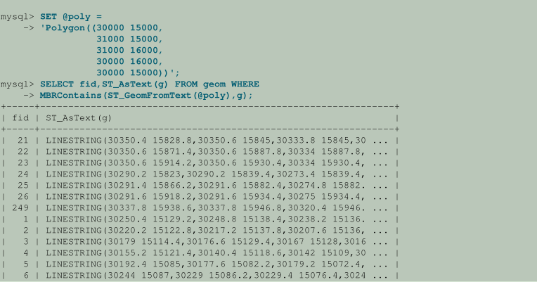
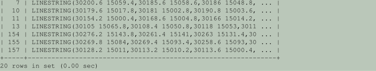

# 4 空间数据类型 (Spatial Data Types)

开放地理空间联盟（OGC）是一个由250多家公司，机构和大学组成的国际联盟，参与公共可用概念解决方案的开发，这些解决方案可用于管理空间数据的各种应用程序。

Open Geospatial Consortium发布了OpenGIS®地理信息实施标准 - 简单特征访问 - 第2部分：SQL选项，该文档提出了几种扩展SQL RDBMS以支持空间数据的概念方法。该规范可从OGC网站http://www.opengeospatial.org/standards/sfs获得。

遵循OGC规范，MySQL将空间扩展实现为具有几何类型环境的SQL的子集。该术语指的是使用一组几何类型扩展的SQL环境。几何值SQL列实现为具有几何类型的列。该规范描述了一组SQL几何类型，以及这些类型上用于创建和分析几何值的函数。

MySQL空间扩展支持地理特征的生成，存储和分析：

• 用于表示空间值的数据类型

• 用于操纵空间值的功能

• 改进空间列访问时间的空间索引空间数据类型和函数可用于`MyISAM`，`InnoDB`，`NDB`和`ARCHIVE`表。对于索引空间列，`MyISAM`和`InnoDB`支持`SPATIAL`和non-`SPATIAL`索引。其他存储引擎支持non-`SPATIAL`索引，如第13.1.14节“CREATE INDEX语法”中所述。

地理特征是世界上任何具有位置的东西。功能可以是：

• 实体。例如，山，池塘，城市。

• 空间。例如，镇区，热带地区。

• 可定义的位置。例如，十字路口，作为两条街道相交的特定地方。

某些文档使用术语地理空间特征来指代地理要素。

几何是表示地理特征的另一个词。最初几何字是指测量地球。另一个含义来自制图，指的是制图师用来绘制世界的几何特征。

这里的讨论认为这些术语是同义的：地理特征，地理空间特征，
特征或几何。最常用的术语是几何，定义为表示世界上具有位置的任何东西的点或点的集合。

以下材料涵盖以下主题：

• MySQL模型中实现的空间数据类型

• OpenGIS几何模型中空间扩展的基础

• 用于表示空间数据的数据格式

• 如何在MySQL中使用空间数据

• 对空间数据使用索引

• MySQL与OpenGIS规范的不同之处

## 4.0.1 MySQL GIS的一致性和兼容性 ( MySQL GIS Conformance and Compatibility )

MySQL没有实现以下GIS功能：

•其他元数据视图

OpenGIS规范提出了几个额外的元数据视图。例如，系统视图名为`GEOMETRY_COLUMNS`的名称包含几何列的说明，每行一行
数据库中的几何列。

•应调用`LineString`和`MultiLineString`上的OpenGIS函数`Length（）`MySQL为`ST_Length（）`问题是存在一个现有的SQL函数`Length（）`来计算字符串值的长度，有时无法区分是在文本还是空间上下文中调用该函数。

## 4.0.2 附加资源 ( Additional Resources )

Open Geospatial Consortium发布OpenGIS®地理信息实施标准 - 简单的功能访问 - 第2部分：SQL选项，该文档提出了几种扩展SQL RDBMS以支持空间数据的概念方法。开放地理空间联盟（OGC）在http://www.opengeospatial.org/上建立了一个网站。该规范可从http://www.opengeospatial.org/standards/sfs获得。它包含与此处材料相关的其他信息。

如果您对使用MySQL的空间扩展有疑问或顾虑，可以在GIS论坛中讨论它们：https：//forums.mysql.com/list.php？23。

# 4.1 空间数据类型 (Spatial Data Types)

MySQL有与OpenGIS类相对应的空间数据类型。

一些空间数据类型具有单一的几何值:

• `GEOMETRY`
• `POINT`
• `LINESTRING`
• `POLYGON`

`GEOMETRY`可以存储任何类型的几何值。其他单值类型（`POINT`，`LINESTRING`和`POLYGON`）将其值限制为特定几何类型。

其他空间数据类型包含值的集合:

• `MULTIPOINT`
• `MULTILINESTRING`
• `MULTIPOLYGON`
• `GEOMETRYCOLLECTION`

`GEOMETRYCOLLECTION`可以存储任何类型的对象集合。其他集合类型（`MULTIPOINT`，`MULTILINESTRING`和`MULTIPOLYGON`）将集合成员限制为具有特定几何类型的集合。

示例：要创建名为`geom`的表，该表具有可以存储任何几何类型的值的名为`g`的列，请使用以下语句：

```mysql
CREATE TABLE geom (g GEOMETRY);
```

可以在`NOT NULL`空间列上创建`SPATIAL`索引，因此如果您计划索引该列，请将其声明为`NOT NULL`：

```mysql
CREATE TABLE geom (g GEOMETRY NOT NULL);
```

# 4.2 OpenGIS几何模型 ( The OpenGIS Geometry Model )

OGC的SQL与几何类型环境提出的几何类型集基于OpenGIS几何模型。在此模型中，每个几何对象都具有以下常规属性：

• 它与空间参考系统相关联，该系统描述定义对象的坐标空间。

• 它属于某个几何类。

## 4.2.1 几何类层次结构 ( The Geometry Class Hierarchy )

- Geometry（不可实例化）

• Point（可实例化）

• Curve（不可实例化）

    •LineString（可实例化）
    
    • Line
    
    • LinearRing

• Surface（不可实例化）

    • Polygon（可实例化）

- GeometryCollection（可实例化）

• MultiPoint（可实例化）

• MultiCurve（不可实例化）

    • MultiLineString（可实例化）

- MultiSurface（不可实例化）

• MultiPolygon（可实例化）

无法在不可实例化的类中创建对象。可以在中创建对象可实例化的类。所有类都有属性，可实例化的类也可能有断言（定义有效类实例的规则）。

`Geometry`是基类。这是一个抽象类。几何的可实例化子类仅限于以二维方式存在的零维，一维和二维几何对象坐标空间。定义所有可实例化的几何类，以便几何类的有效实例在拓扑上闭合（即，所有定义的几何都包括它们的边界）。

基础`Geometry`类具有`Point`，`Curve`，`Surface`和`GeometryCollection`的子类：

• `Point`表示零维对象。

• `Curve`表示一维对象，并具有子类`LineString`，子类为`Line`和`LinearRing`。

• `Surface`是为二维对象设计的，具有子类`Polygon`。

• `GeometryCollection`具有专门的零，一维和二维集合类，分别名为`MultiPoint`，`MultiLineString`和`MultiPolygon`，用于对与`Points`，`LineStrings`和`Polygons`集合对应的几何进行建模。 `MultiCurve`和`MultiSurface`作为抽象超类引入，它概括了集合接口以处理曲线和曲面。

`Geometry`，`Curve`，`Surface`，`MultiCurve`和`MultiSurface`被定义为不可实例化的类。它们为其子类定义了一组通用方法，并包含在其中以实现可扩展性。

`Point`，`LineString`，`Polygon`，`GeometryCollection`，`MultiPoint`，`MultiLineString`和`MultiPolygon`是可实例化的类。

## 4.2.2 Geometry Class

`Geometry`是层次结构的根类。它是一个不可实例化的类，但具有许多属性，如下面的列表所述，这些属性对于从任何`Geometry`子类创建的所有几何值都是通用的。特定的子类具有其自己的特定属性，稍后描述。

**Geometry属性**

几何值具有以下属性：

- 它的类型。每个几何都属于层次结构中的一个可实例化类。

- 其SRID或空间参考标识符。此值标识几何体的关联空间参考系统，描述定义几何对象的坐标空间。

在MySQL中，SRID值是与几何值关联的整数。最大可用SRID值为2^32 -1。如果给出更大的值，则仅使用低32位。无论实际的SRID值如何，所有计算都是在假定SRID为0的情况下完成的。 SRID 0表示无限平坦的笛卡尔平面，其轴没有单位。

- 其空间参照系中的坐标，表示为双精度（8字节）数。所有非空几何都包括至少一对（X，Y）坐标。空几何不包含坐标。

坐标与SRID相关。例如，在不同的坐标系中，即使对象具有相同的坐标，两个对象之间的距离也可能不同，因为平面坐标系上的距离和大地系统上的距离（地球表面上的坐标）是不同的东西。

- 内部，边界和外部。

每个几何体都占据空间的某个位置。几何体的外部是几何体未占据的所有空间。内部是几何体占据的空间。边界是几何体内部和外部之间的界面。

- 其MBR（最小边界矩形）或包络。这是由最小和最大（X，Y）坐标形成的边界几何体：

```mysql
((MINX MINY, MAXX MINY, MAXX MAXY, MINX MAXY, MINX MINY))
```

- 值是simple还是nonsimple。类型的几何值（`LineString`，`MultiPoint`，`MultiLineString`）可以是简单的也可以是非简单的。每种类型都决定了它自己的简单或非简单的断言。

- 值是closed还是not closed。类型的几何值（`LineString`，`MultiString`）要么已关闭，要么未关闭。每种类型都决定了自己关闭或未关闭的断言。

- 值是empty还是nonempty如果没有任何点，则几何为空。未定义空几何的外部，内部和边界（即，它们由`NULL`值表示）。空几何定义为始终简单且面积为0。

- 其dimension。几何可以具有-1,0,1或2的维度：

• -1表示空几何。

• 0表示没有长度且没有区域的几何体。

• 1表示具有非零长度和零面积的几何图形。

• 2表示具有非零区域的几何图形。

`Point`对象的维度为零。 `LineString`对象的维度为1。`Polygon`对象的维度为2.`MultiPoint`，`MultiLineString`和`MultiPolygon`对象的维度与它们所包含的元素的维度相同。

## 4.2.3 Point Class

`Point`是表示坐标空间中单个位置的几何图形。

Point Examples

• 想象一下包含许多城市的大型世界地图。 `Point`对象可以代表每个城市。

• 在城市地图上，`Point`对象可以代表公共汽车站。

Point Properties

• X坐标值。

• Y坐标值。

• `Point`定义为零维几何。

• `Point`的边界是空集。

## 4.2.4 Curve Class

`Curve`是一维几何，通常由一系列点表示。 `Curve`的特定子类定义了点之间的插值类型。 `Curve`是一个不可实例化的类。

Curve Properties

• `Curve`具有其点的坐标。

• `Curve`定义为一维几何。

• 如果`Curve`没有两次通过同一点，则曲线很简单，但如果起点和终点相同，曲线仍然可以很简单。

• 如果`Curve`的起点等于其终点，则曲线将关闭。

• 闭合`Curve`的边界为空。

• 非闭合`Curve`的边界由其两个端点组成。

• 简单且封闭的`Curve`是`LinearRing`。

## 4.2.5 LineString Class

`LineString`是曲线，在点之间具有线性插值。

`LineString`示例

• 在世界地图上，`LineString`对象可以表示河流。

• 在城市地图中，`LineString`对象可以表示街道。

`LineString`属性

• `LineString`具有段的坐标，由每个连续的点对定义。

• 如果`LineString`恰好包含两个点，则它是一个`Line`。

• 如果`LineString`既关闭又简单，则为`LinearRing`。

## 4.2.6 Surface Class

`Surface`是二维几何。 这是一个不可实例化的类。 它唯一可实例化的子类是Polygon。

表面属性

• `Surface`定义为二维几何。

• OpenGIS规范将简单的Surface定义为几何体，该几何体由单个“补丁”组成，该补丁与单个外部边界和零个或多个内部边界相关联。

• 简单`Surface`的边界是与其外部和内部边界对应的闭合曲线集。

## 4.2.7 Polygon Class

`Polygon`是表示多边几何的平面Surface。 它由单个外部边界和零个或多个内部边界定义，其中每个内部边界在`Polygon`中定义一个孔。

`Polygon`示例

• 在区域地图上，Polygon对象可以表示森林，区域等。

`Polygon`断言

• Polygon的边界由一组LinearRing对象（即简单和封闭的LineString对象）组成，构成其外部和内部边界。

• `Polygon`没有交叉的环。 `Polygon`边界中的环可以在点处相交，但仅作为切线。

• `Polygon`没有线条，尖刺或穿孔。

• `Polygon`的内部是连接点集。

• `Polygon`可能有孔。 带孔的`Polygon`外部未连接。 每个孔限定外部的连接部件。

前面的断言使`Polygon`成为一个简单的几何体。

## 4.2.8 GeometryCollection Class

`GeometryCollection`是一个几何体，它是任何类的零个或多个几何体的集合。

几何集合中的所有元素必须位于相同的空间参照系中（即，在相同的坐标系中）。 虽然以下部分中描述的`GeometryCollection`的子类可能会限制成员资格，但几何集合的元素没有其他约束。 限制可能基于：

• 元素类型（例如，`MultiPoint`可能只包含`Point`元素）

• 尺寸

• 对元素之间空间重叠程度的约束

## 4.2.9 MultiPoint Class

`MultiPoint`是由`Point`元素组成的几何集合。 这些点没有以任何方式连接或排序。

`MultiPoint`示例

• 在世界地图上，`MultiPoint`可以代表一系列小岛屿。

• 在城市地图上，`MultiPoint`可以代表售票处的出口。

`MultiPoint`属性

• `MultiPoint`是零维几何体。

• 如果没有两个Point值相等（具有相同的坐标值），`MultiPoint`很简单。

• `MultiPoint`的边界是空集。

## 4.2.10 MultiCurve Class

`MultiCurve`是由曲线元素组成的几何集合。 `MultiCurve`是一个不可实例化的类。

`MultiCurve`属性

• `MultiCurve`是一维几何体。

• 当且仅当所有元素都很简单时，`MultiCurve`才是简单的; 任何两个元素之间的唯一交叉点出现在两个元素边界上的点处。

• 通过应用“mod 2联合规则”（也称为“奇偶规则”）获得`MultiCurve`边界：如果一个点位于奇数个曲线元素的边界内，则它位于`MultiCurve`的边界内。

• 如果`MultiCurve`的所有元素都已关闭，则会关闭它。

• 闭合`MultiCurve`的边界始终为空。

## 4.2.11 MultiLineString Class

`MultiLineString`是由`LineString`元素组成的`MultiCurve`几何集合。

`MultiLineString`示例

•在区域地图上，`MultiLineString`可以表示河流系统或高速公路系统。

## 4.2.12  MultiSurface Class

`MultiSurface`是由表面元素组成的几何集合。 `MultiSurface`是一个不可实例化的类。 它唯一可实例化的子类是MultiPolygon。

`MultiSurface`断言

• `MultiSurface`中的曲面没有相交的内部。

• `MultiSurface`中的曲面具有最多在有限数量的点处相交的边界。

## 4.2.13 MultiPolygon Class

`MultiPolygon`是由`Polygon`元素组成的`MultiSurface`对象。

`MultiPolygon`示例

• 在区域地图上，`MultiPolygon`可以代表湖泊系统。

`MultiPolygon`断言

• `MultiPolygon`没有两个内部相交的`Polygon`元素。

• `MultiPolygon`没有两个交叉的多边形元素（前一个断言也禁止交叉），或触摸无限多个点。

• `MultiPolygon`可能没有切割线，尖刺或穿孔。 `MultiPolygon`是一个常规的闭点集。

• 具有多个`Polygon`的`MultiPolygon`具有未连接的内部。 `MultiPolygon`内部的连接组件数等于`MultiPolygon`中的`Polygon`值的数量。

`MultiPolygon`属性

• `MultiPolygon`是二维几何体。

• `MultiPolygon`边界是一组与其`Polygon`元素边界对应的闭合曲线（`LineString`值）。

• `MultiPolygon`边界中的每条曲线都在一个`Polygon`元素的边界内。

• `Polygon`元素边界中的每条曲线都位于`MultiPolygon`的边界内。

# 4.3 Supported Spatial Data Formats

查询中使用两种标准的空间数据格式表示几何对象:

• Well-Known Text (WKT) format

• Well-Known Binary (WKB) format

在内部，MySQL以与WKT或WKB格式不同的格式存储几何值。(内部格式类似于WKB，但是初始值为4个字节来表示SRID。)

有多种功能可以在不同的数据格式之间进行转换;

下面几节描述MySQL使用的空间数据格式:

• Well-Known Text (WKT) Format

• Well-Known Binary (WKB) Format

• Internal Geometry Storage Format


## 4.3.1 Well-Known Text (WKT) Format

几何值的已知文本（WKT）表示用于以ASCII格式交换几何数据。 OpenGIS规范提供了Backus-Naur语法，该语法指定了用于编写WKT值的正式生成规则

几何对象的WKT表示示例:

• `Point`:

```mysql
POINT(15 20)
```

指定的点坐标没有分隔逗号。 这与SQL `Point()`函数的语法不同，后者需要坐标之间使用逗号。 注意使用适合给定空间操作的上下文的语法。 例如，以下语句都使用`ST_X()`从`Point`对象中提取X坐标。 第一个使用`Point()`函数直接生成对象。 第二个使用WKT表示转换为带有`ST_GeomFromText()`的`Point`。

```mysql
mysql> SELECT ST_X(Point(15, 20));
+---------------------+
| ST_X(POINT(15, 20)) |
+---------------------+
| 15                  |
+---------------------+

mysql> SELECT ST_X(ST_GeomFromText('POINT(15 20)'));
+---------------------------------------+
| ST_X(ST_GeomFromText('POINT(15 20)')) |
+---------------------------------------+
| 15                                    |
+---------------------------------------+
```

• 包含四个点的`LineString`：

```mysql
LINESTRING(0 0, 10 10, 20 25, 50 60)
```

点坐标对由逗号分隔。

• 带有一个外圈和一个内圈的`Polygon`：

```mysql
POLYGON((0 0,10 0,10 10,0 10,0 0),(5 5,7 5,7 7,5 7,5 5))
```

• 具有三个`Point`值的`MultiPoint`：

```mysql
MULTIPOINT(0 0,20 20,60 60)
```

从MySQL 5.7.9开始，诸如`ST_MPointFromText()`和`ST_GeomFromText()`之类的空间函数接受多点值的WKT格式表示，允许值内的各个点被括号括起来。 例如，以下两个函数调用都是有效的，而在MySQL 5.7.9之前，第二个函数调用产生错误：

```mysql
ST_MPointFromText('MULTIPOINT(1 1,2 2,3 3)')
ST_MPointFromText('MULTIPOINT((1 1),(2 2),(3 3))')
```

从MySQL 5.7.9开始，`MultiPoint`值的输出包括每个点周围的括号。 例如：

```mysql
mysql> SET @mp = 'MULTIPOINT(1 1, 2 2, 3 3)';
mysql> SELECT ST_AsText(ST_GeomFromText(@mp));
+---------------------------------+
| ST_AsText(ST_GeomFromText(@mp)) |
+---------------------------------+
| MULTIPOINT((1 1),(2 2),(3 3))   |
+---------------------------------+
```

在MySQL 5.7.9之前，相同值的输出不包含每个点的括号:

```mysql
mysql> SET @mp = 'MULTIPOINT(1 1, 2 2, 3 3)';
mysql> SELECT ST_AsText(ST_GeomFromText(@mp));
+---------------------------------+
| ST_AsText(ST_GeomFromText(@mp)) |
+---------------------------------+
| MULTIPOINT(1 1,2 2,3 3)         |
+---------------------------------+
```

• 具有两个LineString值的MultiLineString：

```mysql
MULTILINESTRING((10 10, 20 20), (15 15, 30 15))
```

• 具有两个`Polygon`值的MultiPolygon：

```mysql
MULTIPOLYGON(((0 0,10 0,10 10,0 10,0 0)),((5 5,7 5,7 7,5 7, 5 5)))
```

• `GeometryCollection`，包含两个`Point`值和一个`LineString`：

```mysql
GEOMETRYCOLLECTION(POINT(10 10), POINT(30 30), LINESTRING(15 15, 20 20))
```

## 4.3.2 Well-Known Binary (WKB) Format

众所周知的几何值的二进制(WKB)表示用于将几何数据交换为包含几何WKB信息的`BLOB`值表示的二进制流。这种格式由OpenGIS规范定义(参见第11.5节“空间数据类型”)。它也在ISO SQL/MM第3部分:空间标准中定义。

WKB使用1字节无符号整数、4字节无符号整数和8字节双精度数(IEEE 754格式)。一个字节是8位。

例如，对应于`POINT(1 -1)`的WKB值由21个字节的序列组成，每个字节由两个十六进制数字表示：

```mysql
0101000000000000000000F03F000000000000F0BF
```

序列由下表所示的组件组成。

Table 11.2 WKB Components Example

|  Component   | Size  | Value  |
|  ----  | ----  | ----  |
| Byte order | 1个字节 |`01` |
| WKB type | 4个字节 |`01000000` |
| X coordinate | 8个字节 |`000000000000F03F` |
| Y coordinate | 8个字节 |`000000000000F0BF` |

组件表示如下:

• 字节顺序指示符为1或0表示little-endian或big-endian存储。 little-endian和big-endian字节顺序也分别称为网络数据表示（NDR）和外部数据表示（XDR）。

• WKB类型是指示几何类型的代码。 MySQL使用1到7之间的值来表示`Point`，`LineString`，`Polygon`，`MultiPoint`，`MultiLineString`，`MultiPolygon`和`GeometryCollection`。

• `Point`值具有X和Y坐标，每个坐标表示为双精度值。

更复杂几何值的WKB值具有更复杂的数据结构，详见OpenGIS规范。

## 4.3.3 Internal Geometry Storage Format

MySQL使用4个字节存储几何值，以表示SRID后面跟着的值的WKB表示。

对于WKB部分，这些特定于mysql的考虑事项如下:

• 字节顺序指示符字节为1，因为MySQL将几何存储为小结束值。

• MySQL支持`Point`，`LineString`，`Polygon`，`MultiPoint`，`MultiLineString`，`MultiPolygon`和`GeometryCollection`的几何类型。不支持其他几何类型。

`LENGTH()`函数返回值存储所需的空格（以字节为单位）。 例：

```mysql
mysql> SET @g = ST_GeomFromText('POINT(1 -1)');
mysql> SELECT LENGTH(@g);
+------------+
| LENGTH(@g) |
+------------+
| 25         |
+------------+
mysql> SELECT HEX(@g);
+----------------------------------------------------+
| HEX(@g)                                            |
+----------------------------------------------------+
| 000000000101000000000000000000F03F000000000000F0BF |
+----------------------------------------------------+
```

值长度为25字节，由这些组件组成(从十六进制值可以看出):

• 4个字节用于整数SRID（0）

• 整数字节顺序为1个字节（1 = little-endian）

• 整数类型信息的4个字节（1 =`Point`）

• 双精度X坐标的8个字节（1）

• 双精度Y坐标为8个字节（-1）

# 4.4 Geometry Well-Formedness and Validity

对于几何值，MySQL区分了语法结构良好和几何有效的概念。

如果几何体满足诸如此（非穷举）列表中的条件，则它在语法上是良好形式的：

•线串至少有两个点

•多边形至少有一个环

•多边形环关闭（第一个和最后一个点相同）

•多边形环至少有4个点（最小多边形是一个三角形，第一个和最后一个点相同）

•集合不为空（`GeometryCollection`除外）

如果几何在语法上格式良好并满足诸如此（非穷举）列表中的条件，则几何在几何上是有效的：

•多边形不是自相交的

•多边形内圈位于外圈内

•多重多边形没有重叠多边形

如果几何在语法上没有良好形成，则空间函数会失败。解析WKT或WKB值的空间导入函数会导致尝试创建语法格式不正确的几何体时出错。还检查了句法良好性，以便将几何存储到表中。

允许插入，选择和更新几何无效的几何，但它们必须在语法上格式良好。由于计算费用，MySQL没有明确检查几何有效性。空间计算可以检测一些无效几何的情况并引发错误，但是它们也可能返回未定义的结果而不检测无效性。应用程序要求几何有效的几何应使用`ST_IsValid()`函数检查它们。

# 4.5  Creating Spatial Columns

MySQL提供了一种为几何类型创建空间列的标准方法，例如，使用`CREATE TABLE`或`ALTER TABLE`。 `MyISAM`，`InnoDB`，`NDB`和`ARCHIVE`表支持空间列。

• 使用`CREATE TABLE`语句创建一个带有空间列的表:

```mysql
CREATE TABLE geom (g GEOMETRY);
```

• 使用`ALTER TABLE`语句向现有表添加或删除空间列:

```mysql
ALTER TABLE geom ADD pt POINT;
ALTER TABLE geom DROP pt;
```

# 4.6 Populating Spatial Columns

创建空间列之后，可以用空间数据填充它们。

值应该以内部几何格式存储，但是您可以将它们从已知的文本(WKT)或已知的二进制(WKB)格式转换为该格式。下面的示例演示如何通过将WKT值转换为内部几何格式将几何值插入到表中:

• 直接在`INSERT`语句中执行转换:

```mysql
INSERT INTO geom VALUES (ST_GeomFromText('POINT(1 1)'));
SET @g = 'POINT(1 1)';

INSERT INTO geom VALUES (ST_GeomFromText(@g));
```

• `INSERT`前执行转换:

```mysql
SET @g = ST_GeomFromText('POINT(1 1)');
INSERT INTO geom VALUES (@g);
```

下面的例子将更复杂的几何图形插入表中:

```mysql
SET @g = 'LINESTRING(0 0,1 1,2 2)';
INSERT INTO geom VALUES (ST_GeomFromText(@g));

SET @g = 'POLYGON((0 0,10 0,10 10,0 10,0 0),(5 5,7 5,7 7,5 7, 5 5))';
INSERT INTO geom VALUES (ST_GeomFromText(@g));

SET @g =
'GEOMETRYCOLLECTION(POINT(1 1),LINESTRING(0 0,1 1,2 2,3 3,4 4))';
INSERT INTO geom VALUES (ST_GeomFromText(@g));
```

前面的示例使用`ST_GeomFromText()`创建几何值。你也可以使用特定类型的函数:

```mysql
SET @g = 'POINT(1 1)';
INSERT INTO geom VALUES (ST_PointFromText(@g));

SET @g = 'LINESTRING(0 0,1 1,2 2)';
INSERT INTO geom VALUES (ST_LineStringFromText(@g));

SET @g = 'POLYGON((0 0,10 0,10 10,0 10,0 0),(5 5,7 5,7 7,5 7, 5 5))';
INSERT INTO geom VALUES (ST_PolygonFromText(@g));

SET @g =
'GEOMETRYCOLLECTION(POINT(1 1),LINESTRING(0 0,1 1,2 2,3 3,4 4))';
INSERT INTO geom VALUES (ST_GeomCollFromText(@g));
```

希望使用几何值的WKB表示形式的客户机应用程序负责在查询中向服务器发送正确格式的WKB。有几种方法可以满足这个要求。例如:

• 使用十六进制文字语法插入`POINT(11)`值:

```mysql
INSERT INTO geom VALUES
(ST_GeomFromWKB(X'0101000000000000000000F03F000000000000F03F'));
```

• ODBC应用程序可以发送WKB表示，使用`BLOB`类型的参数将其绑定到占位符:

```mysql
INSERT INTO geom VALUES (ST_GeomFromWKB(?))
```

其他编程接口可能支持类似的占位符机制。

• 在C程序中，可以使用`mysql_real_escape_string_quote()`转义二进制值，并将结果包含在发送到服务器的查询字符串中。

# 4.7 Fetching Spatial Data

存储在表中的几何值可以以内部格式获取。您还可以将它们转换为WKT或WKB格式。

• 获取内部格式的空间数据:

使用内部格式获取几何值在表对表传输中非常有用:

```mysql
CREATE TABLE geom2 (g GEOMETRY) SELECT g FROM geom;
```

• 获取WKT格式的空间数据:

`ST_AsText()`函数将几何从内部格式转换为WKT字符串。

```mysql
SELECT ST_AsText(g) FROM geom;
```

• 获取WKB格式的空间数据:

`ST_AsBinary()`函数将几何从内部格式转换为包含WKB值的`BLOB`。

```mysql
SELECT ST_AsBinary(g) FROM geom;
```

# 4.8 Optimizing Spatial Analysis

对于`MyISAM`和`InnoDB`表，可以使用`SPATIAL`索引优化包含空间数据的列中的搜索操作。最典型的操作是:

• 搜索包含给定点的所有对象的点查询

• 区域查询，用于搜索与给定区域重叠的所有对象


MySQL使用R-Trees对空间列上的`SPATIAL`索引进行二次分裂。 使用几何的最小边界矩形（MBR）构建`SPATIAL`索引。 对于大多数几何体，MBR是围绕几何形状的最小矩形。 对于水平或垂直线串，MBR是一个退化为线串的矩形。 对于某一点，MBR是一个退化为该点的矩形。

也可以在空间列上创建普通索引。 在non-`SPATIAL`索引中，必须为除`POINT`列之外的任何空间列声明前缀。

`MyISAM`和`InnoDB`支持`SPATIAL`和non-`SPATIAL`索引。

# 4.9 Creating Spatial Indexes

对于`InnoDB`和`MyISAM`表，MySQL可以使用与创建常规索引相似的语法创建空间索引，但是使用的是`SPATIAL`关键字。空间索引中的列必须声明为`NOT NULL`。以下示例演示如何创建空间索引:

• `CREATE TABLE`:

```mysql
CREATE TABLE geom (g GEOMETRY NOT NULL, SPATIAL INDEX(g));
```

• `ALTER TABLE`:

```mysql
CREATE TABLE geom (g GEOMETRY NOT NULL);
ALTER TABLE geom ADD SPATIAL INDEX(g);
```

• `CREATE INDEX`:

```mysql
CREATE TABLE geom (g GEOMETRY NOT NULL);
CREATE SPATIAL INDEX g ON geom (g);
```

`SPATIAL INDEX`创建一个R-tree索引。对于支持空间列的非空间索引的存储引擎，引擎创建一个B-tree索引。空间值的b树索引对精确值查找有用，但对范围扫描无效。

若要删除空间索引，请使用`ALTER TABLE`或`drop INDEX`:

• `ALTER TABLE`:

```mysql
ALTER TABLE geom DROP INDEX g;
```

• `DROP INDEX`:

```mysql
DROP INDEX g ON geom;
```

示例:假设一个表`geom`包含32,000多个几何图形，这些几何图形存储在类型`GEOMETRY`的列`g`中。该表还有一个`AUTO_INCREMENT`列`fid`用于存储对象ID值。

```mysql
mysql> DESCRIBE geom;
+-------+----------+------+-----+---------+----------------+
| Field | Type     | Null | Key | Default | Extra          |
+-------+----------+------+-----+---------+----------------+
| fid   | int(11)  |      | PRI | NULL    | auto_increment |
| g     | geometry |      |     |         |                |
+-------+----------+------+-----+---------+----------------+
2 rows in set (0.00 sec)

mysql> SELECT COUNT(*) FROM geom;
+----------+
| count(*) |
+----------+
| 32376    |
+----------+
1 row in set (0.00 sec)
```

若要在列`g`上添加空间索引，请使用以下语句:

```mysql
mysql> ALTER TABLE geom ADD SPATIAL INDEX(g);
Query OK, 32376 rows affected (4.05 sec)
Records: 32376 Duplicates: 0 Warnings: 0
```

# 4.10 Using Spatial Indexes

优化器研究是否可以在WHERE子句中搜索使用`MBRContains()`或`MBRWithin()`等函数的查询时使用可用的空间索引。下面的查询查找给定矩形中的所有对象:






使用`EXPLAIN`检查该查询的执行方式:

```mysql
mysql> SET @poly =
-> 'Polygon((30000 15000,
31000 15000,
31000 16000,
30000 16000,
30000 15000))';
mysql> EXPLAIN SELECT fid,ST_AsText(g) FROM geom WHERE
-> MBRContains(ST_GeomFromText(@poly),g)\G
*************************** 1. row ***************************
           id: 1
  select_type: SIMPLE
        table: geom
         type: range
possible_keys: g
          key: g
      key_len: 32
          ref: NULL
         rows: 50
        Extra: Using where
1 row in set (0.00 sec)
```

检查没有空间索引会发生什么:

```mysql
mysql> SET @poly =
-> 'Polygon((30000 15000,
31000 15000,
31000 16000,
30000 16000,
30000 15000))';
mysql> EXPLAIN SELECT fid,ST_AsText(g) FROM g IGNORE INDEX (g) WHERE
-> MBRContains(ST_GeomFromText(@poly),g)\G
*************************** 1. row ***************************
           id: 1
  select_type: SIMPLE
        table: geom
         type: ALL
possible_keys: NULL
          key: NULL
      key_len: NULL
          ref: NULL
         rows: 32376
        Extra: Using where
1 row in set (0.00 sec)
```

在不使用空间索引的情况下执行`SELECT`语句会得到相同的结果，但是会导致执行时间从0.00秒增加到0.46秒:

```mysql
mysql> SET @poly =
-> 'Polygon((30000 15000,
31000 15000,
31000 16000,
30000 16000,
30000 15000))';
mysql> SELECT fid,ST_AsText(g) FROM geom IGNORE INDEX (g) WHERE
-> MBRContains(ST_GeomFromText(@poly),g);
+-----+---------------------------------------------------------------+
| fid | ST_AsText(g)                                                  |
+-----+---------------------------------------------------------------+
| 1   | LINESTRING(30250.4 15129.2,30248.8 15138.4,30238.2 15136. ... |
| 2   | LINESTRING(30220.2 15122.8,30217.2 15137.8,30207.6 15136, ... |
| 3   | LINESTRING(30179 15114.4,30176.6 15129.4,30167 15128,3016 ... |
| 4   | LINESTRING(30155.2 15121.4,30140.4 15118.6,30142 15109,30 ... |
| 5   | LINESTRING(30192.4 15085,30177.6 15082.2,30179.2 15072.4, ... |
| 6   | LINESTRING(30244 15087,30229 15086.2,30229.4 15076.4,3024 ... |
| 7   | LINESTRING(30200.6 15059.4,30185.6 15058.6,30186 15048.8, ... |
| 10  | LINESTRING(30179.6 15017.8,30181 15002.8,30190.8 15003.6, ... |
| 11  | LINESTRING(30154.2 15000.4,30168.6 15004.8,30166 15014.2, ... |
| 13  | LINESTRING(30105 15065.8,30108.4 15050.8,30118 15053,3011 ... |
| 21  | LINESTRING(30350.4 15828.8,30350.6 15845,30333.8 15845,30 ... |
| 22  | LINESTRING(30350.6 15871.4,30350.6 15887.8,30334 15887.8, ... |
| 23  | LINESTRING(30350.6 15914.2,30350.6 15930.4,30334 15930.4, ... |
| 24  | LINESTRING(30290.2 15823,30290.2 15839.4,30273.4 15839.4, ... |
| 25  | LINESTRING(30291.4 15866.2,30291.6 15882.4,30274.8 15882. ... |
| 26  | LINESTRING(30291.6 15918.2,30291.6 15934.4,30275 15934.4, ... |
| 154 | LINESTRING(30276.2 15143.8,30261.4 15141,30263 15131.4,30 ... |
| 155 | LINESTRING(30269.8 15084,30269.4 15093.4,30258.6 15093,30 ... |
| 157 | LINESTRING(30128.2 15011,30113.2 15010.2,30113.6 15000.4, ... |
| 249 | LINESTRING(30337.8 15938.6,30337.8 15946.8,30320.4 15946. ... |
+-----+---------------------------------------------------------------+
20 rows in set (0.46 sec)
```


