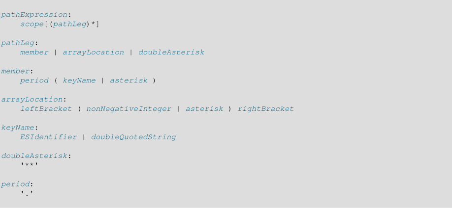
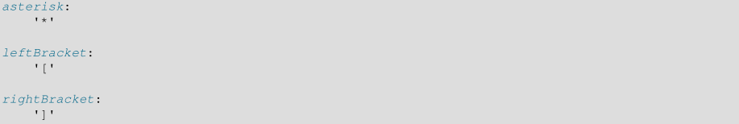

# 5.1 JSON 数据类型

从MySQL 5.7.8开始，MySQL支持RFC7159定义的原生`JSON`数据类型，该类型支持对JSON (JavaScript对象表示法)文档中的数据的有效访问。与在字符串列中存储JSON格式的字符串相比，`JSON`数据类型提供了以下优点:

- 自动验证存储在`JSON`列中的JSON文档。 无效的文档会产生错误。

- 优化的存储格式。 存储在`JSON`列中的JSON文档将转换为内部格式，以允许对文档元素进行快速读取访问。 当服务器稍后必须读取以这种二进制格式存储的JSON值时，不需要从文本表示中解析该值。二进制格式的结构使服务器能够直接通过键或数组索引查找子对象或嵌套值而无需读取 文档中它们之前或之后的所有值。

`注意：本讨论使用monotype中的JSON表示JSON数据类型，并使用常规字体中的“JSON”表示一般的JSON数据。`


存储`JSON`文档所需的空间与`LONGBLOB`或`LONGTEXT`大致相同; 有关更多信息，请参见第11.8节“数据类型存储要求”。 请务必记住，存储在JSON列中的任何JSON文档的大小都限制为`max_allowed_packet`系统变量的值。 （当服务器在内存中内部操作JSON值时，它可能大于此值;当服务器存储时，该限制适用。）

`JSON`列不能具有non-`NULL`默认值。

与`JSON`数据类型一起，可以使用一组SQL函数来启用对JSON值的操作，例如创建，操作和搜索。以下讨论显示了这些操作的示例。有关各个函数的详细信息，请参见第12.17节“JSON函数”。

还提供了一组用于操作GeoJSON值的空间函数。请参见第12.16.11节“空间GeoJSON函数”。

`JSON`列，如其他二进制类型的列，不直接索引;相反，您可以在生成的列上创建索引，从而从JSON列中提取标量值。有关详细示例，请参阅索引生成的列以提供JSON列索引。

MySQL优化器还在与JSON表达式匹配的虚拟列上查找兼容索引。

MySQL NDB Cluster 7.5（7.5.2及更高版本）支持`JSON`列和MySQL JSON函数，包括在从`JSON`列生成的列上创建索引，作为无法索引`JSON`列的变通方法。每个NDB表最多支持3个`JSON`列。

接下来的几节提供了有关`JSON`值的创建和操作的基本信息。

## 5.1.1 Creating JSON Values

JSON数组包含一个由逗号分隔并包含在`[`和`]`字符中的值列表:

```mysql
["abc", 10, null, true, false]
```

JSON对象包含一组键值对，由逗号分隔，并包含在`{`和`}`字符中:

```mysql
{"k1": "value", "k2": 10}
```

如示例所示，JSON数组和对象可以包含标量值，这些标量值是字符串或数字、JSON null文字或JSON boolean真或假文字。JSON对象中的键必须是字符串。时态(日期、时间或datetime)标量值也可以:

```mysql
["12:18:29.000000", "2015-07-29", "2015-07-29 12:18:29.000000"]
```

JSON数组元素和JSON对象键值允许嵌套:

```mysql
[99, {"id": "HK500", "cost": 75.99}, ["hot", "cold"]]
{"k1": "value", "k2": [10, 20]}
```

您还可以从MySQL为此目的提供的许多函数中获取JSON值(参见12.17.2节，创建JSON值的函数)，还可以使用`CAST(value as JSON)`将其他类型的值转换为JSON类型(参见JSON与非JSON值之间的转换)。下面几段描述MySQL如何处理作为输入提供的JSON值。

在MySQL中，JSON值被写成字符串。MySQL解析在需要JSON值的上下文中使用的任何字符串，如果它不是JSON，就会产生错误。这些上下文包括将值插入具有`JSON`数据类型的列中，并将参数传递给期望JSON值的函数(通常在MySQL JSON函数的文档中显示为`JSON_doc`或`JSON_val`)，如下面的示例所示

如果值是有效的`JSON`值，则尝试将值插入JSON列将成功，如果不是，则失败

```mysql
mysql> CREATE TABLE t1 (jdoc JSON);
Query OK, 0 rows affected (0.20 sec)

mysql> INSERT INTO t1 VALUES('{"key1": "value1", "key2": "value2"}');
Query OK, 1 row affected (0.01 sec)

mysql> INSERT INTO t1 VALUES('[1, 2,');
ERROR 3140 (22032) at line 2: Invalid JSON text:
"Invalid value." at position 6 in value (or column) '[1, 2,'.

```

此类错误消息中“在位置`N`”的位置是从0开始的，但应该被视为实际发生值中问题的粗略指示。

- `JSON_TYPE（）`函数需要JSON参数并尝试将其解析为JSON值。 如果值有效，则返回值的JSON类型，否则产生错误：

```mysql
mysql> SELECT JSON_TYPE('["a", "b", 1]');
+----------------------------+
| JSON_TYPE('["a", "b", 1]') |
+----------------------------+
| ARRAY                      |
+----------------------------+

mysql> SELECT JSON_TYPE('"hello"');
+----------------------+
| JSON_TYPE('"hello"') |
+----------------------+
| STRING               |
+----------------------+

mysql> SELECT JSON_TYPE('hello');
ERROR 3146 (22032): Invalid data type for JSON data in argument 1
to function json_type; a JSON string or JSON type is required.
```

MySQL使用`utf8mb4`字符集和`utf8mb4_bin`排序规则处理JSON上下文中使用的字符串。 其他字符集中的字符串将根据需要转换为`utf8mb4`。 （对于`ascii`或`utf8`字符集中的字符串，不需要转换，因为`ascii`和`utf8`是`utf8mb4`的子集。）

作为使用文字字符串编写JSON值的替代方法，存在用于从组件元素组成JSON值的函数。 `JSON_ARRAY（）`接受一个（可能是空的）值列表，并返回包含这些值的JSON数组：

```mysql
mysql> SELECT JSON_ARRAY('a', 1, NOW());
+----------------------------------------+
| JSON_ARRAY('a', 1, NOW())              |
+----------------------------------------+
| ["a", 1, "2015-07-27 09:43:47.000000"] |
+----------------------------------------+
```

`SON_OBJECT()`接受一个键值对列表(可能是空的)，并返回一个包含这些对的JSON对象:

```mysql
mysql> SELECT JSON_OBJECT('key1', 1, 'key2', 'abc');
+---------------------------------------+
| JSON_OBJECT('key1', 1, 'key2', 'abc') |
+---------------------------------------+
| {"key1": 1, "key2": "abc"}            |
+---------------------------------------+
```

`JSON_MERGE()`接受两个或多个JSON文档并返回组合结果:

```mysql
mysql> SELECT JSON_MERGE('["a", 1]', '{"key": "value"}');
+--------------------------------------------+
| JSON_MERGE('["a", 1]', '{"key": "value"}') |
+--------------------------------------------+
| ["a", 1, {"key": "value"}]                 |
+--------------------------------------------+
```

JSON值可以分配给用户定义的变量:

```mysql
mysql> SET @j = JSON_OBJECT('key', 'value');
mysql> SELECT @j;
+------------------+
| @j               |
+------------------+
| {"key": "value"} |
+------------------+
```

但是，用户定义的变量不能是`JSON`数据类型，因此尽管前面示例中的`@j`看起来像JSON值并且具有与JSON值相同的字符集和排序规则，但它没有JSON数据类型。 相反，`JSON_OBJECT（）`的结果在分配给变量时会转换为字符串。

通过转换JSON值生成的字符串具有`utf8mb4`的字符集和`utf8mb4_bin`的排序规则：

```mysql
mysql> SELECT CHARSET(@j), COLLATION(@j);
+-------------+---------------+
| CHARSET(@j) | COLLATION(@j) |
+-------------+---------------+
| utf8mb4     |   utf8mb4_bin |
+-------------+---------------+
```

因为`utf8mb4_bin`是一个二进制排序规则，所以JSON值的比较是区分大小写的。

```mysql
mysql> SELECT JSON_ARRAY('x') = JSON_ARRAY('X');
+-----------------------------------+
| JSON_ARRAY('x') = JSON_ARRAY('X') |
+-----------------------------------+
| 0                                 |
+-----------------------------------+
```

区分大小写还适用于JSON `null`、`true`和`false`文本，这些文本必须始终用小写:

```mysql
mysql> SELECT JSON_VALID('null'), JSON_VALID('Null'), JSON_VALID('NULL');
+--------------------+--------------------+--------------------+
| JSON_VALID('null') | JSON_VALID('Null') | JSON_VALID('NULL') |
+--------------------+--------------------+--------------------+
| 1                  | 0                  | 0                  |
+--------------------+--------------------+--------------------+

mysql> SELECT CAST('null' AS JSON);
+----------------------+
| CAST('null' AS JSON) |
+----------------------+
| null                 |
+----------------------+
1 row in set (0.00 sec)

mysql> SELECT CAST('NULL' AS JSON);
ERROR 3141 (22032): Invalid JSON text in argument 1 to function cast_as_json:
"Invalid value." at position 0 in 'NULL'.
```

JSON文本的大小写敏感性不同于SQL `NULL`、`TRUE`和`FALSE`文本的大小写敏感性，它们可以用任何lettercase编写:

```mysql
mysql> SELECT ISNULL(null), ISNULL(Null), ISNULL(NULL);
+--------------+--------------+--------------+
| ISNULL(null) | ISNULL(Null) | ISNULL(NULL) |
+--------------+--------------+--------------+
| 1            | 1            | 1            |
+--------------+--------------+--------------+
```

有时，在JSON文档中插入引号字符(`"`或`'`)是必要的或可取的。假设在本例中，您希望将一些JSON对象插入到使用SQL语句创建的表中，其中包含一些表示语句的字符串，这些语句陈述了关于MySQL的一些事实，每个语句都配有适当的关键字:

```mysql
mysql> CREATE TABLE facts (sentence JSON);
```

在这些关键字-句子对中有这样一对:

```mysql
mascot: The MySQL mascot is a dolphin named "Sakila".
```

将其作为JSON对象插入`facts`表的一种方法是使用`MySQL JSON_OBJECT()`函数。在这种情况下，必须使用反斜杠转义每个引用字符，如下所示:

```mysql
mysql> INSERT INTO facts VALUES
> (JSON_OBJECT("mascot", "Our mascot is a dolphin named \"Sakila\"."));
```

如果将值作为JSON对象文本插入，则不能以相同的方式工作，在这种情况下，必须使用双反斜杠转义序列，如下所示:

```mysql
mysql> INSERT INTO facts VALUES
> ('{"mascot": "Our mascot is a dolphin named \\"Sakila\\"."}');
```

使用双反斜杠可以防止MySQL执行转义序列处理，而是使它将字符串文本传递给存储引擎进行处理。在以上述两种方式插入JSON对象之后，您可以看到反斜杠出现在JSON列值中，只需进行简单的`select`，如下所示:

```mysql
mysql> SELECT sentence FROM facts;
+---------------------------------------------------------+
| sentence                                                |
+---------------------------------------------------------+
| {"mascot": "Our mascot is a dolphin named \"Sakila\"."} |
+---------------------------------------------------------+
```

要查找这个使用`mascot`作为键的特殊句子，可以使用列路径操作符`->`，如下所示:

```mysql
mysql> SELECT col->"$.mascot" FROM qtest;
+---------------------------------------------+
| col->"$.mascot"                             |
+---------------------------------------------+
| "Our mascot is a dolphin named \"Sakila\"." |
+---------------------------------------------+
1 row in set (0.00 sec)
```

这样就保留了反斜杠以及周围的引号。要使用`mascot`作为键显示所需的值，但不包括周围的引号或任何转义，可以使用内联路径操作符`->>`，如下所示:

```mysql
mysql> SELECT sentence->>"$.mascot" FROM facts;
+-----------------------------------------+
| sentence->>"$.mascot"                   |
+-----------------------------------------+
| Our mascot is a dolphin named "Sakila". |
+-----------------------------------------+
```

`注意`

如果启用了`NO_BACKSLASH_ESCAPES` server SQL模式，则前面的示例无法正常工作。 如果设置了此模式，则可以使用单个反斜杠而不是双反斜杠来插入JSON对象文字，并保留反斜杠。 如果在执行插入时使用`JSON_OBJECT（）`函数并设置了此模式，则必须替换单引号和双引号，如下所示：

```mysql
mysql> INSERT INTO facts VALUES
> (JSON_OBJECT('mascot', 'Our mascot is a dolphin named "Sakila".'));
```

有关此模式对JSON值中转义字符的影响的更多信息，请参见`JSON_UNQUOTE()`函数的描述。

`注意`

## 5.1.2 JSON值的规范化，合并和自动包装(Normalization, Merging, and Autowrapping of JSON Values)

当一个字符串被解析并被发现是一个有效的JSON文档时，它也被规范化:具有与文档中先前发现的键重复的键的成员将被丢弃(即使值不同)。下面的`JSON_OBJECT()`调用生成的对象值不包含第二个`key1`元素，因为该键名出现在值的前面:

```mysql
mysql> SELECT JSON_OBJECT('key1', 1, 'key2', 'abc', 'key1', 'def');
+------------------------------------------------------+
| JSON_OBJECT('key1', 1, 'key2', 'abc', 'key1', 'def') |
+------------------------------------------------------+
| {"key1": 1, "key2": "abc"}                           |
+------------------------------------------------------+
```

`注意：这种重复密钥的“first key wins”处理与RFC 7159不一致。这是MySQL 5.7中的已知问题，已在MySQL 8.0中修复。 （Bug＃86866，Bug＃26369555）`

MySQL还丢弃了原始JSON文档中键、值或元素之间的额外空格。为了提高查找效率，它还对JSON对象的键进行排序。您应该知道，这种排序的结果可能会发生更改，并且不能保证在不同版本之间保持一致。

生成JSON值的MySQL函数(参见12.17.2节，“创建JSON的函数”)总是返回规范化的值。

### 5.1.2.1 Merging JSON Values

在组合多个数组的上下文中，通过将稍后命名的数组连接到第一个数组的末尾，将数组合并为单个数组。在下面的例子中，`JSON_MERGE()`将它的参数合并成一个数组:

```mysql
mysql> SELECT JSON_MERGE('[1, 2]', '["a", "b"]', '[true, false]');
+-----------------------------------------------------+
| JSON_MERGE('[1, 2]', '["a", "b"]', '[true, false]') |
+-----------------------------------------------------+
| [1, 2, "a", "b", true, false]                       |
+-----------------------------------------------------+
```

当值插入JSON列时也会执行标准化，如下所示:

```mysql
mysql> CREATE TABLE t1 (c1 JSON);

mysql> INSERT INTO t1 VALUES
> ('{"x": 17, "x": "red"}'),
> ('{"x": 17, "x": "red", "x": [3, 5, 7]}');

mysql> SELECT c1 FROM t1;
+-----------+
| c1        |
+-----------+
| {"x": 17} |
| {"x": 17} |
+-----------+
```

合并时多个对象生成一个对象。如果多个对象具有相同的键，则合并后的对象中该键的值为包含键值的数组:

```mysql
mysql> SELECT JSON_MERGE('{"a": 1, "b": 2}', '{"c": 3, "a": 4}');
+----------------------------------------------------+
| JSON_MERGE('{"a": 1, "b": 2}', '{"c": 3, "a": 4}') |
+----------------------------------------------------+
| {"a": [1, 4], "b": 2, "c": 3}                      |
+----------------------------------------------------+
```

在需要数组值的上下文中使用的非数组值是自动转换的:该值被`[`和`]`字符包围，以便将其转换为数组。在下面的语句中，每个参数都作为数组自动拖拽(`[1]`，`[2]`)。然后将它们合并生成一个结果数组:

```mysql
mysql> SELECT JSON_MERGE('1', '2');
+----------------------+
| JSON_MERGE('1', '2') |
+----------------------+
| [1, 2]               |
+----------------------+
```


数组和对象值通过自动敲击对象作为一个数组并合并两个数组来合并:

```mysql
mysql> SELECT JSON_MERGE('[10, 20]', '{"a": "x", "b": "y"}');
+------------------------------------------------+
| JSON_MERGE('[10, 20]', '{"a": "x", "b": "y"}') |
+------------------------------------------------+
| [10, 20, {"a": "x", "b": "y"}]                 |
+------------------------------------------------+
```

### 5.1.2.2 Searching and Modifying JSON Values

JSON路径表达式选择JSON文档中的值。

对于提取JSON文档的部分或修改JSON文档的函数，路径表达式非常有用，可以指定在该文档中操作的位置。例如，下面的查询从JSON文档中提取具有`name`键的成员的值:

```mysql
mysql> SELECT JSON_EXTRACT('{"id": 14, "name": "Aztalan"}', '$.name');
+---------------------------------------------------------+
| JSON_EXTRACT('{"id": 14, "name": "Aztalan"}', '$.name') |
+---------------------------------------------------------+
| "Aztalan"                                               |
+---------------------------------------------------------+
```

Path语法使用一个前导的`$`字符来表示正在考虑的JSON文档，后面可选跟随选择器，这些选择器依次表示文档中更具体的部分:

- 后跟密钥名称的句点用具有给定键的对象中的成员命名。 如果没有引号的名称在路径中不合法，则必须在双引号内指定密钥名称表达式（例如，如果它包含空格）。

- 附加到选择数组的路径的`[N]`命名数组中位置`N`的值。 数组位置是从零开始的整数。 如果`path`没有选择数组值，则`path`[0]计算为与`path`相同的值：

```mysql
mysql> SELECT JSON_SET('"x"', '$[0]', 'a');
+------------------------------+
| JSON_SET('"x"', '$[0]', 'a') |
+------------------------------+
| "a"                          |
+------------------------------+
1 row in set (0.00 sec)
```

- 路径可以包含`*`或`**`通配符:

• `.[*]`计算JSON对象中所有成员的值。

• `[*]`计算JSON数组中所有元素的值。

• `prefix**suffix`后缀计算所有以命名前缀开头并以named命名结尾的路径后缀。

- 文档中不存在的路径(计算为不存在的数据)计算为`NULL`。

让`$`引用这个包含三个元素的JSON数组:

```mysql
[3, {"a": [5, 6], "b": 10}, [99, 100]]
```

然后：

- `$[0]`的计算结果为3。
- `$[1]`计算结果为`{"a"：[5,6]，"b"：10}`。
- `$[2]`计算结果为`[99,100]`。
- `$[3]`求值为NULL（它指的是第四个不存在的数组元素）。因为`$[1]`和`$[2]`计算为非标量值，所以它们可以用作选择嵌套值的更具体路径表达式的基础。 例子：
- `$[1].a`计算结果为`[5,6]`。
- `$[1].a[1]`计算结果为`6`。
- `$[1].b`的计算结果为`10`。
- `$[2][0]`的评估值为`99`。

如前所述，如果路径表达式中的未加引号的键名称不合法，则必须引用命名键的路径组件。 让`$`引用这个值：

```mysql
{"a fish": "shark", "a bird": "sparrow"}
```

键都包含空格，并且必须被引用:

- `$."a fish"` 计算结果为 `shark`。
- `$."a bird"` 计算结果为 `sparrow`。

使用通配符的路径对可以包含多个值的数组求值:

```mysql
mysql> SELECT JSON_EXTRACT('{"a": 1, "b": 2, "c": [3, 4, 5]}', '$.*');
+---------------------------------------------------------+
| JSON_EXTRACT('{"a": 1, "b": 2, "c": [3, 4, 5]}', '$.*') |
+---------------------------------------------------------+
| [1, 2, [3, 4, 5]]                                       |
+---------------------------------------------------------+

mysql> SELECT JSON_EXTRACT('{"a": 1, "b": 2, "c": [3, 4, 5]}', '$.c[*]');
+------------------------------------------------------------+
| JSON_EXTRACT('{"a": 1, "b": 2, "c": [3, 4, 5]}', '$.c[*]') |
+------------------------------------------------------------+
| [3, 4, 5]                                                  |
+------------------------------------------------------------+
```

在以下示例中，路径`$**.b`计算为多个路径（`$.a.b`和`$.c.b`）并生成匹配路径值的数组：

```mysql
mysql> SELECT JSON_EXTRACT('{"a": {"b": 1}, "c": {"b": 2}}', '$**.b');
+---------------------------------------------------------+
| JSON_EXTRACT('{"a": {"b": 1}, "c": {"b": 2}}', '$**.b') |
+---------------------------------------------------------+
| [1, 2]                                                  |
+---------------------------------------------------------+
```

在MySQL 5.7.9及更高版本中，可以使用带有JSON列标识符的`column->path`和JSON路径表达式作为`JSON_EXTRACT(column, path)`的同义词。


某些函数采用现有的JSON文档，以某种方式对其进行修改，并返回生成的修改后的文档。 路径表达式指示文档中的更改位置。 例如，`JSON_SET()`，`JSON_INSERT()`和`JSON_REPLACE()`函数各自接受一个JSON文档，以及一个或多个路径/值对，这些路径/值对描述了修改文档的位置和要使用的值。函数的不同之处在于它们如何处理现有的和 文档中不存在的值。

考虑这个文件：

```mysql
mysql> SET @j = '["a", {"b": [true, false]}, [10, 20]]';
```

`JSON_SET()`替换存在路径的值，并添加不存在路径的值:。

```mysql
mysql> SELECT JSON_SET(@j, '$[1].b[0]', 1, '$[2][2]', 2);
+--------------------------------------------+
| JSON_SET(@j, '$[1].b[0]', 1, '$[2][2]', 2) |
+--------------------------------------------+
| ["a", {"b": [1, false]}, [10, 20, 2]]      |
+--------------------------------------------+
```

在这种情况下，路径`$[1].b[0`]选择一个现有值（`true`），该值将替换为path参数（`1`）后面的值。 路径`$[2][2]`不存在，因此相应的值（`2`）被添加到`$[2]`选择的值。

`JSON_INSERT()`添加新值，但不替换现有值:

```mysql
mysql> SELECT JSON_INSERT(@j, '$[1].b[0]', 1, '$[2][2]', 2);
+-----------------------------------------------+
| JSON_INSERT(@j, '$[1].b[0]', 1, '$[2][2]', 2) |
+-----------------------------------------------+
| ["a", {"b": [true, false]}, [10, 20, 2]]      |
+-----------------------------------------------+
```

`JSON_REPLACE()`替换现有值并忽略新值:

```mysql
mysql> SELECT JSON_REPLACE(@j, '$[1].b[0]', 1, '$[2][2]', 2);
+------------------------------------------------+
| JSON_REPLACE(@j, '$[1].b[0]', 1, '$[2][2]', 2) |
+------------------------------------------------+
| ["a", {"b": [1, false]}, [10, 20]]             |
+------------------------------------------------+
```

从左到右计算路径/值对。通过计算一个对生成的文档将成为计算下一个对的新值。

`JSON_REMOVE()`接受一个JSON文档和一个或多个指定要从文档中删除的值的路径。返回值是原始文档减去文档中存在的路径所选择的值:

```mysql
mysql> SELECT JSON_REMOVE(@j, '$[2]', '$[1].b[1]', '$[1].b[1]');
+---------------------------------------------------+
| JSON_REMOVE(@j, '$[2]', '$[1].b[1]', '$[1].b[1]') |
+---------------------------------------------------+
| ["a", {"b": [true]}]                              |
+---------------------------------------------------+
```

这些路径有以下效果:

- `$[2]`匹配`[10,20]`并将其删除。

- `$[1].b[1]`的第一个实例在`b`元素中匹配`false`并将其删除。

- `$[1].b[1]`的第二个实例不匹配：该元素已被删除，路径不再存在，并且无效。

## 5.1.3 JSON 路径语法 (JSON Path Syntax)

MySQL支持并在本手册中其他地方描述的许多JSON函数（请参见第12.17节“JSON函数”）需要路径表达式来标识JSON文档中的特定元素。 路径由路径范围后跟一个或多个路径支路组成。对于MySQL JSON功能中使用的路径，范围始终是正在搜索或以其他方式操作的文档，由前导`$`字符表示。 路径分支用句点字符（`.`）分隔。 

数组中的单元格由`[N]`表示，其中`N`是非负整数。 密钥的名称必须是双引号字符串或有效的ECMAScript标识符（参见http：//www.ecma international.org/ecma-262/5.1/#sec-7.6）。路径表达式（如JSON文本）应使用`ascii`，`utf8`或`utf8mb4`字符集进行编码。 其他字符编码被隐式强制转换为`utf8mb4`。 完整语法如下所示：





如前所述，在MySQL中，路径的范围始终是正在操作的文档，表示为`$`。 您可以使用`'$'`作为JSON路径表达式中文档的synonynm。

`注意：一些实现支持JSON路径范围的列引用;目前，MySQL不支持这些。`

通配符`*`和`**`标记的用法如下：

- `.*`表示对象中所有成员的值。

- `[*]`表示数组中所有单元格的值。

- `[prefix] **prefix`表示以`prefix`开头且以`suffix`结尾的所有路径。 `prefix`是可选的，后缀是必需的; 换句话说，路径可能不以`**`结尾。此外，路径可能不包含序列`***`。对于路径语法示例，请参阅将路径作为参数的各种JSON函数的描述，例如`JSON_CONTAINS_PATH（ ）`，`JSON_SET（）`和`JSON_REPLACE（）`。 有关使用`*`和`**`通配符的示例，请参阅`JSON_SEARCH（）`函数的说明。

## 5.1.4 JSON值得比较和排序( Comparison and Ordering of JSON Values )

可以使用`=`、`<`、`<=`、`>`、`>=`、`<>`、`!=`和`<=>`操作符比较JSON值。

JSON值还不支持以下比较操作符和函数:

• `BETWEEN`
• `IN()`
• `GREATEST()`
• `LEAST()`


刚才列出的比较运算符和函数的解决方法是将JSON值转换为本机MySQL数值或字符串数据类型，以便它们具有一致的非JSON标量类型。

JSON值的比较发生在两个级别。 第一级比较基于比较值的JSON类型。 如果类型不同，则比较结果仅由哪种类型具有更高优先级来确定。 如果这两个值具有相同的JSON类型，则使用特定于类型的规则进行第二级比较。

以下列表显示了JSON类型的优先级，从最高优先级到最低优先级。 （类型名称是`JSON_TYPE（）`函数返回的类型名称。）一行显示的类型具有相同的优先级。 列表中前面列出的任何具有JSON类型的值都比列表中稍后列出的具有JSON类型的任何值都要大。

```mysql
BLOB
BIT
OPAQUE
DATETIME
TIME
DATE
BOOLEAN
ARRAY
OBJECT
STRING
INTEGER, DOUBLE
NULL
```

对于相同优先级的JSON值，比较规则是特定于类型的:

• `BLOB`

比较两个值的前`N`个字节，其中`N`是较短值中的字节数。如果两个值的前`N`个字节相同，则在较长值之前排序较短的值。

• `BIT`

与`BLOB`相同的规则。

• `OPAQUE`

与`BLOB`相同的规则。 `OPAQUE`值是未归类为其他类型之一的值。

• `DATETIME`

表示较早时间点的值在表示稍后时间点的值之前排序。如果两个值最初分别来自MySQL `DATETIME`和`TIMESTAMP`类型，则它们相等，如果它们代表相同的时间点。

• `TIME`

两个时间值中较小的一个在较大的值之前排序。

• `DATE`

较早的日期是在最近的日期之前订购的。

• `ARRAY`

如果两个JSON数组具有相同的长度并且数组中相应位置的值相等，则它们是相等的。

如果数组不相等，则它们的顺序由第一个位置中存在差异的元素确定。首先排序在该位置具有较小值的数组。

如果较短数组的所有值都等于较长数组中的相应值，则首先排序较短的数组。

例：

```mysql
[] < ["a"] < ["ab"] < ["ab", "cd", "ef"] < ["ab", "ef"]
```

• BOOLEAN


JSON false literal小于JSON true literal。

• OBJECT

如果两个JSON对象具有相同的键集，则它们是相等的，并且每个键在两个对象中具有相同的值。

例：

```json
{"a": 1, "b": 2} = {"b": 2, "a": 1}
```

两个不相等的对象的顺序是不确定的，但是确定的。

• STRING

字符串在被比较的两个字符串的`utf8mb4`表示的前`N`个字节上按字母顺序排序，其中`N`是较短字符串的长度。如果两个字符串的前`N`个字节相同，则认为较短的字符串小于较长的字符串。

例：

"a"<"ab"<"b"<"bc"

这种排序等同于使用排序规则`utf8mb4_bin`的SQL字符串的排序。因为`utf8mb4_bin`是二进制排序规则，所以JSON值的比较区分大小写：

"A"<"a"

• `INTEGER`，`DOUBLE`

JSON值可以包含精确值数字和近似值数字。有关这些类型数字的一般讨论，请参见第9.1.2节“数字文字”。

第12.2节“表达式求值中的类型转换”中讨论了比较本机MySQL数值类型的规则，但是比较JSON值中的数字的规则有所不同：

    • 在分别使用本机MySQL INT和DOUBLE数字类型的两列之间进行比较时，已知所有比较都涉及整数和双精度，因此对于所有行，整数将转换为double。也就是说，精确值数字被转换为近似值数字。

    • 另一方面，如果查询比较包含数字的两个JSON列，则无法预先知道数字是整数还是双数。为了在所有行中提供最一致的行为，MySQL将近似值数字转换为精确值数字。生成的顺序是一致的，并且不会丢失精确值数字的精度。例如，给定标量9223372036854775805,9223372036854775806,9223372036854775807和9.223372036854776e18，顺序如下：

    9223372036854775805 <9223372036854775806 <9223372036854775807
    <9.223372036854776e18 = 9223372036854776000 <9223372036854776001

如果JSON比较使用非JSON数字比较规则，则可能发生不一致的排序。通常的数字MySQL比较规则产生这些排序：

• Integer comparison：

9223372036854775805 <9223372036854775806 <9223372036854775807（not defined 9.223372036854776e18）

• Double comparison：

9223372036854775805 = 9223372036854775806 = 9223372036854775807 = 9.223372036854776e18

为了将任何JSON值与SQL `NULL`进行比较，结果为`UNKNOWN`。

为了比较JSON和非JSON值，根据下表中的规则将非JSON值转换为JSON，然后如前所述比较值。

## 5.1.5 在JSON和非JSON值之间进行转换( Converting between JSON and non-JSON values )

下表总结了MySQL在JSON值和其他类型值之间转换时遵循的规则:

表11.3 JSON转换规则

| other type  | CAST(other type AS JSON)  | CAST(JSON AS other type) |
| ------ | ------ | ------ |
| JSON  | No change  | No change  |
| utf8字符类型(`utf8mb4`, `utf8`, `ascii`) | 字符串被解析为JSON值。 | JSON值被序列化为utf8mb4字符串。 |
|其他字符类型|其他字符编码被隐式转换为`utf8mb4`，并按照utf8字符类型的描述进行处理。|JSON值序列化为`utf8mb4`字符串，然后转换为其他字符编码。结果可能没有意义。|
|`NULL`|结果为JSON类型的`NULL`。|不适用。|
|几何类型|通过调用将几何值转换为JSON文档`ST_AsGeoJSON()`。|非法操作。解决方法:将`CAST(json_val ASA CHAR)`传递给`ST_GeomFromGeoJSON()`。|
|所有其他类型|结果生成一个由单个标量值组成的JSON文档。|如果JSON文档包含目标类型的单个标量值，并且该标量值可以转换为目标类型，则成功。否则，返回`NULL`并生成警告。|

`ORDER BY`和`GROUP BY` for JSON值的工作原理如下:

• 标量JSON值的排序使用与前面讨论中相同的规则。

• 对于升序排序，SQL `NULL`在所有JSON值之前排序，包括JSON空文字; 对于降序排序，所有JSON值之后的SQL `NULL`顺序，包括JSON空文字。

• JSON值的排序键由`max_sort_length`系统变量的值绑定，因此仅在第一个`max_sort_length`字节比较之后才相同的键相等。

• 当前不支持对非标量值进行排序，并发出警告。

对于排序，将JSON标量转换为其他一些本机MySQL类型可能是有益的。 例如，如果名为`jdoc`的列包含具有由`id`键和非负值组成的成员的JSON对象，请使用此表达式按id值排序：

```mysql
ORDER BY CAST(JSON_EXTRACT(jdoc, '$.id') AS UNSIGNED)
```

如果刚好有一个生成的列定义为使用`ORDER BY`中的相同表达式，MySQL优化器会识别出这一点，并考虑为查询执行计划使用索引。


