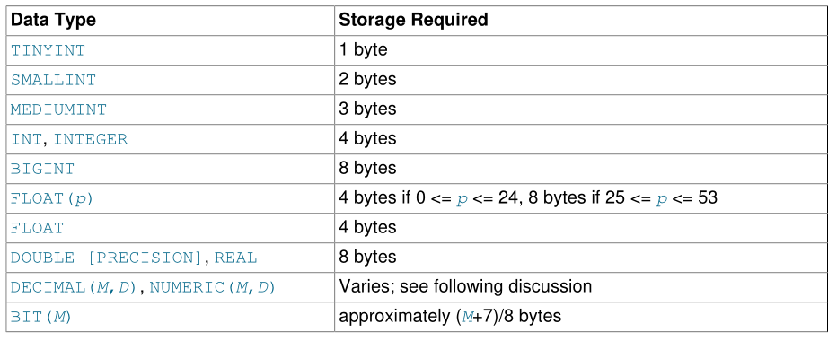
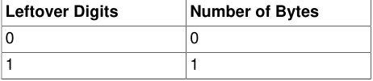
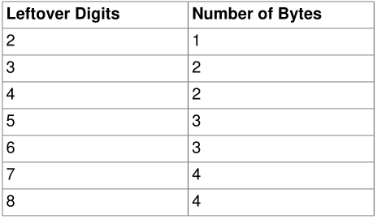
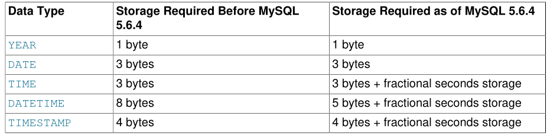
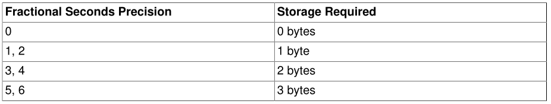

# 7.1 数据类型存储要求(Data Type Storage Requirements)

磁盘上表数据的存储要求取决于几个因素。不同的存储引擎代表数据类型并以不同方式存储原始数对于列或整行，可能会压缩表数据，从而使计算表或列的存储要求变得复杂。

尽管磁盘上的存储布局存在差异，但是通信和交换有关表行信息的内部MySQL API使用适用于所有存储引擎的一致数据结构。

本节包括有关MySQL支持的每种数据类型的存储要求的指南和信息，包括使用固定大小的数据类型表示形式的存储引擎的内部格式和大小。信息按类别或存储引擎列出。

即使存储引擎能够支持更大的行，表的内部表示的最大行大小为65,535字节。该图不包括`BLOB`或`EXT`列，它们只向该大小贡献9到12个字节。对于`BLOB`和`TEXT`数据，信息内部存储在与行缓冲区不同的内存区域中。根据用于处理相应类型的方法，不同的存储引擎以不同的方式处理该数据的分配和存储。

## 7.1.1 InnoDB Table Storage Requirements

## 7.1.2 NDB Table Storage Requirements

略过.................

## 7.1.3 数字类型存储要求(Numeric Type Storage Requirements)

`DECIMAL`（和`NUMERIC`）列的值使用二进制格式表示，该格式将九个十进制（基数10）数字打包成四个字节。每个值的整数和小数部分的存储是分开确定的。九个数字的每个倍数需要四个字节，“剩余”数字需要四个字节的一小部分。超出数字所需的存储量由下表给出。

## 7.1.4 日期和时间类型的存储要求( Date and Time Type Storage Requirements )

对于`TIME`，`DATETIME`和`TIMESTAMP`列，在MySQL 5.6.4之前创建的表所需的存储与从5.6.4创建的表不同。这是由于5.6.4中的更改允许这些类型具有小数部分，这需要0到3个字节。

从MySQL 5.6.4开始，`YEAR`和`DATE`的存储保持不变。但是，`TIME`，`DATETIME`和`TIMESTAMP`的表示方式不同。 `DATETIME`打包效率更高，非分数部分需要5个而不是8个字节，并且所有三个部分都有一个小数部分，需要0到3个字节，具体取决于存储值的小数秒精度。

例如，`TIME（0）`，`TIME（2）`，`TIME（4）`和`TIME（6）`分别使用3,4,5和6个字节。 TIME和TIME（0）是等效的，需要相同的存储空间。

## 7.1.5 字符串类型存储要求( String Type Storage Requirements )

在下表中，M表示非二进制字符串类型的声明列长度，以及二进制字符串类型的字节。 L表示给定字符串值的实际长度（以字节为单位）。

| Data Type | Storage Required|
| :------| :------|
| `CHAR(M)` | 紧凑的InnoDB行格式系列优化了可变长度字符集的存储。请参阅COMPACT行格式存储特性。否则，M×w字节，<= M <= 255，其中w是字符集中最大长度字符所需的字节数。         |
| `BINARY(M)` |`M`个字节，0 `<= M <=` 255|
|`VARCHAR(M)`, `VARBINARY(M)`|如果列值需要0-255个字节，则为`L`+1个字节;如果值可能需要超过255个字节，则为`L`+2个字节|
|`TINYBLOB`, `TINYTEXT`|`L` + 1个字节，其中`L` <2^8|
|`BLOB`, `TEXT` |`L` + 2 个字节, 其中 `L` < 2^16|
|`MEDIUMBLOB`, `MEDIUMTEXT`|`L` + 3 个字节, 其中 `L` < 2^24|
|`LONGBLOB`, `LONGTEXT`|L + 4 个字节, 其中 L < 2^32|
|`ENUM('value1','value2',...)`|1或2个字节，具体取决于枚举值的数量（最多65,535个值）|
|`SET('value1','value2',...)`|1个，2个，3个，4个或8个字节，具体取决于设置成员的数量（最多64个成员）|

使用长度前缀加数据存储可变长度字符串类型。长度前缀需要一到四个字节，具体取决于数据类型，前缀的值是`L`（字符串的字节长度）。例如，`MEDIUMTEXT`值的存储需要`L`个字节来存储该值加上三个字节来存储值的长度。

若要计算用于存储特定`CHAR`，`VARCHAR`或`TEXT`列值的字节数，必须考虑用于该列的字符集以及该值是否包含多字节字符。特别是，在使用`utf8` Unicode字符集时，必须记住并非所有字符都使用相同的字节数。 `utf8mb3`和`utf8mb4`字符集每个字符最多可分别需要三个和四个字节。有关用于不同类别的`utf8mb3`或`utf8mb4`字符的存储的细分，请参见第10.9节“Unicode支持”。

`VARCHAR`，`VARBINARY`以及`BLOB`和`TEXT`类型是可变长度类型。对于每个，存储要求取决于以下因素：

• 列值的实际长度

• 列的最大可能长度

• 用于列的字符集，因为某些字符集包含多字节字符

例如，`VARCHAR（255）`列可以包含最大长度为255个字符的字符串。假设该列使用`latin1`字符集（每个字符一个字节），所需的实际存储量是字符串（`L`）的长度，加上一个字节来记录字符串的长度。对于字符串`'abcd'`，`L`为4，存储要求为5个字节。如果声明同一列使用`ucs2`双字节字符集，则存储要求为10个字节：`'abcd'`的长度为`8`个字节，并且该列需要两个字节来存储长度，因为最大长度大于255 （最多510个字节）。

可以存储在`VARCHAR`或`VARBINARY`列中的有效最大字节数受最大行大小65,535字节的影响，该字节在所有列之间共享。对于存储多字节字符的`VARCHAR`列，有效的最大字符数较少。例如，`utf8mb3`字符每个字符最多可能需要三个字节，因此使用`utf8mb3`字符集的`VARCHAR`列可以声明为最多21,844个字符。请参见第C.10.4节“表列数和行大小的限制”。

`InnoDB`将长度大于或等于768字节的固定长度字段编码为可变长度字段，可以在页外存储。例如，如果字符集的最大字节长度大于3，则`CHAR（255）`列可以超过768字节，就像使用`utf8mb4`一样。

NDB存储引擎支持可变宽度列。这意味着NDB Cluster表中的VARCHAR列需要与任何其他存储引擎相同的存储量，但这些值是4字节对齐的例外。因此，使用latin1字符集存储在VARCHAR（50）列中的字符串`'abcd'`需要8个字节（而不是`MyISAM`表中相同列值的5个字节）。

`TEXT`和`BLOB`列在NDB存储引擎中的实现方式不同，其中TEXT列中的每一行由两个独立的部分组成。其中一个是固定大小（256字节），实际存储在原始表中。另一个包含超过256个字节的任何数据，存储在隐藏表中。第二个表中的行总是2000个字节长。这意味着如果`size` <= 256（其中`size`表示行的大小），TEXT列的大小为256;否则，`size`为256 +`size`+（2000×（`size` -  256）％2000）。

`ENUM`对象的大小由不同枚举值的数量决定。一个字节用于最多255个可能值的枚举。两个字节用于具有256到65,535个可能值的枚举。请参见第11.4.4节“ENUM类型”。

SET对象的大小由不同集合成员的数量决定。如果设置大小为N，则对象占用`（N + 7）/ 8`字节，向上舍入为1,2,3,4或8字节。 `SET`最多可以为64成员。

## 7.1.6 空间类型存储要求( Spatial Type Storage Requirements )

MySQL使用4个字节存储几何值，以指示SRID，后跟值的WKB表示。 `LENGTH()`函数返回值存储所需的空格（以字节为单位）。

## 7.1.7 JSON存储要求(JSON Storage Requirements)

通常，`JSON`列的存储要求与`LONGBLOB`或`LONGTEXT`列的存储要求大致相同;也就是说，`JSON`文档占用的空间与存储在其中一种类型的列中的文档字符串表示形式大致相同。但是，存储在JSON文档中的各个值的二进制编码（包括查找所需的元数据和字典）会产生开销。例如，存储在JSON文档中的字符串需要4到10个字节的额外存储空间，具体取决于字符串的长度以及存储它的对象或数组的大小。

此外，MySQL对存储在`JSON`列中的任何JSON文档的大小施加限制，使其不能大于`max_allowed_pa​​cket`的值。

