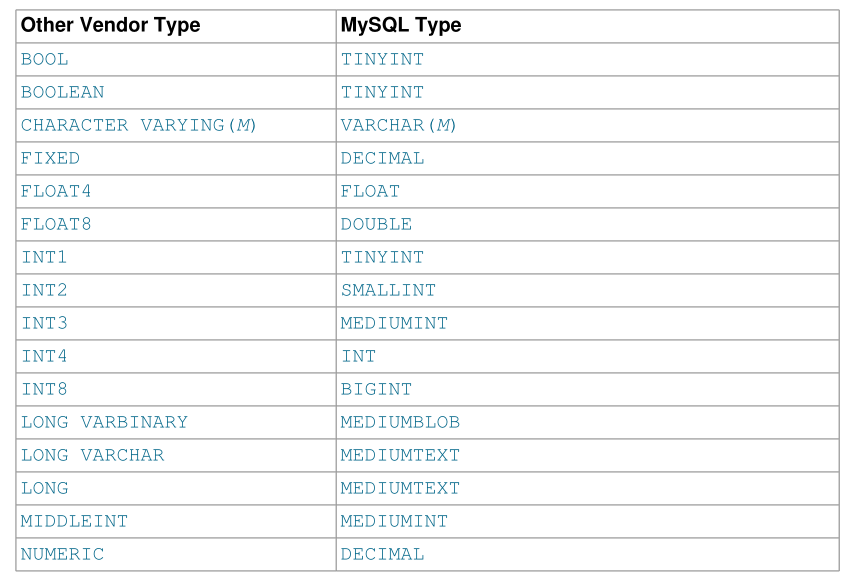

# Using Data Types from Other Database Engines

为了便于使用为其他供应商的SQL实现编写的代码，MySQL映射数据类型，如下表所示。这些映射使得将表定义从其他数据库系统导入MySQL变得更加容易。



数据类型映射在表创建时发生，之后将丢弃原始类型规范。如果您创建一个包含其他供应商使用的类型的表，然后发出`DESCRIBE tbl_name`语句，MySQL将使用等效的MySQL类型报告表结构。例如：

```mysql
mysql> CREATE TABLE t (a BOOL, b FLOAT8, c LONG VARCHAR, d NUMERIC);
Query OK, 0 rows affected (0.00 sec)
mysql> DESCRIBE t;
+-------+---------------+------+-----+---------+-------+
| Field | Type          | Null | Key | Default | Extra |
+-------+---------------+------+-----+---------+-------+
| a     | tinyint(1)    | YES  |     | NULL    |       |
| b     | double        | YES  |     | NULL    |       |
| c     | mediumtext    | YES  |     | NULL    |       |
| d     | decimal(10,0) | YES  |     | NULL    |       |
+-------+---------------+------+-----+---------+-------+
4 rows in set (0.01 sec)
```
