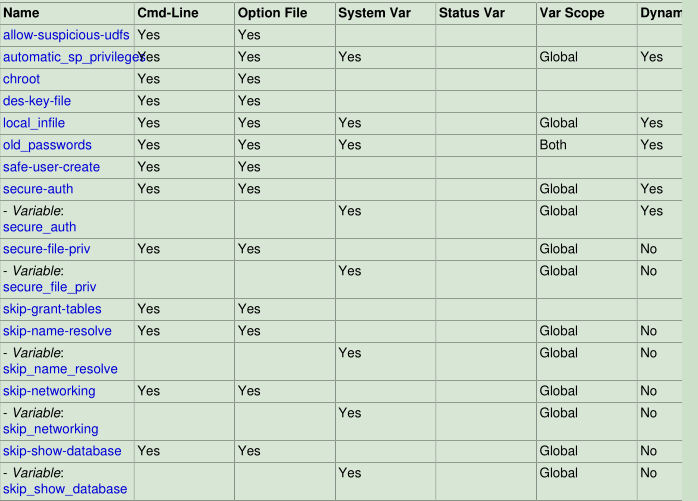

# 4.1 一般安全问题(General Security Issues)

本节描述需要注意的一般安全问题，以及如何使您的MySQL安装更安全，不受攻击或误用。

## 4.1.1 安全指引(Security Guidelines)

任何在连接到Internet的计算机上使用MySQL的人都应该阅读本节，以避免最常见的安全错误。

在讨论安全性时，有必要考虑完全保护整个服务器主机(而不仅仅是针对所有类型的攻击:窃听、修改、回放和拒绝服务。在这里，我们没有涵盖可用性和容错的所有方面。

MySQL对所有连接、查询和用户可以尝试执行的其他操作使用基于访问控制列表(acl)的安全性。还支持MySQL客户机和服务器之间的ssl加密连接。这里讨论的许多概念根本不是MySQL特有的;同样的一般思想适用于几乎所有的应用。

运行MySQL时，请遵循以下准则:

- 永远不要让任何人(MySQL root帐户除外)访问`mysql`系统数据库中的`user`表!这是至关重要的。

- 了解MySQL访问权限系统的工作原理(参见6.2节“访问控制和帐户”)管理”)。使用`GRANT`和`REVOKE`语句控制对MySQL的访问。不要授予不必要的特权。永远不要授予所有主机特权。

清单:

   ① 尝试`mysql -u root`。如果您能够成功地连接到服务器，而不需要输入密码，任何人都可以以MySQL `root`用户的身份以完全特权连接到您的MySQL服务器!查看MySQL安装说明，特别注意关于设置`root`密码的信息。

   ② 使用`SHOW GRANTS`语句检查哪些帐户可以访问什么。然后使用`REVOKE`语句删除不需要的特权。


- 不要在数据库中存储明文密码。如果您的计算机受到攻击，入侵者可以获取完整的密码列表并使用它们。相反，使用`SHA2()`或其他单向哈希函数并存储哈希值。

为防止使用 rainbow 表恢复密码，请不要在普通密码上使用这些功能;相反，选择一些字符串用作salt，并使用hash(hash(password)+salt)值。

- 不要从词典中选择密码。 存在破坏密码的特殊程序。 甚至像“xfish98”这样的密码都非常糟糕。更好的是“duag98”，它包含相同的单词“fish”，但在标准的QWERTY键盘上键入了左键。另一种方法是使用从句子中每个单词的第一个字符中获取的密码（例如，“Four score and seven years ago”产生密码“Fsasya”）。密码易于记忆和输入，但对于不知道该句子的人来说很难猜到。 在这种情况下，你可以另外用数字代替数字来获得短语“4 score and 7 years ago”，产生密码“4sa7ya”，这更难以猜测。

- 投资防火墙。这将保护您免受任何软件中至少50%的所有类型的攻击。把MySQL在防火墙后面或在非军事区(DMZ)。

清单:

   ① 尝试使用nmap之类的工具从Internet上扫描端口。MySQL默认使用端口3306。此端口不应由不受信任的主机访问。作为检查MySQL端口是否打开的一种简单方法，可以从远程机器尝试以下命令，其中`server_host`是运行MySQL服务器的主机的主机名或IP地址:
    
```bash
shell> telnet server_host 3306
```

如果`telnet`挂起或连接被拒绝，端口将被阻塞，这是您希望的情况。如果您获得了一个连接和一些垃圾字符，则端口是打开的，并且应该关闭防火墙或路由器上的端口，除非您确实有很好的理由让它保持打开状态。

- 访问MySQL的应用程序不应该信任用户输入的任何数据，应该使用适当的防御性编程技术编写。

- 不要在互联网上传输普通(未加密)数据。只要有时间和能力截取这些信息并将其用于自己的目的，任何人都可以访问这些信息。相反，使用加密的协议，如SSL或SSH。MySQL支持内部SSL连接。另一种技术是使用SSH端口转发创建用于通信的加密(和压缩)隧道。

- 学习使用`tcpdump`和`string`实用程序。在大多数情况下，您可以通过发出如下命令来检查MySQL数据流是否未加密:

```bash
shell> tcpdump -l -i eth0 -w - src or dst port 3306 | strings
```

这在Linux下可以工作，在其他系统下只需要进行少量修改。

`注意：如果您没有看到明文数据，这并不总是意味着信息实际上是加密的。如果您需要高安全性，请咨询安全专家。`


## 4.1.2 保持密码安全(Keeping Passwords Secure)

密码出现在MySQL中的几个上下文中。 以下各节提供了一些指导原则，使最终用户和管理员能够确保这些密码的安全并避免泄露这些密码。

还讨论了MySQL如何在内部使用密码散列以及可以用来强制执行更严格密码的插件。

### 4.1.2.1 密码安全的最终用户指南(End-User Guidelines for Password Security)

MySQL用户应该使用以下准则来保证密码的安全性。

当您运行一个客户机程序连接到MySQL服务器时，不建议以一种让其他用户发现密码的方式指定密码。这里列出了运行客户机程序时可以用来指定密码的方法，以及每种方法的风险评估。简而言之，最安全的方法是让客户机程序提示输入密码，或者在受适当保护的选项文件中指定密码。

- 使用`mysql_config_editor`实用程序，它使您能够将身份验证凭据存储在名为`.mylogin.cnf`的加密登录路径文件中。稍后，MySQL客户机程序可以读取该文件，以获得连接到MySQL服务器的身份验证凭据。

- 在命令行上使用`-pyour_pass`或`--password=your_pass`选项。例如:

```bash
shell> mysql -u francis -pfrank db_name
```

`注意：`这很方便，但不安全。在某些系统上，您的密码对于系统状态程序(如`ps`)是可见的，其他用户可以调用这些程序来显示命令行。MySQL客户机通常在初始化序列期间用0覆盖命令行密码参数。但是，仍然有一个很短的时间间隔，在此期间值是可见的。此外，在某些系统上，这种覆盖策略是无效的，并且密码对`ps`仍然可见(SystemV Unix系统和其他系统可能会遇到这个问题)。


如果将操作环境设置为在终端窗口的标题栏中显示当前命令，则只要该命令正在运行，密码就会保持可见，即使该命令已在窗口内容区域中滚动到视图之外。

- 在命令行上使用`-p`或`--password`选项，但不指定密码值。在这种情况下，客户端程序交互请求密码:

```bash
shell> mysql -u francis -p db_name
Enter password: ********
```

`*`字符表示您输入密码的位置。输入密码时不会显示密码。

以这种方式输入密码比在命令行中指定密码更安全，因为它对其他用户不可见。然而，这种输入密码的方法只适用于交互式运行的程序。如果希望从非交互式运行的脚本调用客户机，则没有机会从键盘输入密码。在某些系统上，您甚至可能发现脚本的第一行被读取并解释为密码(incorrectly)。

将密码存储在选项文件中。 例如，在Unix上，您可以在主目录的`.my.cnf`文件的`[client]`部分列出您的密码：

```ini
[client]
password=your_pass
```

为确保密码安全，除您自己外，任何人都不能访问该文件。要确保这一点，请将文件访问模式设置为`400`或`600`。例如:

```bash
shell> chmod 600 .my.cnf
```

要从命令行指定包含密码的特定选项文件，请使用`--default-file=file_name`选项，其中`file_name`是文件的完整路径名。例如:

```bash
shell> mysql --defaults-file=/home/francis/mysql-opts
```

- 将密码存储在`MYSQL_PWD`环境变量中。

这种指定MySQL密码的方法必须被认为是非常不安全的，不应该使用。`ps`的一些版本包含一个显示正在运行的进程环境的选项。在某些系统上，如果您设置`MYSQL_PWD`，您的密码就会暴露给任何其他运行`ps`的用户，即使在没有`ps`版本的系统上，假定没有其他方法可以让用户检查进程环境也是不明智的。

在Unix上，`mysql`客户端将执行语句的记录写入历史文件（参见第4.5.1.3节“mysql客户端日志记录”）。 默认情况下，此文件名为`.mysql_history`，并在您的主目录中创建。 密码可以在SQL语句中以纯文本形式写入，例如`CREATE USER`和`ALTER USER`，因此如果使用这些语句，它们将记录在历史文件中。 要保证此文件的安全，请使用限制性访问模式，方法与前面针对`.my.cnf`文件所述的方式相同。

如果您的命令解释器配置为维护历史记录，那么保存命令的任何文件都将包含在命令行中输入的MySQL密码。例如，`bash`使用`~/.bash_history`。任何这样的文件都应该具有限制性的访问模式。

### 4.1.2.2 管理员密码安全指南(Administrator Guidelines for Password Security)

数据库管理员应该使用以下准则来确保密码的安全性。

MySQL在`mysql.user`系统表中存储用户帐户的密码。 永远不应该向任何非管理帐户授予对此表的访问权限。

帐户密码可能过期，因此用户必须重置它们。

`validate_password`插件可用于对可接受的密码执行策略。

有权修改插件目录(`plugin_dir`系统变量的值)或指定插件目录位置的`my.cnf`文件的用户可以替换插件并修改插件提供的功能，包括身份验证插件。

应该保护可能写入密码的日志文件等文件。

### 4.1.2.3 密码和日志记录(Passwords and Logging)

密码可以在SQL语句中以纯文本形式写入，例如`CREATE USER`，`GRANT`，`SET PASSWORD`和调用`PASSWORD（）`函数的语句。 如果MySQL服务器将此类语句记录为已写入，则访问日志的任何人都可以看到其中的密码。

语句日志避免为以下语句编写明文密码:

```mysql
CREATE USER ... IDENTIFIED BY ...
ALTER USER ... IDENTIFIED BY ...
GRANT ... IDENTIFIED BY ...
SET PASSWORD ...
SLAVE START ... PASSWORD = ...
CREATE SERVER ... OPTIONS(... PASSWORD ...)
ALTER SERVER ... OPTIONS(... PASSWORD ...)
```

这些语句中的密码被重写为不会出现在写入常规查询日志，慢查询日志和二进制日志的语句文本中。 重写不适用于其他语句。特别是，`mysql.user`系统表中引用文字密码的`INSERT`或`UPDATE`语句按原样记录，因此您应该避免使用这些语句。 （无论如何，不鼓励直接修改授权表。）

对于常规查询日志，可以通过使用`--log-raw`选项启动服务器来抑制密码重写。 出于安全原因，建议不要将此选项用于生产用途。 出于诊断目的，查看服务器收到的语句的确切文本可能很有用。

审计日志插件生成的审计日志文件的内容未加密。 出于安全原因，应将此文件写入只有MySQL服务器和用户才能访问的目录，并且有正当理由查看日志。

如果安装了查询重写插件，则可以重写服务器收到的语句（请参阅查询重写插件）。在这种情况下， `--log-raw`选项会影响语句日志记录，如下所示：

• 如果没有`--log-raw`，服务器会记录查询重写插件返回的语句。这可能与收到的声明不同。

• 使用`--log-raw`，服务器将原始语句记录为已接收。

密码重写的含义是无法解析的语句（例如，由于语法错误）不会写入通用查询日志，因为无法知道它们是无密码的。需要记录所有语句（包括有错误的语句）的用例应使用`--log-raw`选项，请记住这也会绕过密码重写。

只有在需要纯文本密码时才会进行密码重写。对于具有期望密码哈希值的语法的语句，不会发生重写。如果为此类语法错误地提供了纯文本密码，则会将密码记录为给定，而不进行重写。例如，如下所示记录以下语句，因为需要密码哈希值：

```mysql
CREATE USER 'user1'@'localhost' IDENTIFIED BY PASSWORD 'not-so-secret';
```

要保护日志文件免受不必要的暴露，请将它们放在限制访问服务器和数据库管理员的目录中。 如果服务器登录到`mysql`数据库中的表，则仅将这些表的访问权限授予数据库管理员。

复制从站将复制主机的密码存储在主信息存储库中，该信息库可以是文件或表（请参见第16.2.4节“复制中继和状态日志”）。 确保只能由数据库管理员访问存储库。 将密码存储在文件中的替代方法是使用`START SLAVE`语句指定用于连接到主服务器的凭据。

使用受限访问模式来保护包含日志表或包含密码的日志文件的数据库备份。

### 4.1.2.4 密码哈希在MySQL中(Password Hashing in MySQL)

`注意`

本节中的信息仅在MySQL 5.7.5之前完全适用，并且仅适用于使用mysql_native_password或mysql_old_password身份验证插件的帐户。 MySQL 5.7.5中删除了对4.1之前密码哈希的支持。 这包括删除mysql_old_password身份验证插件和OLD_PASSWORD（）函数。 此外，无法禁用secure_auth，并且old_passwords不能设置为1。

从MySQL 5.7.5开始，只有关于4.1密码哈希值和mysql_native_password身份验证插件的信息仍然相关。

`注意`

由于仅在MySQL 5.7.5 之前完全受用 所以 以下内容略过略过(目前是5.7.26)............................

## 4.1.3 使MySQL不受攻击( Making MySQL Secure Against Attackers )

当您连接到MySQL服务器时，应该使用密码。密码不会在连接上以明文传输。客户端连接序列期间的密码处理在MySQL 4.1.1中升级为非常安全。如果您仍然使用4.1.1之前风格的密码，则加密算法不如新算法强大。通过一些努力，能够嗅出客户机和服务器之间通信的聪明攻击者可以破解密码。

所有其他信息都以文本形式传输，任何能够观看连接的人都可以阅读。如果客户机和服务器之间的连接通过一个不受信任的网络，并且您关心这个问题，那么您可以使用压缩协议使通信更加难以破译。您还可以使用MySQL的内部SSL支持使连接更加安全。或者，使用SSH获得加密的MySQL服务器和MySQL客户机之间的TCP/IP连接。您可以在http://www.openssh.org/找到一个开源SSH客户机，并在http://en.wikipedia.org/wiki/Comparison_of_SSH_clients找到开源SSH客户机和商业SSH客户机的比较。

为了保证MySQL系统的安全性，您应该认真考虑以下建议:

- 要求所有MySQL帐户都有密码。 客户端程序不一定知道运行它的人的身份。 客户端/服务器应用程序通常可以为客户端程序指定任何用户名。 例如，如果`other_user`没有密码，任何人都可以使用`mysql`程序作为任何其他人连接，只需将其作为`mysql -u other_user db_name`调用即可。 如果所有帐户都有密码，则使用其他用户的帐户进行连接会变得更加困难。

- 确保数据库目录中惟一具有读或写特权的Unix用户帐户是用于运行`mysqld`的帐户。

- 永远不要以Unix`root`用户的身份运行MySQL服务器。这是非常危险的，因为任何具有文件特权的用户都可以让服务器创建`root`文件(例如，`~root/.bashrc`)。为了防止这种情况发生，mysqld拒绝以`root`身份运行，除非使用`--user=root`选项显式地指定它。

`mysqld`可以（而且应该）作为普通的非特权用户运行。 您可以创建一个名为`mysql`的独立Unix帐户，以使一切更加安全。 仅将此帐户用于管理MySQL。 要将`mysqld`作为不同的Unix用户启动，请添加一个`user`选项，该选项在`my.cnf`选项文件的`[mysqld]`组中指定用户名，您可以在其中指定服务器选项。 例如：

```mysql
[mysqld]
user=mysql
```

这将导致服务器以指定用户的身份启动，无论您是手动启动还是使用`mysqld_safe`或`mysql.server`启动。

以Unix用户而不是`root`用户的身份运行`mysqld`并不意味着需要更改用户表中的`user`用户名。MySQL帐户的用户名与Unix帐户的用户名无关。

- 不要将`FILE`权限授予非管理用户。 具有此权限的任何用户都可以使用`mysqld`守护程序的权限在文件系统中的任何位置编写文件。 这包括服务器的数据目录，其中包含实现权限表的文件。 为了使`FILE`特权操作更安全，使用`SELECT ... INTO OUTFILE`生成的文件不会覆盖现有文件，并且每个人都可以写入。

`FILE`权限还可用于读取服务器运行的Unix用户可以访问或访问的任何文件。 使用此权限，您可以将任何文件读入数据库表。 例如，通过使用`LOAD DATA`将`/etc/passwd`加载到表中然后可以使用`SELECT`显示，这可能会被滥用。

要限制可以读取和写入文件的位置，请将`secure_file_priv`系统设置为特定目录。

- 不要向非管理用户授予`PROCESS`或`SUPER`权限。 `mysqladmin processlist`和`SHOW PROCESSLIST`的输出显示当前正在执行的任何语句的文本，因此任何被允许查看服务器进程列表的用户都可以看到其他用户发出的语句，例如 `UPDATE user SET password=PASSWORD('not_secure')`。

`mysqld`为拥有`SUPER`权限的用户保留额外的连接，这样即使所有正常连接都在使用，MySQL `root`用户也可以登录并检查服务器活动。

`SUPER`权限可用于终止客户端连接，通过更改系统变量的值来更改服务器操作，以及控制复制服务器。

- 不允许对表使用符号链接。 （可以使用`--skip-symbolic-links`选项禁用此功能。）如果以`root`身份运行`mysqld`，这一点尤为重要，因为任何对服务器数据目录具有写访问权限的人都可以删除系统中的任何文件！

- 存储的程序和视图应该使用前面讨论的安全指南编写

- 如果您不信任您的DNS，您应该在grant表中使用IP地址而不是主机名。在任何情况下，您都应该非常小心地使用包含通配符的主机名值创建grant表条目。

- 如果希望将允许连接的数量限制为单个帐户，可以通过在`mysqld`中设置`max_user_connections`变量来实现。`CREATE USER`和`ALTER USER`语句还支持资源控制选项，用于限制允许帐户使用服务器的范围。

如果服务器可以写入插件目录，则用户可以使用·SELECT ... INTO DUMPFILE·将可执行代码写入目录中的文件。 这可以通过将`plugin_dir`只读取到服务器或将`--secure-file-priv`设置为可以安全地进行`SELECT`写入的目录来防止这种情况。

## 4.1.4 安全相关的mysqld选项和变量( Security-Related mysqld Options and Variables )

下表显示了影响安全性的mysqld选项和系统变量。



## 4.1.5 How to Run MySQL as a Normal User

在Windows上，可以使用普通用户帐户将服务器作为Windows服务运行。

在Linux上，对于使用MySQL存储库、RPM包或Debian包执行的安装，MySQL服务器`mysqld`应该由本地`mysql`操作系统用户启动。安装过程中包含的init脚本不支持由其他操作系统用户启动。

在Unix（或Linux上使用`tar`或`tar.gz`包执行安装），MySQL服务器`mysqld`可以由任何用户启动和运行。但是，出于安全原因，应避免以Unix `root`用户身份运行服务器。要将`mysqld`更改为以普通非特权Unix用户`user_name`运行，必须执行以下操作：

1. 如果服务器正在运行，请停止它(使用`mysqladmin shutdown`)。

2. 更改数据库目录和文件，以便`user_name`具有读取和写入文件的权限（您可能需要以Unix `root`用户身份执行此操作）：

```bash
shell> chown -R user_name /path/to/mysql/datadir
```

如果不这样做，服务器在以`user_name`运行时将无法访问数据库或表。

如果MySQL数据目录中的目录或文件是符号链接，`chown -R`可能不会跟随符号链接。如果没有，还需要跟踪这些链接并更改它们指向的目录和文件。

3. 以`user_name`用户身份启动服务器。另一种方法是启动`mysqld`作为Unix `root`用户并使用`--user = user_name`选项。 `mysqld`启动，然后切换到以Unix用户身份运行`user_name`在接受任何连接之前。

4. 要在系统启动时自动启动服务器作为给定用户，请通过在`/etc/my.cnf`选项文件的`[mysqld]`组或`my.cnf`选项文件中添加`user`选项来指定用户名。服务器的数据目录。例如：

```ini
[mysqld]
user=user_name
```

如果你的Unix机器本身不安全，你应该在授权表中为MySQL `root`帐户分配密码。否则，在该计算机上具有登录帐户的任何用户都可以使用`--user = root`选项运行`mysql`客户端并执行任何操作。 （在任何情况下都最好将密码分配给`MySQL`帐户，但在服务器主机上存在其他登录帐户时尤其如此。）

## 4.1.6  Security Issues with LOAD DATA LOCAL

`LOAD DATA`语句可以加载位于服务器主机上的文件，如果指定了`LOCAL`关键字，则可以加载位于客户机主机上的文件。

`LOCAL`版本的`LOAD DATA`存在两个潜在的安全问题：

- 从客户端主机到服务器主机的文件传输由MySQL服务器启动。理论上，可以构建修补的服务器，该服务器将告诉客户端程序传输服务器选择的文件而不是`LOAD DATA`语句中客户端指定的文件。这样的服务器可以访问客户端用户具有读访问权限的客户端主机上的任何文件。 （补丁服务器实际上可以回复任何语句的文件传输请求，而不仅仅是`LOAD DATA LOCAL`，因此更基本的问题是客户端不应该连接到不受信任的服务器。）

- 在客户端从Web服务器连接的Web环境中，用户可以使用`LOAD DATA LOCAL`来读取Web服务器进程具有读访问权限的任何文件（假设用户可以对SQL服务器运行任何语句）。在此环境中，与MySQL服务器相关的客户端实际上是Web服务器，而不是由连接到Web服务器的用户运行的远程程序。


为避免`LOAD DATA`问题，客户端应避免使用`LOCAL`。为避免连接到不受信任的服务器，客户端可以通过使用`--ssl-mode = VERIFY_IDENTITY`选项和相应的CA证书进行连接来建立安全连接并验证服务器标识。

要使管理员和应用程序能够管理本地数据加载功能，请使用`LOCAL`配置如下：

- 在服务器端：

    ① `local_infile`系统变量控制服务器端`LOCAL`功能。根据`local_infile`设置，服务器拒绝或允许客户端启用了`LOCAL`的客户端加载本地数据。默认情况下，启用`local_infile`。

    ②  要显式地使服务器拒绝或允许`LOAD DATA LOCAL`语句（无论在构建时或运行时如何配置客户端程序和库），请分别启用`mysqld`并禁用或启用`local_infile`。 `local_infile`也可以在运行时设置。

- 在客户端：

    ① `ENABLED_LOCAL_INFILE CMake`选项控制MySQL客户端库的已编译默认`LOCAL`功能。因此，没有明确安排的客户端根据MySQL构建时指定的`ENABLED_LOCAL_INFILE`设置禁用或启用`LOCAL`功能。
    
     默认情况下，MySQL二进制发行版中的客户端库是在启用`ENABLED_LOCAL_INFILE`的情况下编译的。如果从源代码编译MySQL，则根据未进行显式排列的客户端是否应分别禁用或启用`LOCAL`功能，禁用或启用`ENABLED_LOCAL_INFILE`进行配置。
        
    ② 使用C API的客户端程序可以通过调用`mysql_options（）`来禁用或启用`MYSQL_OPT_LOCAL_INFILE`选项来显式控制加载数据加载。

    ③ 对于mysql客户端，默认情况下禁用本地数据加载。要显式禁用或启用它，请使用`--local-infile=0`或`--local-infile[=1]`选项。

    ④ 对于`mysqlimport`客户端，默认情况下禁用本地数据加载。要显式禁用或启用它，请使用`--local=0`或`--local[=1]`选项。

    ⑤ 如果在Perl脚本或从选项文件中读取`[client]`组的其他程序中使用`LOAD DATA LOCAL`，则可以向该组添加`local-infile`选项设置。要防止不理解此选项的程序出现问题，请使用`loose-prefix`指定它：

```ini
[client]
loose-local-infile=0
```

或者：

```ini
[client]
loose-local-infile=1
```
    
   ⑥ 在所有情况下，客户端成功使用LOCAL加载操作也需要服务器允许它。
    


如果禁用`LOCAL`功能，则无论是在服务器端还是客户端端，尝试发出`LOAD DATA LOCAL`语句的客户端都会收到以下错误消息：

```mysql
ERROR 1148: The used command is not allowed with this MySQL version
```

## 4.1.7 Client Programming Security Guidelines

访问MySQL的应用程序不应该信任用户输入的任何数据，用户可以通过在Web表单，URL或您构建的任何应用程序中输入特殊或转义的字符序列来欺骗您的代码。如果用户输入类似的内容，请确保您的应用程序保持安全; `DROP DATABASE mysql;`。这是一个极端的例子，但是如果你没有为它们做准备，黑客可能会使用类似的技术来发生大量的安全漏洞和数据丢失。

常见的错误是仅保护字符串数据值。记得也要检查数字数据。如果应用程序在用户输入值234时生成诸如`SELECT * FROM table WHERE ID=234`之类的查询，则用户可以输入值`234 OR 1 = 1`以使应用程序生成查询`SELECT * FROM table WHERE ID=234 OR 1=1`。结果，服务器检索表中的每一行。这会暴露每一行并导致过多的服务器负载。防止此类攻击的最简单方法是在数字常量周围使用单引号：`SELECT * FROM table WHERE ID ='234'`。如果用户输入额外信息，则它们都成为字符串的一部分。在数字上下文中，MySQL会自动将此字符串转换为数字，并从中删除任何尾随的非数字字符。

有时人们会认为，如果数据库只包含公开可用的数据，则无需受到保护。这是不正确的。即使允许在数据库中显示任何行，您仍应该防止拒绝服务攻击（例如，那些基于前一段中导致服务器浪费资源的技术的攻击）。否则，您的服务器将无法响应合法用户。

清单：

- 启用strict SQL模式来告诉服务器对它接受的数据值进行更严格的限制。

- 尝试在所有Web表单中输入单引号和双引号(`'` and `"`)。如果你发现任何MySQL错误，请立即调查这个问题。

- 尝试通过添加`%22`(`"`)、`%23`(`#`)和`%27`(`'`)来修改动态url。

- 尝试使用前面示例中显示的字符将动态url中的数据类型从数值类型修改为字符类型。您的应用程序应该是安全的，不受这些攻击和类似的攻击。

- 尝试在数字字段中输入字符、空格和特殊符号，而不是数字。应用程序应该在将它们传递给MySQL或生成错误之前删除它们。将未检查值传递给MySQL是非常危险的!

- 在将数据传递给MySQL之前，请检查数据的大小。

- 让应用程序使用不同于用于管理目的的用户名连接到数据库。不要给应用程序任何它们不需要的访问特权。


许多应用程序编程接口提供了转义数据值中的特殊字符的方法。如果使用得当，这可以防止应用程序用户输入一些值，这些值会导致应用程序生成与您预期的效果不同的语句:

- MySQL C API:使用`mysql_real_escape_string_quote()` API调用。

- MySQL ++：对查询流使用`escape`和`quote`修饰符。

- PHP:使用`mysqli`或`pdo_mysql`扩展，而不是旧的`ext/mysql`扩展。首选API支持改进的MySQL身份验证协议和密码，以及带有占位符的语句。


如果必须使用旧的`ext/mysql`扩展，那么对于转义，请使用`mysql_real_escape_string_quote()`函数，而不要使用`mysql_escape_string()`或`addslashes()`，因为只有`mysql_real_escape_string_quote()`是字符集感知的；当使用(无效的)多字节字符集时，可以“绕过”其他函数。

- Perl DBI:使用占位符或`quote()`方法。

- Ruby DBI:使用占位符或`quote()`方法。

- Java JDBC:使用`PreparedStatement`对象和占位符。

其他编程接口可能具有类似的功能。


