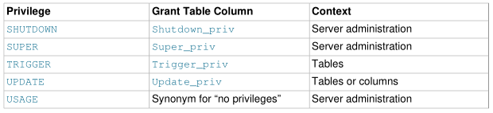

# 4.2 访问控制和帐户管理(Access Control and Account Management)

MySQL允许创建允许客户端用户连接到服务器并访问服务器管理的数据的帐户。 MySQL权限系统的主要功能是对从给定主机连接的用户进行身份验证，并将该用户与数据库（如`SELECT`，`INSERT`，`UPDATE`和`DELETE`）的权限相关联。其他功能包括为管理操作授予权限的功能。

要控制哪些用户可以连接，可以为每个帐户分配身份验证凭据，例如密码。 MySQL帐户的用户界面由SQL语句组成，例如`CREATE USER`，`GRANT`和`REVOKE`。

MySQL权限系统确保所有用户只能执行允许的操作。作为用户，当您连接到MySQL服务器时，您的身份由您连接的主机和您指定的用户名决定。在连接后发出请求时，系统会根据您的身份和您要执行的操作授予权限。

MySQL在识别您时同时考虑您的主机名和用户名，因为没有理由假定给定的用户名属于所有主机上的同一个人。例如，从`office.example.com`连接的用户`joe`不需要与从`home.example.com`连接的用户`joe`是同一个人。MySQL通过使您能够区分不同主机上恰好具有相同名称的用户来处理这一问题：您可以为`joe`与`office.example.com`之间的连接授予一组特权，为`joe`与`home.example.com`之间的连接授予另一组特权。要查看给定帐户具有哪些特权，请使用`show grants`语句。

例如：

```mysql
SHOW GRANTS FOR 'joe'@'office.example.com';
SHOW GRANTS FOR 'joe'@'home.example.com';
```

在内部，服务器将特权信息存储在`mysql`系统数据库的grant表中。mysql服务器在启动时将这些表的内容读取到内存中，并将访问控制决策基于授予表的内存副本。

当运行连接到服务器的客户端程序时，mysql访问控制涉及两个阶段：

阶段1:服务器根据您的身份接受或拒绝连接，以及您是否可以通过提供正确的密码来验证您的身份。

阶段2:假设您可以连接，服务器将检查您发出的每个语句，以确定您是否具有足够的权限来执行它。例如，如果您试图从数据库中的表中选择行或从数据库中删除表，服务器将验证您是否拥有表的`select`特权或数据库的`drop`特权。

如果您的特权在连接时被更改（由您自己或其他人更改），则这些更改不一定对您发出的下一条语句立即生效。

有一些事情您不能用MySQL特权系统做：

•不能明确指定应拒绝给定用户访问。也就是说，不能显式匹配用户，然后拒绝连接。

•不能指定用户有权在数据库中创建或删除表，但不能指定用户有权创建或删除数据库本身。

•密码适用于全局帐户。不能将密码与特定对象关联

例如数据库、表或例程(routine)。

## 4.2.1 Account User Names and Passwords

MySQL将帐户存储在`MySQL`系统数据库的`user`表中。帐户是根据用户名和客户机主机定义的，用户可以从这些主机连接到服务器。

帐户还可以具有身份验证凭据，如密码。凭证由帐户身份验证插件处理。MySQL支持多个身份验证插件。其中一些使用内置的身份验证方法，而另一些使用外部身份验证方法启用身份验证。

MySQL和你的操作系统使用用户名和密码的方式有几个区别:

- MySQL用于身份验证的用户名与Windows或Unix使用的用户名（登录名）无关。在Unix上，大多数MySQL客户端默认尝试使用当前的Unix用户名作为MySQL用户名登录，但这只是为了方便起见。可以轻松覆盖默认值，因为客户端程序允许使用`-u`或`--user`选项指定任何用户名。这意味着任何人都可以尝试使用任何用户名连接到服务器，因此除非所有MySQL帐户都有密码，否则无法以任何方式使数据库安全。为没有密码的帐户指定用户名的任何人都可以成功连接到服务器。

- MySQL用户名长达32个字符。操作系统用户名可能具有不同的最大长度。

`警告`

MySQL用户名长度限制在MySQL服务器和客户机中是硬编码的，试图通过修改`MySQL`数据库中表的定义来绕过它是行不通的。

除非通过第2.11节“升级MySQL”中描述的过程，否则不应以任何方式更改`mysql`数据库中表的结构。尝试以任何其他方式重新定义MySQL的系统表会导致未定义和不受支持的行为。服务器可以自由忽略由于此类修改而变得格式错误的行。

`警告`

- 要对使用内置身份验证方法的帐户的客户端连接进行身份验证，服务器将使用存储在`user`表中的密码。这些密码与登录操作系统的密码不同。用于登录Windows或Unix计算机的“外部”密码与用于访问该计算机上的MySQL服务器的密码之间没有必要的连接。

如果服务器使用其他插件对客户端进行身份验证，则插件实现的身份验证方法可能会也可能不会使用存储在`user`表中的密码。在这种情况下，外部密码也可能用于向MySQL服务器进行身份验证。

- 存储在用户表中的密码使用特定于插件的算法进行加密。

- 如果用户名和密码仅包含ASCII字符，则无论字符集设置如何，都可以连接到服务器。要在用户名或密码包含非ASCII字符时启用连接，客户端应用程序应使用`MYSQL_SET_CHARSET_NAME`选项和相应的字符集名称作为参数调用`mysql_options（）`C API函数。这会导致使用指定的字符集进行身份验证。否则，除非服务器默认字符集与身份验证默认值中的编码相同，否则身份验证将失败。

标准MySQL客户端程序支持`--default-character-set`选项，该选项会导致调用`mysql_options（）`，如上所述。另外，字符集自动检测是支持，如第10.4节“连接字符集和排序规则”中所述。对于使用不基于C API的连接器的程序，连接器可以提供与可以使用的`mysql_options（）`等效的等效项。检查连接器文档。

前面的注释不适用于`ucs2`，`utf16`和`utf32`，它们不允许作为客户端字符集。


要使用命令行客户机连接到MySQL服务器，请根据需要为要使用的帐户指定用户名和密码选项:

```bash
shell> mysql --user=finley --password db_name
```

如果你喜欢短选项，命令如下:

```bash
shell> mysql -u finley -p db_name
```

如果您省略了命令行中`--password`或`-p`选项后面的密码值(如所示)，客户端会提示输入一个。或者，可以在命令行上指定密码:

```bash
shell> mysql --user=finley --password=password db_name
shell> mysql -u finley -ppassword db_name
```

如果使用`-p`选项，`-p`和下面的密码值之间必须没有空格。

## 4.2.2 Privileges Provided by MySQL

授予MySQL帐户的权限决定了帐户可以执行的操作。 MySQL权限在它们适用的上下文和不同操作级别上有所不同：

•管理权限使用户能够管理MySQL服务器的操作。这些权限是全局的，因为它们不是特定于特定数据库的。

•数据库权限适用于数据库及其中的所有对象。可以为特定数据库或全局授予这些权限，以便它们适用于所有数据库。

•可以为数据库中的特定对象，数据库中给定类型的所有对象（例如，数据库中的所有表）或全局的特定对象授予数据库对象（如表，索引，视图和存储例程）的权限。所有数据库中给定类型的所有对象。

有关帐户权限的信息存储在mysql系统数据库的授权表中。有关这些表的结构和内容的说明，请参见第6.2.3节“授权表”。 MySQL服务器在启动时将内容读取到内存中，并在第6.2.9节“当权限更改生效时”中指示的情况下重新加载它们。服务器基于授权表的内存中副本建立访问控制决策。

`重要：一些MySQL版本引入了对授权表的更改以添加新的特权或功能。要确保您可以利用任何新功能，请在升级MySQL时将授权表更新为当前结构。请参见第2.11节“升级MySQL”。`

以下部分总结了可用权限，提供了有关每个权限的更详细说明以及提供使用指南。

### 4.2.2.1 可用特权摘要(Summary of Available Privileges)

下表显示了`GRANT`和`REVOKE`语句中使用的特权名称，以及与GRANT表中的每个特权关联的列名以及特权应用的上下文。

Table 6.2 Permissible Privileges for GRANT and REVOKE




### 4.2.2.2 Privilege Descriptions

以下列表提供了MySQL中可用的每个权限的一般说明。特定的SQL语句可能具有比此处指示的更具体的权限要求。如果是，则有关语句的描述提供了详细信息。

- `ALL`，`ALL PRIVILEGES`

这些权限说明符是“在给定权限级别可用的所有权限”的简写（`GRANT OPTION`除外）。例如，在全局或表级别授予`ALL`分别授予所有全局特权或所有表级特权。

- `ALTER`

允许使用ALTER TABLE语句来更改表的结构。 ALTER TABLE还需要CREATE和INSERT权限。重命名表需要旧表上的ALTER和DROP，新表上的`CREATE`和`INSERT`。

- `ALTER ROUTINE`

允许使用更改或删除存储例程（存储过程和函数）的语句。

- `CREATE`

允许使用创建新数据库和表的语句。

- `CREATE ROUTINE`

允许使用创建存储例程（存储过程和函数）的语句。

- `CREATE TABLESPACE`

允许使用创建，更改或删除表空间和日志文件组的语句。

- `CREATE TEMPORARY TABLES`

允许使用`CREATE TEMPORARY TABLE`语句创建临时表。在会话创建临时表之后，服务器不会对表执行进一步的权限检查。创建会话可以对表执行任何操作，例如`DROP TABLE`，`INSERT`，`UPDATE`或`SELECT`。有关更多信息，请参见第13.1.18.3节“创建临时表”句法”。

- `CREATE USER`

允许使用`ALTER USER`，`CREATE USER`，`DROP USER`，`RENAME USER`和`REVOKE ALL PRIVILEGES`语句。

- `CREATE VIEW`

允许使用`CREATE VIEW`语句。

- `DELETE`

允许从数据库中的表中删除行。

- `DROP`

允许使用删除（删除）现有数据库，表和视图的语句。需要DROP特权才能在分区表上使用`ALTER TABLE ... DROP PARTITION`语句。 `TRUNCATE TABLE`也需要`DROP`特权。

- `EVENT`

允许使用为事件调度程序创建，更改，删除或显示事件的语句。

- `EXECUTE`

允许使用执行存储例程（存储过程和函数）的语句。


- `FILE`

影响以下操作和服务器行为：

• 使用`LOAD DATA`和`SELECT ... INTO OUTFILE`语句和`LOAD_FILE（）`函数，可以在服务器主机上读写文件。具有`FILE`权限的用户可以读取服务器主机上的任何文件，该文件是世界可读的或MySQL服务器可读的。 （这意味着用户可以读取任何数据库目录中的任何文件，因为服务器可以访问任何这些文件。）

• 允许在MySQL服务器具有写访问权限的任何目录中创建新文件。这包括服务器的数据目录，其中包含实现权限表的文件。

• 从MySQL 5.7.17开始，允许对`CREATE TABLE`语句使用`DATA DIRECTORY`或`INDEX DIRECTORY`表选项。

作为安全措施，服务器不会覆盖现有文件。

要限制可以读取和写入文件的位置，请将`secure_file_priv`系统变量设置为特定目录。请参见第5.1.7节“服务器系统变量”。


- `GRANT OPTION`

允许您向其他用户授予或撤消您自己拥有的权限。

- `INDEX`

允许使用创建或删除（删除）索引的语句。 `INDEX`适用于现有表。如果您具有表的`CREATE`特权，则可以在`CREATE TABLE`语句中包含索引定义。

- `INSERT`

允许将行插入数据库中的表。 `ANALYZE TABLE`，`OPTIMIZE TABLE`和`REPAIR TABLE`表维护语句也需要`INSERT`。

- `LOCK TABLES`

允许使用显式`LOCK TABLES`语句来锁定具有`SELECT`权限的表。这包括使用写锁定，这可以防止其他会话读取锁定的表。

- `PROCESS`
允许显示有关服务器内执行的线程的信息（即有关会话正在执行的语句的信息）。该权限允许使用`SHOW PROCESSLIST`或`mysqladmin`进程列表来查看属于其他帐户的线程;你总能看到自己的主题。 `PROCESS`权限还允许使用`SHOW ENGINE`。

- `REFERENCES`

创建外键约束需要父表的`REFERENCES`特权。

- `RELOAD`

允许使用`FLUSH`语句。它还启用了与`FLUSH`操作等效的`mysqladmin`命令：`flush-hosts`，`flush-logs`，`flush-privileges`，`flush-status`，`flush-tables`，`flush-threads`，`refresh`和`reload`。

`reload`命令告诉服务器将授权表重新加载到内存中。`flush-privileges`是重新加载的同义词。 `refresh`命令关闭并重新打开日志文件并刷新所有表。其他`flush-xxx`命令执行类似于刷新的功能，但更具体，在某些情况下可能更为可取。例如，如果要仅刷新日志文件，则刷新日志是比刷新更好的选择。

`RELOAD`权限还允许使用RESET MASTER和RESET SLAVE语句。

- `REPLICATION CLIENT`

允许使用`SHOW MASTER STATUS`，`SHOW SLAVE STATUS`和`SHOW BINARY LOGS`语句。将此权限授予从服务器用于连接到当前服务器作为其主服务器的帐户。

- `REPLICATION SLAVE`

允许帐户使用`SHOW SLAVE HOSTS`，`SHOW RELAYLOG EVENTS`和`SHOW BINLOG EVENTS`语句请求对主服务器上的数据库进行的更新。使用`mysqlbinlog`选项`--read-from-remote-server（-R）`和`--read-from-remote-master`也需要此权限。将此权限授予从服务器用于连接到当前服务器作为其主服务器的帐户。

- `SELECT`

允许从数据库中的表中选择行。 `SELECT`语句只有在实际访问表时才需要`SELECT`权限。某些`SELECT`语句不访问表，并且可以在没有任何数据库许可的情况下执行。例如，您可以使用`SELECT`作为简单的计算器来计算不引用表的表达式：

```mysql
SELECT 1 + 1;
SELECT PI（）* 2;
```

读取列值的其他语句也需要`SELECT`权限。例如，对于UPDATE语句中`col_name = expr`赋值右侧引用的列或`DELETE`或`UPDATE`语句的`WHERE`子句中指定的列，需要`SELECT`。

与EXPLAIN一起使用的表或视图需要`SELECT`权限，包括视图定义中的任何基础表。

- `SHOW DATABASES`

通过发出`SHOW DATABASE`语句使帐户能够查看数据库名称。没有此权限的帐户只能看到具有某些权限的数据库，如果服务器是使用`--skip-show-database`选项启动的，则根本不能使用该语句。

`小心`

由于全局特权被视为所有数据库的特权，因此任何全局特权都允许用户使用`SHOW DATABASES`或通过检查`INFORMATION_SCHEMA SCHEMATA`表来查看所有数据库名称。

`小心`


-  `SHOW VIEW`

允许使用`SHOW CREATE VIEW`语句。与`EXPLAIN`一起使用的视图也需要此权限。

-   `SHUTDOWN`

允许使用`SHUTDOWN`语句，`mysqladmin shutdown`命令和`mysql_shutdown（）`C API函数。

-  `SUPER`

影响以下操作和服务器行为：

•   通过修改全局系统变量来启用服务器配置更改。对于某些系统变量，设置会话值还需要SUPER权限。如果系统变量受限制并且需要特殊权限来设置会话值，则变量说明指示该限制。示例包括`binlog_format`，`sql_log_bin`和`sql_log_off`。请参见第5.1.8.1节“系统变量权限”。

•   启用对全局事务特征的更改（请参见第13.3.6节“SET TRANSACTION语法”）。

•   使帐户能够启动和停止复制，包括组复制。

•   允许使用`CHANGE MASTER TO`和`CHANGE REPLICATION FILTER`语句。

•   通过`PURGE BINARY LOGS`和`BINLOG`语句启用二进制日志控制。

•   允许在执行视图或存储程序时设置有效的授权ID。具有此权限的用户可以在视图或存储程序的`DEFINER`属性中指定任何帐户。

•   允许使用`CREATE SERVER`，`ALTER SERVER`和`DROP SERVER`语句。

•   允许使用`mysqladmin debug`命令。

•   启用`InnoDB`加密密钥轮换。

•   允许通过`DES_ENCRYPT（）`函数读取`DES`密钥文件。

•   允许执行版本标记用户定义的功能。

•   允许控制不允许非`SUPER`帐户的客户端连接：

   ① 允许使用`KILL`语句或`mysqladmin kill`命令来终止属于其他帐户的线程。 （帐户总是可以杀死自己的线程。）
   
   ② `SUPER`客户端连接时，服务器不执行`init_connect`系统变量内容。
   
   ③ 即使达到`max_connections`系统变量配置的连接限制，服务器也会接受来自`SUPER`客户端的一个连接。
   
   ④ 处于脱机模式的服务器（启用`offline_mode`）不会在下一个客户端请求时终止`SUPER`客户端连接，并接受来自`SUPER`客户端的新连接。
   
•   即使启用了`read_only`系统变量，也可以执行更新。 这适用于显式表更新，以及使用`GRANT`和`REVOKE`等帐户管理语句隐式更新表。


如果启用了二进制日志记录，您可能还需要超级特权来创建或修改存储函数


-` TRIGGER`

启用触发器操作。 您必须拥有此表的权限才能创建，删除，执行或显示该表的触发器。

激活触发器时（由具有为触发器关联的表执行`INSERT`，`UPDATE`或`DELETE`语句的权限的用户），触发器执行要求定义触发器的用户仍具有该表的`TRIGGER`权限。

-  `UPDATE`

允许在数据库中的表中更新行。

-  `USAGE`

此权限说明符代表“无权限”。它在全局级别与`GRANT`一起用于修改帐户属性（如资源限制或SSL特征），而无需在权限列表中指定特定帐户权限。 `SHOW GRANTS`显示`USAGE`以指示帐户在特权级别没有特权。

### 4.2.2.3 Privilege-Granting指南

最好只向帐户授予它所需的权限。在授予FILE和管理权限时应特别小心：

最好只向帐户授予它所需的权限。在授予FILE和管理权限时应特别小心：

- 可以滥用FILE将`mysql`服务器可以在服务器主机上读取的任何文件读入数据库表。这包括服务器数据目录中的所有世界可读文件和文件。然后可以使用`SELECT`访问该表以将其内容传输到客户端主机。

- `GRANT OPTION`使用户可以将其权限授予其他用户。具有不同权限且具有`GRANT OPTION`权限的两个用户可以组合权限。

- `ALTER`可用于通过重命名表来破坏权限系统。

- SHUTDOWN`可以被滥用，通过终止服务器完全拒绝向其他用户提供服务。

- PROCESS可用于查看当前正在执行的语句的纯文本，包括设置或更改密码的语句。

- SUPER可用于终止其他会话或更改服务器的运行方式。

- 为`mysql`系统数据库本身授予的权限可用于更改密码和其他访问权限信息：

- 密码以加密方式存储，因此恶意用户无法简单地读取密码以了解明文密码。但是，具有对`mysql.user`系统表`authentication_string`列的写访问权限的用户可以更改帐户的密码，然后使用该帐户连接到`mysql`服务器。

- 为`mysql`系统数据库授予的INSERT或UPDATE分别允许用户添加权限或修改现有权限。

- `mysql`系统数据库的DROP使用户能够使用远程权限表，甚至是数据库本身。可以滥用`FILE`将`mysql`服务器可以在服务器主机上读取的任何文件读入数据库表。这包括服务器数据目录中的所有世界可读文件和文件。然后可以使用`SELECT`访问该表以将其内容传输到客户端主机。

- `GRANT OPTION`使用户可以将其权限授予其他用户。具有不同权限且具有`GRANT OPTION`权限的两个用户可以组合权限。

- `ALTER`可用于通过重命名表来破坏权限系统。

- `SHUTDOWN`可以被滥用，通过终止服务器完全拒绝向其他用户提供服务。

- `PROCESS`可用于查看当前正在执行的语句的纯文本，包括设置或更改密码的语句。

- `SUPER`可用于终止其他会话或更改服务器的运行方式。

- 为`mysql`系统数据库本身授予的权限可用于更改密码和其他访问权限信息：

- 密码以加密方式存储，因此恶意用户无法简单地读取密码以了解明文密码。但是，具有对`mysql.user`系统表`authentication_string`列的写访问权限的用户可以更改帐户的密码，然后使用该帐户连接到`mysql`服务器。

- 为`mysql`系统数据库授予的INSERT或UPDATE分别允许用户添加权限或修改现有权限。

- `mysql`系统数据库的DROP使用户能够使用远程权限表，甚至是数据库本身。

### 4.2.2.4 Grant Tables


